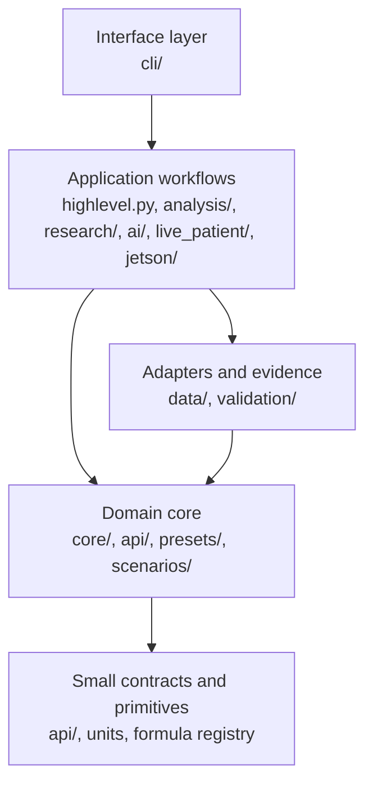

# Architecture Hardening Plan

This document is the engineering map for keeping IINTS-AF strong as the SDK grows across simulation, data, AI, reports, edge hardware, and research training.

The short version: keep the medical/simulation core small, deterministic, and dependency-light; put optional workflows at the edges; make every risky boundary explicit and testable.

## Current Architectural Strengths

| Strength | Why It Matters |
| --- | --- |
| Deterministic safety supervisor is separate from candidate algorithms | AI or experimental controllers can fail without becoming the final authority. |
| Public algorithm API is isolated in `src/iints/api` | Third-party algorithms can target a stable contract instead of simulator internals. |
| Data, analysis, research, AI, and edge live in separate packages | Features can evolve without all code living in one folder. |
| CLI is packaged as one public entry point | Users get a real SDK experience instead of disconnected scripts. |
| Docs already include architecture and contribution guides | Contributors have a map before touching safety-sensitive code. |
| Tests cover realism, safety, imports, edge, reports, and AI boundaries | The SDK has safety nets beyond happy-path demos. |

## Target Layering



The dependency direction should mostly point downward. The core may expose domain state and deterministic rules, but it should not import reporting, training, CLI, or hardware orchestration.

## Boundary Rules

| Rule | Rationale |
| --- | --- |
| `core` must not depend on `analysis`, `research`, `cli`, `live_patient`, `jetson`, or visualization | The simulator must remain deterministic, importable, and safe on minimal installs. |
| `data` must not depend on `analysis`, `research`, `ai`, `cli`, hardware, or visualization | Data certification should stay reproducible and not pull optional stacks. |
| `analysis`, `research`, and `ai` must not import `cli` | User interfaces should call workflows, not become a dependency of them. |
| Edge/hardware code must call core contracts, not redefine safety policy | Raspberry Pi, UNO Q, Jetson, and FPGA paths should remain thin execution surfaces. |
| LLM modules may explain and summarize, but numeric authority stays deterministic | Prevent hallucinated equations, formulas, doses, or safety outcomes. |
| Report generation consumes run artifacts; it must not mutate simulation state | Evidence should be reproducible after the run finishes. |

These rules are enforced by `tools/ci/check_architecture_boundaries.py`.

## Legacy Seams Removed In v1.5.16

The first architecture-hardening pass removed the static seams that previously forced lower layers to import higher-level packages.

| Removed Seam | Replacement |
| --- | --- |
| `core/algorithms/battle_runner.py` importing `analysis.clinical_metrics` | Clinical metrics now live in `core.clinical_metrics`; `analysis.clinical_metrics` is a compatibility wrapper. |
| `data/realism_validator.py` importing `analysis.clinical_metrics` | Data realism checks now use the dependency-light core metrics module. |
| `core/algorithms/neural_controller.py` importing `research.neural_control` at module import | Research helpers are loaded lazily only when the experimental controller is constructed. |
| `core/algorithms/imitation_controller.py` importing `research.control` at module import | Research helpers are loaded lazily only when the experimental controller is constructed. |

## Hardening Priorities

| Priority | Action | Success Signal |
| --- | --- | --- |
| P0 | Keep deterministic safety and numeric formula authority isolated | Core tests pass without AI/reporting extras. |
| P0 | Run architecture boundary check in developer checks | New layer violations fail before merging. |
| P1 | Split `src/iints/cli/cli.py` into command modules | Main CLI becomes a router, not a 10k+ line command warehouse. |
| P1 | Split `src/iints/core/simulator.py` into event, recorder, safety, and patient-step services | Simulation loop becomes easier to test and reason about. |
| P1 | Move shared metrics to a dependency-light module | Data, validation, and core stop importing analysis. |
| P2 | Separate research controllers from production-safe algorithm examples | Experimental AI remains clearly labeled and optional. |
| P2 | Define artifact schemas for run outputs, reports, AGP assets, and training bundles | Long-term result management becomes stable. |
| P2 | Add import-time smoke tests for optional dependency profiles | Minimal, reports, edge, research, and full installs stay clean. |

## Refactor Strategy

Use strangler refactoring: add a small new module, move one function, keep old imports as compatibility wrappers, and delete wrappers only after tests and docs are updated.

Do not rewrite large files in one pass unless there is a failing safety bug. For this SDK, architectural stability is more valuable than dramatic cleanup.

## Required Local Checks

```bash
python3 tools/ci/check_architecture_boundaries.py
python3 -m pytest tests/core tests/data tests/research tests/ai -q
mypy src/iints/
```

Before release, run the normal full/release check after the current worktree is clean enough for it:

```bash
tools/dev/sdk_check.sh release
```
