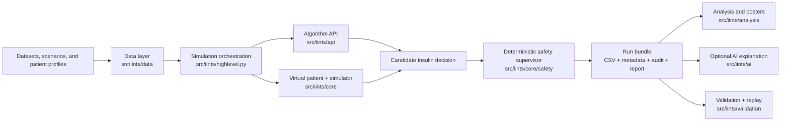
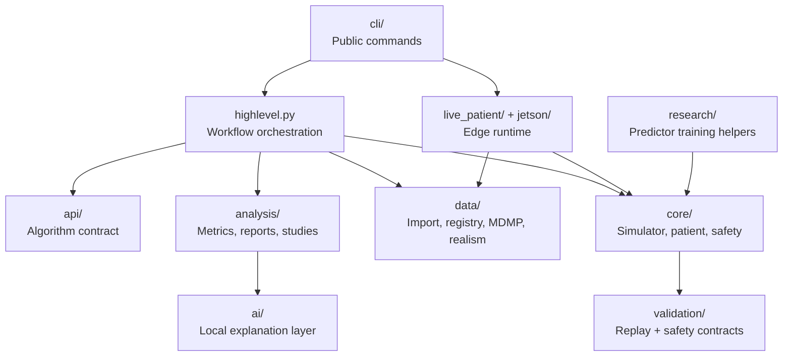
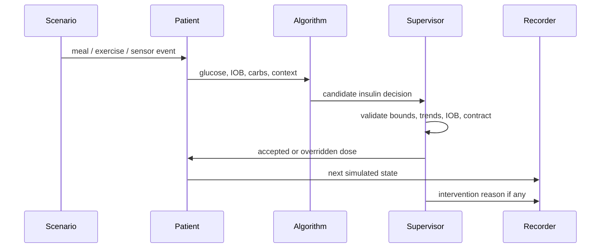
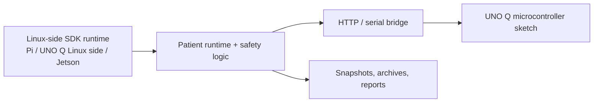

# Visual Architecture

This page gives code contributors the shortest possible map of how the IINTS-AF SDK fits together before they edit a subsystem.

## End-To-End Flow

The important design rule is that a candidate algorithm may propose insulin, but the deterministic safety supervisor remains a separate hard gate before outputs are accepted.

## Source Layout

## One Simulation Step

## Edge And Hardware Boundary

The microcontroller bridge is intentionally thin. The main simulation state, safety policy, replay data, and reporting stay on the Linux-side SDK runtime.

## Where To Edit What

| If You Need To Change | Start In |
| --- | --- |
| dose validation, safety limits, override reasons | `src/iints/core/safety/`, `src/iints/core/supervisor.py` |
| simulation timing, patient updates, event handling | `src/iints/core/simulator.py`, `src/iints/core/patient/` |
| algorithm plugin contract | `src/iints/api/` |
| command behavior or user-facing flows | `src/iints/cli/` |
| dataset imports, realism, certification | `src/iints/data/` |
| reports, posters, study summaries | `src/iints/analysis/` |
| Pi / UNO Q / Jetson runtime | `src/iints/live_patient/`, `src/iints/jetson/` |
| local AI summaries and guardrails | `src/iints/ai/` |

## Read Next

- [Developer Portal](DEVELOPER_PORTAL.md)
- [API Reference](API_REFERENCE.md)
- [Architecture Hardening Plan](ARCHITECTURE_HARDENING.md)
- [Architecture & Module Guide](COMPREHENSIVE_GUIDE.md)
- [Contribute Safely](CONTRIBUTING_SAFELY.md)
