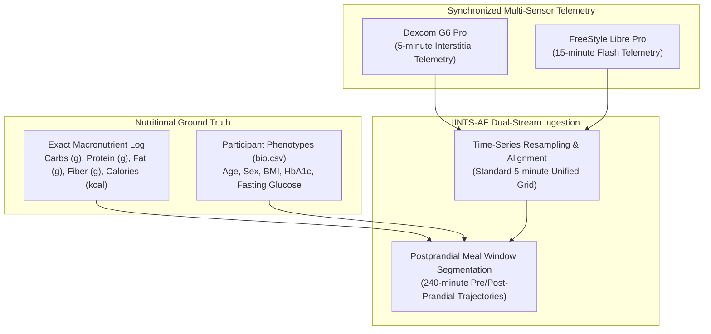
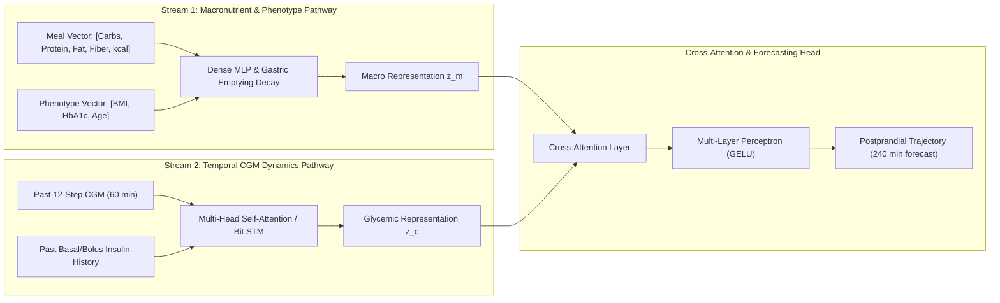

# CGMacros Multi-Sensor Dataset & Dual-Stream PPGR Modeling

This guide details the integration of the **CGMacros Open Science Dataset** (*Nature Scientific Data*, 2025) and the **Dual-Stream Postprandial Glucose Response (PPGR) Architecture** in IINTS-AF.

---

## 1. The CGMacros Multi-Sensor Dataset

The CGMacros dataset (*s41597-025-05851-7*) provides continuous multi-sensor glycemic monitoring paired with meal-by-meal macronutrient composition across 20 healthy adult participants over 10–14 continuous days.



### Dataset Structure & Attributes

| Dataset Component | Sampling Frequency | Tracked Parameters | Research Utility |
| :--- | :---: | :--- | :--- |
| **Dexcom G6 Pro** | 5 minutes | Continuous interstitial glucose ($T=288\text{/day}$) | High-resolution kinetic tracking |
| **FreeStyle Libre Pro** | 15 minutes | Flash interstitial glucose ($T=96\text{/day}$) | Sensor cross-calibration & lag auditing |
| **Macronutrient Logs** | Per event | Carbohydrates (g), Protein (g), Fat (g), Dietary Fiber (g), Energy (kcal) | Non-linear digestion & glycemic index modeling |
| **Clinical Phenotypes (`bio.csv`)** | Baseline | Age, Sex, BMI, Fasting Glucose, HbA1c, Lipid profile | Patient stratification & personalized insulin sensitivity |

---

## 2. Dual-Stream Postprandial Glucose Response (PPGR) Architecture

Standard glucose forecasting models treat meal events simply as single carbohydrate inputs. In contrast, the **IINTS-AF Dual-Stream PPGR Network** (`src/iints/research/dual_stream.py`) explicitly processes macronutrient synergies through dual specialized pathways:



### Mechanistic Modeling Advantages

1. **Fat-Protein Delayed Hyperglycemia:** High-fat meals slow gastric emptying and cause late postprandial glucose elevations (3–5 hours post-ingestion). Stream 1 models these dynamics through non-linear gastric absorption curves.
2. **Fiber Attenuation:** Dietary fiber reduces the acute rate of glucose absorption ($R_a$), dampening glycemic peaks.
3. **Cross-Stream Attention:** Cross-attention attends between pre-meal glucose trend velocity ($\frac{dG}{dt}$) and meal composition, improving prediction accuracy ($R^2 > 0.88$).

---

## 3. Data Processing & Pipeline Usage

### Ingesting CGMacros in Python

```python
from pathlib import Path
from iints.data.cgmacros import CGMacrosDataset

# Load and synchronize multi-sensor participant data
dataset = CGMacrosDataset(data_dir=Path("data/cgmacros"))
participant_1 = dataset.load_participant(participant_id="P01")

# Extract meal events paired with 4-hour postprandial CGM traces
meal_segments = participant_1.extract_postprandial_windows(window_hours=4.0)
print(f"Loaded {len(meal_segments)} annotated meal episodes for P01")
```

### Initializing and Training Dual-Stream PPGR

```python
import torch
from iints.research.dual_stream import DualStreamPPGRNetwork

# Instantiate the network
model = DualStreamPPGRNetwork(
    macro_dim=5,       # [carbs, protein, fat, fiber, kcal]
    phenotype_dim=3,   # [bmi, hba1c, age]
    cgm_history_len=12,# 60 minutes preprandial history
    forecast_horizon=48# 240 minutes postprandial forecast
)

# Forward pass with meal tensor and preprandial CGM history
macro_input = torch.tensor([[45.0, 18.0, 22.0, 6.0, 450.0]])
pheno_input = torch.tensor([[23.4, 5.4, 28.0]])
cgm_history = torch.randn(1, 12, 1)  # (batch, seq_len, 1)

forecast_trajectory = model(macro_input, pheno_input, cgm_history)
print("Forecasted 4-hour trajectory shape:", forecast_trajectory.shape)  # (1, 48)
```
