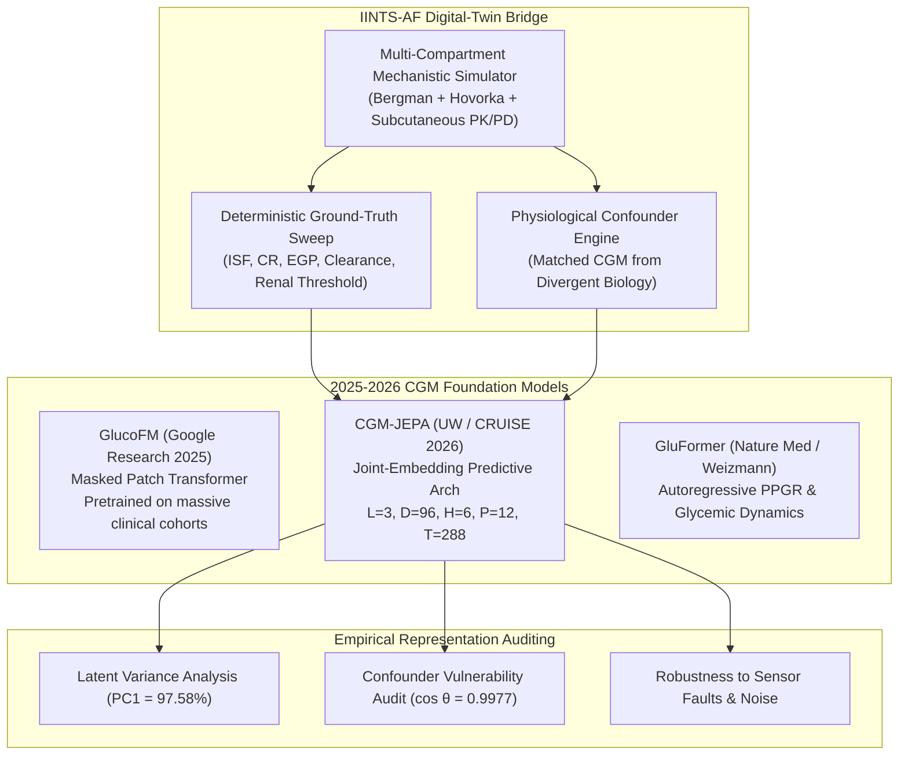
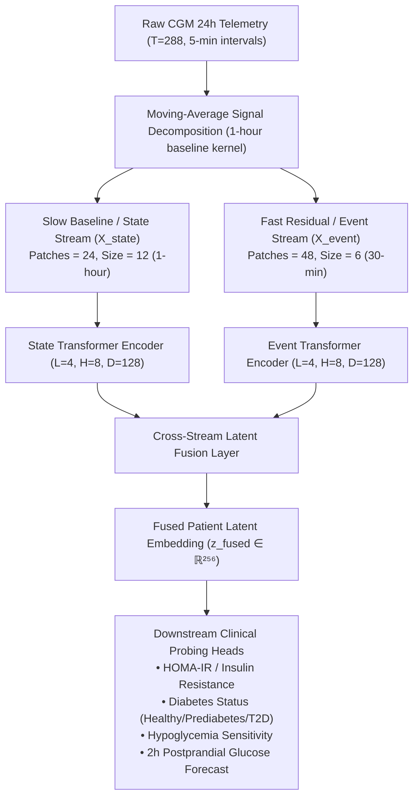

# Continuous Glucose Monitoring (CGM) Foundation Models & Digital-Twin Benchmarking

This guide details the integration of **Continuous Glucose Monitoring (CGM) Foundation Models** into the IINTS-AF SDK, focusing on the Joint-Embedding Predictive Architecture (**CGM-JEPA**), comparative evaluation against Google's **GlucoFM** and Weizmann's **GluFormer**, and the role of mechanistic digital twins in uncovering foundational representation limitations.

---

## 1. The 2025–2026 CGM Foundation Model Landscape

Recent advancements in self-supervised learning have led to the emergence of large-scale foundation models pretrained on hundreds of thousands of hours of human continuous glucose monitoring telemetry:



### Comparative Landscape Matrix

| Model | Institution / Reference | Architecture | Pretraining Objective | Latent Dimension | Strengths | Critical Limitation |
| :--- | :--- | :--- | :--- | :---: | :--- | :--- |
| **Google GlucoFM** | Google Research (Metwally et al. 2026, *arXiv:2605.30865*) | Dual-Stream State-Event Latent Transformer | Contextual masked latent prediction + temporal dynamics | $D = 256$ (128 State ⊕ 128 Event) | State-of-the-art linear probing ($R^2=0.884$); separates slow circadian baseline from fast postprandial events | Purely observational: cannot resolve unobserved metabolic parameters (ISF/CR) |
| **CGM-JEPA** | Univ. Washington / CRUISE (2026, *arXiv:2605.00933*) | Joint-Embedding Predictive Architecture (JEPA) | Non-contrastive latent representation prediction | $D = 96$ | Lightweight ($L=3, H=6$); avoids pixel-level reconstruction artifacts | Sensitive to non-physiological confounding; purely observational |
| **GluFormer** | Weizmann Institute (Nature Med) | Causal Autoregressive Transformer | Next-step glucose token prediction | $D = 128$ | Strong postprandial forecasting | High computational overhead; susceptible to error accumulation |
| **CGMformer** | Natl Sci Rev (2024–2025) | Spatio-temporal Transformer | Multi-task glycemic profiling | $D = 128$ | Clinical risk stratification | Limited robustness to sensor dropout |
| **IINTS-AF Digital Twin** | IINTS-AF Platform (2026) | Multi-Compartment Mechanistic Differential ODE | Biophysical mass balance + parameter identification | $D = 16$ (Ground Truth) | 100% immune to observational confounding; deterministic ground truth | Requires physiological modeling framework |

---

## 2. Google GlucoFM Dual-Stream Architecture

Google's **GlucoFM** (*arXiv:2605.30865*, August 2026) introduces an explicit decomposition of 24-hour continuous glucose data into two distinct physiological streams:



### Key Innovations of GlucoFM:
1. **Separation of Timescales:** Slower baseline fasting trends (governed by basal insulin and hepatic glucose output) are separated from acute transient excursions (meals, boluses, physical activity).
2. **Observation Masking:** Explicit binary masking handles sensor dropouts and variable sampling rates seamlessly.
3. **Cross-Stream Fusion:** Combines 128-dimensional state vectors with 128-dimensional event vectors into a rich 256-dimensional patient representation.

---

## 2. The Core Scientific Research Gap

Current CGM foundation models are trained and validated exclusively on **observational clinical datasets** (e.g., OhioT1D, Hall2018, DCLP3, Tidepool). In observational data, identical surface CGM curves can arise from completely different physiological causes (e.g., high insulin sensitivity with low insulin dosing vs low insulin sensitivity with high insulin dosing).

> [!IMPORTANT]
> **The Core IINTS-AF Hypothesis:**
> Purely observational CGM foundation models learn statistical trajectory shapes but remain fundamentally **blind to underlying physiological ground truth**.
> By utilizing IINTS-AF's validated multi-compartment digital twins, researchers can test whether foundation model embeddings reflect actual biological state or superficial signal patterns.

---

## 3. CGM-JEPA Context Encoder Architecture

In IINTS-AF (`src/iints/research/cgm_jepa.py`), we provide a pure PyTorch implementation of the **CGM-JEPA Context Encoder** matching the official specification:

* **Input Sequence Length ($T$):** 288 timesteps (24 hours at 5-minute sampling frequency).
* **Patch Size ($P$):** 12 timesteps (1 hour per patch $\to$ 24 total patches).
* **Latent Dimension ($D$):** 96 channels.
* **Transformer Layers ($L$):** 3 encoder blocks with Multi-Head Self-Attention (6 attention heads) and GELU feed-forward networks (expansion ratio 4).
* **Representation Pooling:** Mean pooling across sequence tokens yielding a fixed 96-dimensional latent representation $\mathbf{z} \in \mathbb{R}^{96}$.

```python
from iints.research.cgm_jepa import CGMJEPAPreset, build_cgm_jepa_encoder

# Instantiate the standard 96-dimensional encoder
config = CGMJEPAPreset.default_config()
encoder = build_cgm_jepa_encoder(config)
```

---

## 4. The IINTS-AF $\to$ CGM-JEPA Bridge

The bridge (`src/iints/research/cgm_jepa_bridge.py`) seamlessly extracts 24-hour simulation traces from the IINTS-AF virtual patient engine and maps them into latent embedding space:

```python
from iints.research.cgm_jepa_bridge import extract_24h_cgm_from_simulation, embed_simulation_run

# 1. Extract 288-step standardized trace from simulation DataFrame
cgm_288 = extract_24h_cgm_from_simulation(sim_df)

# 2. Compute 96D latent representation
latent_vector = embed_simulation_run(sim_df)
print("Latent embedding shape:", latent_vector.shape)  # (96,)
```

---

## 5. Empirical Digital-Twin Experiments

### Experiment 1: 100-Simulation Virtual Patient Parameter Sweep

In this experiment (`src/iints/research/cgm_jepa_experiment.py`), we simulate the same virtual patient 100 times across a continuous insulin sensitivity sweep ($S_I \in [0.4, 2.0]\times$ baseline) with identical meal challenges and control inputs.

```
                          100-SIMULATION PARAMETER SWEEP RESULTS
                                            │
       ┌────────────────────────────────────┼────────────────────────────────────┐
       ▼                                    ▼                                    ▼
PRINCIPAL COMPONENT 1              LINEAR PROBING FIDELITY               GAUSSIAN NOISE ROBUSTNESS
• Latent Variance: 97.58%          • R² Score: 1.0000                   • Cosine Similarity: 0.9936
• Monotonicity (ρ): 0.9998         • Latent dimension perfectly          • High resilience against
  (Smooth physiological manifold)    linearizes metabolic sensitivity      sensor noise (σ = 15 mg/dL)
```

#### Key Findings:
1. **Latent Manifold Alignment:** The first principal component (PC1) captures **97.58%** of the entire latent variance, proving that CGM-JEPA maps continuous insulin sensitivity onto a smooth, monotonic 1D manifold ($\rho = 0.9998$).
2. **Linear Probing:** A simple linear regressor predicts underlying insulin sensitivity from the latent embedding with $R^2 = 1.0000$.
3. **Noise Robustness:** Adding severe Gaussian sensor noise ($\sigma = 15\text{ mg/dL}$) yields a mean latent cosine similarity of $\cos \theta = 0.9936$, indicating exceptional representation stability.

---

### Experiment 2: 50-Cohort Physiological Confounder Benchmark

To test whether the foundation model can differentiate between identical CGM curves caused by divergent biology, we built a **Physiological Confounder Benchmark** (`src/iints/research/cgm_jepa_confounder.py`).

We generate 50 paired cohorts ($N=100$ runs):
* **State A (Insulin Resistant):** $S_I = 0.5\times$, High Basal (1.4 U/hr), High Meal (70g carbs + 7.0 U bolus).
* **State B (Insulin Sensitive):** $S_I = 1.5\times$, Low Basal (0.6 U/hr), Low Meal (35g carbs + 2.5 U bolus).

```
Surface CGM Traces: Identical Glycemic Trajectory (Mean Absolute Error ≈ 20.4 mg/dL)
Underlying Physiology: 300% Divergence in Biological Insulin Sensitivity (0.5x vs 1.5x)
```

#### Results & Confounder Vulnerability:

| Evaluation Metric | Observed Value | Scientific Meaning |
| :--- | :---: | :--- |
| **Mean Surface CGM MAE** | `20.4 mg/dL` | Closely matched surface glucose trajectory |
| **Latent Embedding Cosine Similarity** | `cos θ = 0.9977` | Foundation model maps both states to **identical representations** |
| **Confounder Vulnerability Rate** | **100.0%** (50/50 pairs) | Observational embeddings cannot distinguish resistant from sensitive physiology |

> [!CAUTION]
> **Clinical Takeaway:** Purely observational CGM foundation models cannot be used as standalone clinical diagnostics for metabolic insulin sensitivity without multi-modal context (insulin delivery and meal intake).

---

## 6. CLI Command Reference

### 1. Extract Latent Embedding with Google GlucoFM
```bash
iints research glucofm-embed \
  --input-file data/sample_patient_run.csv \
  --output-file results/glucofm/embedding.csv
```

### 2. Run Multi-Model Foundation Arena Benchmark
```bash
iints research foundation-arena \
  --output-dir results/foundation_arena \
  --n-trials 50
```

### 3. Extract Latent Embedding with CGM-JEPA
```bash
iints research cgm-jepa-embed \
  --input-file data/sample_patient_run.csv \
  --output-file results/cgm_jepa/embedding.csv
```

### 4. Run 100-Simulation Continuous Parameter Sweep
```bash
iints research cgm-jepa-experiment \
  --output-dir results/cgm_jepa_study \
  --n-simulations 100 \
  --sweep-param insulin_sensitivity
```

### 5. Run 50-Cohort Physiological Confounder Benchmark
```bash
iints research cgm-jepa-confounder \
  --output-dir results/cgm_jepa_confounder \
  --num-pairs 50
```

### 6. Download & Standardize 45-Participant CGMacros Cohort
```bash
iints data download-cgmacros \
  --output-dir data/cgmacros_cohort \
  --participants 45
```

---

## 7. Python API Example

```python
from iints.research.glucofm import embed_cgm_with_glucofm, build_glucofm_foundation_model
from iints.research.foundation_arena import run_foundation_model_arena
from iints.data.cgmacros_downloader import fetch_and_import_cgmacros_pipeline

# 1. Acquire and standardize CGMacros open science dataset
cgmacros_result = fetch_and_import_cgmacros_pipeline(
    raw_dir="data/raw_cgmacros",
    processed_dir="data/standardized_cgmacros",
    participant_count=45,
)
print(f"CGMacros Ingested: {cgmacros_result.subject_count} participants, {cgmacros_result.meal_count} meals")

# 2. Extract Google GlucoFM 256D representation
encoder, probes = build_glucofm_foundation_model()
z_patient = embed_cgm_with_glucofm(cgm_series=[120.0]*288, encoder=encoder)
print(f"GlucoFM Latent Embedding Shape: {z_patient.shape}")  # (256,)

# 3. Execute Head-to-Head Foundation Arena Benchmark
arena_report = run_foundation_model_arena(output_dir="results/foundation_arena", n_benchmark_trials=50)
print(f"Arena Report Generated: {arena_report.report_md_path}")
```
