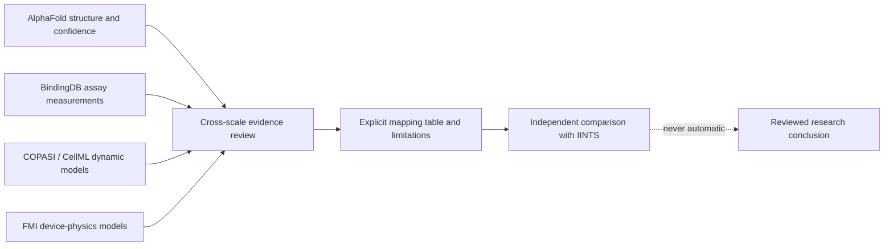

# Cross-scale Reference Labs

The Cross-scale Reference Labs place four independent evidence layers beside the IINTS digital patient:

1. **COPASI** for configured sensitivity analysis and parameter-estimation tasks
2. **CellML and OpenCOR** for independent model structure and standards validation
3. **FMI and FMPy** for reviewed pump, motor, fluid, occlusion, and sensor models
4. **BindingDB** for measured ligand-target affinity records beside AlphaFold structures

These tools improve scientific challenge and traceability. They do not make IINTS clinically validated, and they never change IINTS patient parameters automatically.

!!! danger "Research only"
    This workbench is not a medical device. It must not be used for insulin dosing, diagnosis, treatment, or control of a real pump. External models and database records can be incomplete, wrong, incompatible, or unsuitable for the research question.

## Why Four Separate Layers?



The layers answer different questions:

| Layer | Question it can support | What it cannot establish alone |
| --- | --- | --- |
| AlphaFold | What fold is predicted, and where is local confidence high or low? | binding affinity, signalling strength, PK/PD, disease severity |
| BindingDB | What affinity did a particular assay report for a ligand-target pair? | in-vivo efficacy, dose, patient response, equivalence of `Ki`, `Kd`, and `IC50` |
| COPASI / CellML | How do explicit equations evolve or respond to parameters? | clinical validity, identifiability from task presence, transferability to IINTS |
| FMI / FMPy | How does a reviewed device model evolve through a defined interface? | bench validation, hardware safety, permission to control a real device |

## Installation Matrix

Static inspection uses the normal SDK. Optional engines remain separate:

```bash
# SBML execution
python -m pip install -U "iints-sdk-python35[mechanistic]"

# FMU execution
python -m pip install -U "iints-sdk-python35[fmi]"
```

Install [COPASI](https://copasi.org/) and [OpenCOR](https://opencor.ws/) from their official projects. When the executables are not on `PATH`, set:

```bash
export COPASISE_EXECUTABLE=/absolute/path/to/CopasiSE
export OPENCOR_EXECUTABLE=/absolute/path/to/OpenCOR
```

Check all optional engines:

```bash
iints research copasi status
iints research cellml status
iints research fmi status
```

## COPASI Lab

### Scientific role

COPASI can perform sensitivity analysis, parameter estimation, parameter scans, optimisation, and related systems-biology tasks. IINTS does **not** manufacture a fitting objective or select parameters automatically. The researcher prepares the `.cps` file in COPASI and remains responsible for:

- measured-data provenance and subject splits
- observable-to-model mappings and units
- residual definition and weighting
- parameter bounds and initial values
- optimiser, random starts, seed handling, and convergence criteria
- structural and practical identifiability analysis

Sensitivity and identifiability are not synonyms. A parameter can influence an output locally yet remain poorly identifiable from available measurements. Conversely, a good fit can coexist with broad or correlated parameter uncertainty.

### Inspect without execution

```bash
iints research copasi inspect path/to/analysis.cps \
  --output-json results/copasi_inspection.json
```

The inspector records task names, methods, scheduling, model-update flags, report targets, external data-file references, model version metadata, warnings, and SHA-256.

### Run a configured task

```bash
iints research copasi run path/to/analysis.cps \
  --output-dir results/copasi \
  --timeout-seconds 900 \
  --allow-external-execution
```

Optionally override the scheduled task by exact name:

```bash
iints research copasi run path/to/analysis.cps \
  --task "Local sensitivities" \
  --output-dir results/copasi \
  --allow-external-execution
```

The run uses the official `CopasiSE` batch behaviour: only an already configured or explicitly selected task is executed. The source model is copied for provenance; logs, report, updated-output model, inspection, manifest, and reviewer notes remain in a timestamped directory.

!!! note "Identifiability claim gate"
    Do not describe a parameter as identifiable because COPASI returned one optimum. Report multi-start behaviour, confidence information, parameter correlations, profile likelihood or another justified identifiability method, and out-of-sample behaviour.

## CellML And OpenCOR Lab

### Scientific role

[CellML](https://www.cellml.org/) represents mathematical models with reusable components and explicit variable/units metadata. The [Physiome Model Repository](https://models.physiomeproject.org/cellml) provides public models, while OpenCOR can organise, validate, simulate, and analyse CellML models.

The current IINTS integration deliberately implements two bounded steps:

1. entity-safe, size-limited local CellML inspection
2. independent validation through OpenCOR's official `CellMLTools::validate` command

It does not silently download repository models, resolve imports, or map their variables into the IINTS simulator.

### Inspect and validate

```bash
iints research cellml inspect path/to/model.cellml \
  --output-json results/cellml_inspection.json

iints research cellml validate path/to/model.cellml \
  --output-dir results/cellml
```

Inspection records CellML version, components, variables, declared units, MathML blocks, connections, imports, warnings, and hash. OpenCOR validation writes its exact return code and output into a separate evidence bundle.

!!! warning "Validation boundary"
    A valid CellML document can still contain unsuitable equations, parameters, initial conditions, or population assumptions. An imported dependency can change independently. Pin and review every import before publication.

## FMI And FMPy Device-physics Lab

### Scientific role

The [Functional Mock-up Interface](https://fmi-standard.org/docs/3.0.2/) packages dynamic models as Functional Mock-up Units. A pump-focused FMU might expose:

- motor position, speed, current, and missed-step state
- plunger displacement and commanded volume
- tubing pressure, compliance, leakage, and flow
- occlusion onset, pressure rise, alarm state, and recovery
- sensor lag, drift, saturation, filtering, and dropout

IINTS can compare such outputs with software commands or simulated patient events, but the FMU stays a separate device-physics model until a reviewed coupling contract defines variables, units, sampling, timing, and failure semantics.

### Safe static inspection

```bash
iints research fmi inspect path/to/pump_model.fmu \
  --output-json results/fmu_inspection.json
```

The inspector treats the FMU as a ZIP/XML artifact. It checks archive paths, symbolic links, encryption, entry count, decompressed size, suspicious compression ratios, FMI version, interfaces, variables, platform binaries, source code, resources, and SHA-256. It does **not** extract or load executable binaries.

### Explicit trusted execution

```bash
iints research fmi run path/to/pump_model.fmu \
  --output-dir results/fmi \
  --start 0 \
  --end 60 \
  --output-interval 0.1 \
  --variable flow_ml_min \
  --variable pressure_kpa \
  --trust-native-code
```

!!! danger "Native-code boundary"
    FMI does not provide a security sandbox. An FMU may load native code and use operating-system resources. Execute only an exact, reviewed hash from a trusted publisher, preferably on an isolated research machine. Never run an untrusted FMU merely because static inspection succeeds.

FMPy writes finite named outputs, timing, engine version, trust declaration, model hash, CSV, inspection, manifest, and reviewer notes. Successful execution is not bench validation.

## BindingDB Affinity Lab

### Scientific role

[BindingDB](https://www.bindingdb.org/rwd/bind/BindingDBRESTfulAPI.jsp) provides experimental protein-ligand affinity records. This complements AlphaFold because predicted structure confidence is not a measured binding constant.

Query one reviewed UniProt target:

```bash
iints research binding query \
  --uniprot P06213 \
  --cutoff-nm 10000 \
  --max-records 5000 \
  --output-dir results/bindingdb
```

The connector uses a fixed HTTPS endpoint with normal certificate verification. It exports:

```text
bindingdb_accession_timestamp/
|-- binding_affinities.csv
|-- bindingdb_evidence.json
`-- BINDINGDB_REVIEW.md
```

Each row keeps the assay type, reported relation (`<`, `>`, `=`, or `~`), numeric value in the API's nM context, SMILES, BindingDB monomer ID, PMID, and DOI. Censored values such as `>10000` are not converted into exact measurements.

The JSON evidence preserves source text. The spreadsheet-oriented CSV escapes formula-like text prefixes so opening an external record in Excel or similar software cannot silently execute it as a formula.

### Interpretation rules

- `Kd` is an equilibrium dissociation measure.
- `Ki` is an inhibition constant under a defined model and assay.
- `IC50` is the assay concentration producing a specified half-maximal effect.
- assay construct, temperature, buffer, substrate, method, and curation can change interpretation.
- in-vitro affinity is not insulin sensitivity, absorption rate, efficacy, dose, or clinical outcome.

The API result is never translated into Hovorka/Bergman parameters or pump decisions.

## Desktop Workflow

Open **Biology & algorithm stressors → Cross-scale Reference Labs** in the Tauri desktop app. Each lab is collapsible so its inputs and safety boundary remain visible together.

- **Check all engines** reports optional engine availability.
- **COPASI** requires an explicit review checkbox before execution.
- **OpenCOR** separates inspection from validation.
- **FMI** requires an explicit native-code trust checkbox before execution.
- **BindingDB** writes read-only evidence over verified HTTPS.

The desktop shell does not reimplement scientific calculations. JavaScript collects the request, Rust validates bounds and consent, and the Python SDK remains the scientific source of truth.

## Evidence Bundle Checklist

For publication or academic review, preserve:

1. exact input artifact and SHA-256
2. source record, access date, licence, and redistribution conditions
3. engine name/version and full task configuration
4. units, initial conditions, solver, tolerances, bounds, and seeds
5. external dataset lineage and subject-split strategy
6. successful, failed, and rejected runs
7. explicit mapping tables between external variables and IINTS quantities
8. sensitivity, uncertainty, and identifiability evidence appropriate to the claim
9. limitations and no-treatment boundary

Continue with [Mechanistic Reference Model Lab](MECHANISTIC_REFERENCE_MODELS.md) for SBML/libRoadRunner and [Academic Research Workbench](ACADEMIC_RESEARCH_WORKBENCH.md) for RO-Crate-oriented run packaging.

## Primary References

- Hoops et al., *COPASI—a COmplex PAthway SImulator*, [Bioinformatics (2006)](https://doi.org/10.1093/bioinformatics/btl485).
- [COPASI command-line manual](https://copasi.org/Support/User_Manual/Model_Creation/Commandline_Version_and_Commandline_Options/) and [parameter-estimation manual](https://copasi.org/Support/User_Manual/Tasks/Parameter_Estimation/).
- Garny and Hunter, *OpenCOR: a modular and interoperable approach to computational biology*, [Frontiers in Bioengineering and Biotechnology (2015)](https://doi.org/10.3389/fbioe.2014.00079).
- [OpenCOR command-line interface](https://opencor.ws/user/userInterfaces/commandLineInterface.html) and [CellMLTools validation](https://opencor.ws/user/plugins/tools/cellmlTools.html).
- [FMI 3.0.2 specification](https://fmi-standard.org/docs/3.0.2/) and [FMPy documentation](https://fmpy.readthedocs.io/en/latest/).
- Gilson et al., *BindingDB in 2015*, [Nucleic Acids Research (2016)](https://doi.org/10.1093/nar/gkv1072), and the [BindingDB REST API](https://www.bindingdb.org/rwd/bind/BindingDBRESTfulAPI.jsp).
