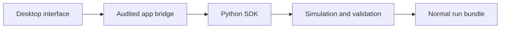

# Desktop App

The IINTS-AF desktop app is a graphical workbench for the same Python SDK used by the CLI. It helps users run curated workflows, inspect artifacts, certify data, use local AI review, and explore research evidence without memorising every command.

The app does not contain a second physiology or safety engine.



!!! warning "Scope"
    The desktop app is research software, not a medical device. It must not be used for dosing, diagnosis, treatment decisions, or real-time patient care.

## Install Or Download

Packaged beta downloads use the stable `desktop-beta-latest` release tag:

| Platform | Direct download |
| --- | --- |
| Windows | [IINTS-AF-Desktop-Beta-windows-x64.exe](https://github.com/python35/IINTS-SDK/releases/download/desktop-beta-latest/IINTS-AF-Desktop-Beta-windows-x64.exe) |
| macOS | [IINTS-AF-Desktop-Beta-macos.dmg](https://github.com/python35/IINTS-SDK/releases/download/desktop-beta-latest/IINTS-AF-Desktop-Beta-macos.dmg) |
| Linux | [IINTS-AF-Desktop-Beta-linux-x64](https://github.com/python35/IINTS-SDK/releases/download/desktop-beta-latest/IINTS-AF-Desktop-Beta-linux-x64) |

For platform-specific startup and security guidance, use [Desktop App Installation](APP_INSTALL.md).

For a Python installation:

```bash
python -m pip install --upgrade "iints-sdk-python35[desktop-all]"
iints-desktop
```

The `desktop-all` extra installs PySide6, reports, MDMP, research/AI libraries, edge/serial support, libRoadRunner, and FMPy. Packaged `.exe`, `.dmg`, and Linux builds contain the supported Python-side runtime already; do not install PySide6 or these libraries into a packaged app.

COPASI, OpenCOR, and Ollama are separate system applications. Their connectors, validation boundaries, and readiness checks ship with the app, but their binaries and model files are not silently downloaded. This keeps licences, native-code trust, model size, and reproducibility decisions visible to the researcher.

## Workbench Areas

| Area | Purpose | Output or effect |
| --- | --- | --- |
| Simulation | choose a curated protocol, output folder, and seed | normal SDK run bundle |
| Results | open a run CSV, graph glucose, and inspect a bounded table preview | read-only review of generated artifacts |
| Reproducibility | create RO-Crate metadata, checksums, a source snapshot, and an academic audit | local FAIR-oriented package beside the run |
| AI Review | start/check local Ollama and ask about a loaded result | non-authoritative review text |
| Run Archive | find recent local runs and reopen their artifacts | local history index |
| Data/MDMP | apply an explicit certification contract to a CSV | certification and validation artifacts |
| Biology/Research | view structures and run independent SBML, COPASI, CellML, FMI, and BindingDB workflows | explanatory, mechanistic, device-physics, and assay-evidence artifacts |
| Methods/Updates | inspect versions, diagnostics, logs, and update routes | transparent maintenance output |

The exact tab names can differ between the current Qt beta and the newer Tauri prototype. Both must call SDK functions or the fixed bridge rather than reimplementing formulas in the interface.

## Run A Workflow

1. Select an output workspace you can find again.
2. Select a protocol and read its patient, scenario, duration, and expected output.
3. Set or record the seed.
4. Start the run and keep the execution log.
5. Open the Results area only after the run reports completion or a recorded failure.
6. Inspect the CSV, metadata, report, and safety events together.

Curated protocols include baseline, meal stress, delayed absorption, clinical discussion, jury, and public-demo routes. They are starting points, not claims that every virtual trajectory is clinically representative.

## Results Viewer

The results viewer can load `results.csv`, calculate a compact preview, render a glucose graph, and show selected rows. Use it for orientation.

For formal analysis, use the generated report and study tools. The viewer must not silently change thresholds, columns, missing-data handling, or time intervals.

Read [Understand A Run](RUN_OUTPUTS.md) before comparing two runs.

## Local AI Review

When Ollama is installed, the app can:

- start or connect to the local server
- list installed models
- prepare a selected local model
- ask a research question about a compact result summary

The app should show model name, backend status, and the evidence supplied to the model. AI responses are formatted for readability, but bullets and confident wording do not make them authoritative.

Use local AI only after deterministic metrics and certification checks. See [AI Assistant](AI_ASSISTANT.md).

## Data Certification

The app can create MDMP certification artifacts for selected CSV files. The user still chooses the contract and reviews the grade details.

A certificate means the recorded checks completed under that contract. It does not certify a medical device, establish clinical safety, or make a dataset unbiased.

See [Certification Quickstart](MDMP_QUICKSTART.md).

## Academic Reproducibility Package

After loading a completed run CSV, use **Create Academic Package**. The app runs the same exporter as:

```bash
iints research academic-bundle path/to/completed_run
```

The output records checksums, run/software metadata, selected references, and unresolved review checks. It stays local and never uploads the run. A `ready` result means the implemented metadata checklist passed; it does not establish scientific validity, privacy clearance, or clinical safety.

The artifact licence starts as `NOASSERTION`. Do not replace it with the SDK's Apache-2.0 code licence unless that licence genuinely applies to every exported artifact.

Read [Academic Research Workbench](ACADEMIC_RESEARCH_WORKBENCH.md) for the artifact definitions and publication workflow.

## Biology And Evidence Tools

The research area can display or open explanatory evidence such as:

- AlphaFold structures and PAE confidence views
- STRING or Reactome pathway context
- GTEx or Human Protein Atlas expression context
- ClinVar or Ensembl variant information
- ChEMBL, RCSB PDB, UniProt, and Open Targets records
- genomics and tissue-resistance stress-test outputs

These resources help investigate biological assumptions. They do not automatically calibrate the virtual patient and never enter dosing or safety logic.

Each evidence card identifies its integration maturity. **Portal** means the app only opens an official site; **planned** means no functioning import exists yet. AlphaFold pLDDT and PAE remain structural-confidence measures and are never translated automatically into mutation severity or physiological parameters.

The Tauri shell opens approved external evidence sites in the system browser through an allowlist. It does not embed arbitrary remote pages.

### Mechanistic Reference Model Lab

The Tauri workbench can safely inspect a local SBML file without executing it. When the optional `mechanistic` extra is installed, the same panel can run that external model independently through libRoadRunner and write a CSV, model summary, provenance manifest, and review report.

This workflow complements AlphaFold: structure is inspected separately from dynamic equations. It does not convert external units to mg/dL or minutes, does not replace the Python patient models, and never tunes patient parameters automatically. Read [Mechanistic Reference Models](MECHANISTIC_REFERENCE_MODELS.md) before interpreting cross-model plots.

### Cross-scale Reference Labs

The Tauri workbench also exposes four collapsible labs:

- COPASI task inspection and explicitly confirmed CopasiSE execution
- CellML inspection and OpenCOR standards validation
- safe FMU archive inspection and explicitly trusted FMPy execution
- read-only BindingDB affinity evidence by UniProt accession

COPASI and FMI execution require separate review confirmations. Rust validates the request boundary, while the Python SDK remains the source of scientific logic and provenance artifacts. FMI execution can load native code and must be limited to a reviewed model hash from a trusted publisher.

Read [Cross-scale Reference Labs](CROSS_SCALE_REFERENCE_LABS.md) before using these workflows.

## Updates And Logs

The app exposes version checks, the latest download route, and the Python SDK updater. Before updating an environment used for a paper or benchmark:

1. record the current SDK and app versions
2. archive the environment or dependency lock
3. finish or freeze active studies
4. use a dry run where available
5. repeat smoke and reproducibility checks after updating

Read [Update The SDK](UPDATING.md).

## Desktop Implementations

| Implementation | Status | Role |
| --- | --- | --- |
| PySide6/Qt | current rich Python workbench | main results, AI, and research UI |
| Cocoa | compact macOS packaging fallback | reliable native beta shell |
| Tauri + Rust | next-generation prototype | smaller audited native boundary around the Python SDK |
| Tkinter | compatibility fallback | minimal launcher when Qt is unavailable |

For implementation and security details, see [Tauri Desktop Shell](TAURI_DESKTOP.md), [Desktop Signing](DESKTOP_SIGNING.md), and [Developer Portal](DEVELOPER_PORTAL.md).

## When To Use The CLI Instead

Prefer the CLI for:

- scripted or batch studies
- CI and reproducibility checks
- long-running Jetson training
- exact command capture for a paper
- advanced options not exposed by the workbench

The desktop app and CLI should produce compatible SDK artifacts. If they disagree, treat that as a bug and preserve both logs.
