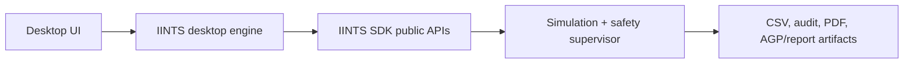

# IINTS-AF Desktop App

IINTS-AF started as a command-line SDK because researchers need reproducible commands, logs, and scripts. The desktop app is a friendlier shell around the same SDK engine for demos, education, and non-technical review sessions.

The desktop app does not replace the SDK. It calls the same simulation/reporting code that the CLI uses.


## Installation

For normal users, install the desktop app from PyPI with the Qt desktop extra:

```bash
python -m pip install -U "iints-sdk-python35[full,desktop-qt,mdmp]"
iints-desktop
```

For the newest app code from GitHub:

```bash
git clone https://github.com/python35/IINTS-SDK.git
cd IINTS-SDK
python -m pip install -U -e ".[full,desktop-qt,mdmp]"
iints-desktop
```

See [Desktop App Install](APP_INSTALL.md) for the app install and download guide.

## Design Goal



The UI is intentionally thin:

- no medical formulas in the app layer
- no duplicate safety logic
- no hidden AI authority
- all outputs remain normal SDK artifacts
- CLI workflows remain available for reproducibility

## Workbench Layout

The Qt application is intentionally styled as a compact scientific workstation rather than a marketing dashboard. It uses a conventional menu bar, a small core-action toolbar, tabbed work areas, resizable split panes, and a persistent status bar.

The goal is fast orientation during a demo or research session:

- `Simulation` keeps the selected protocol, output workspace, actions, and execution log visible together
- `Results` places the glucose trajectory beside metrics and the bounded data preview
- `AI Review` places the research question beside the local model response
- `Run Archive` keeps prior artifacts searchable without turning the main workspace into a file browser
- `Biology` remains an optional explanatory visual layer, separate from all deterministic computation

This approach takes inspiration from the information-dense, tool-and-status oriented patterns used by scientific desktop software such as ImageJ, JASP, and PyMOL. It deliberately avoids a second simulation engine or a hidden web application layer.


## Responsive Layout

The Qt workbench is designed to stay usable on smaller laptop screens and split-screen windows. At narrow widths, the main split panes automatically switch from side-by-side to stacked panels, while each tab provides scrolling instead of clipping controls. Button groups are arranged in compact grids so action buttons remain visible without overlapping text.

The supported compact baseline is approximately `760x520` pixels. This is intentionally small enough for demos on projectors, university meeting-room screens, or a MacBook window beside notes.

## What Exists Now

The desktop companion app has two UI shells that share the same engine:

- `src/iints_desktop/app.py`
- `src/iints_desktop/qt_app.py`
- `src/iints_desktop/launcher.py`
- `src/iints_desktop/engine.py`

It currently provides:

- a lightweight Tkinter desktop window through `iints-desktop-tk`
- a more polished PySide6/Qt desktop window through `iints-desktop-qt`
- a smart `iints-desktop` launcher that prefers PySide6/Qt and falls back to Tkinter
- output-folder selection
- curated demo workflows for doctors, EUCYS-style review, public booths, delayed absorption, and baseline verification
- seed selection for reproducible runs
- remembered output folder, seed, and selected workflow in the Qt app
- generated CSV/report/audit artifacts through the normal SDK engine
- buttons to open the output folder, generated PDF report, and results CSV
- an in-app Results tab that loads generated CSV files, summarizes glucose metrics, previews table rows, and renders a glucose graph
- an in-app Local AI tab that can start a local Ollama server, prepare the selected Mistral/Ministral model, and answer research-only questions about the SDK or the loaded result summary
- a Biology / AlphaFold deep-dive tab with bundled insulin and glucagon structures
- one-click biology evidence actions for GTEx, ChEMBL, ClinVar, and STRING
- an offline interactive 3D protein-chain viewer: drag to rotate, scroll to zoom, and double-click to reset
- a run-history table in the Qt app for recent desktop outputs, including seed values
- a one-click action to load a previous run's CSV from history into the Results tab
- selected-run actions for opening a previous output folder, PDF report, or results CSV
- workflow descriptions that state audience, scenario, expected outputs, and research scope
- copy buttons for the last run summary
- a save-log button for debugging or sharing a desktop run transcript
- a small run log that explains which workflow/preset is being executed
- an explicit research-only / not-a-medical-device disclaimer

## Desktop Workflows

The app deliberately exposes a small set of understandable workflows instead of the full CLI surface:

| Workflow | SDK preset | Best for |
| --- | --- | --- |
| Doctor safety discussion | `hypo_prone_night` | a calm clinical feedback discussion about safety checks and uncertainty |
| EUCYS experiment run | `stress_test_meal` | a science-jury story: disturbance, response, safety interpretation |
| Booth / public demo | `quickstart_meal` | fast explanation of the digital-patient idea |
| Pizza / delayed absorption | `pizza_paradox` | showing why glucose prediction is difficult |
| Reference baseline day | `baseline_t1d` | verifying installation, reports, and artifact generation |

The desktop app presents protocol facts and expected outputs rather than presentation scripts. Presenter-specific material remains a separate documentation concern, not part of the normal research workflow.

## Results Viewer

The PySide6 app includes a `Results` tab for inspecting SDK outputs without leaving the desktop app.

It can:

- load a generated `results.csv`
- show summary metrics such as mean glucose, min/max glucose, time in range, total carbs, and total insulin
- render a quick glucose graph inside the app
- preview the first bounded rows of the CSV in a table
- open the CSV or generated graph PNG externally when needed

The graph is intentionally a review preview, not a clinical report. Publication-style AGP/PDF exports still come from the SDK reporting engine.

## Local AI Mode

The PySide6 app includes a `Local AI` tab for local Ollama/Mistral questions. The app now has a `Start Local AI` button: when the Ollama binary is installed locally, the desktop app can start the Ollama server, wait for the local API, and prepare the selected model. If the model is missing, the app attempts to download it in the background.

The intended use is:

- click `Start Local AI` in the app
- wait while Ollama starts and the selected model is checked or downloaded
- load a result CSV in the Results tab
- ask questions such as "explain this run", "find realism issues", or "write a doctor-facing research summary"

The one thing the beta app does not silently install is Ollama itself. Users still need Ollama installed once on the machine; after that, the app manages starting it and preparing the model.

The desktop AI mode sends only a compact result summary by default, not the full raw CSV. It is guarded by a research-only system prompt:

- no diagnosis
- no insulin dosing
- no treatment advice
- explicit uncertainty and limitation language
- critical review of simulation realism and data quality

The AI is a review assistant. It is not part of the simulator, safety supervisor, or medical decision logic.

## Biology / AlphaFold Deep Dive

The PySide6 app includes a `Biology` tab that bundles two AlphaFold structures:

| Molecule | UniProt | SDK Link |
| --- | --- | --- |
| Insulin | `P01308` | insulin-on-board, subcutaneous PK/PD delay, Hovorka/Bergman insulin action |
| Glucagon | `P01275` | hypoglycemia defense, hepatic glucose production, dual-hormone research demos |

This tab is intentionally explanatory. The structures are not used as live simulation inputs, dosing logic, or clinical evidence. Their purpose is to make the biological motivation visible:

- insulin delay is not just a software delay; it abstracts physical absorption and receptor-level biology
- glucagon rescue is not just a safety flag; it connects to a real counter-regulatory hormone pathway
- future assets such as GLUT4 can explain exercise/NIMGU behavior in the same visual style

The app keeps this separation clear: structural biology supports explanation, while deterministic model formulas remain in the SDK engine.

### Interactive 3D Viewer

The main viewer renders the C-alpha protein backbone from the packaged mmCIF structure locally. It does not need a browser, an internet connection, or a cloud viewer, which keeps it reliable for an offline demo or a PyInstaller build.

- drag with the left mouse button to rotate the chain
- use the mouse wheel to zoom
- double-click to reset the camera
- colours use the AlphaFold pLDDT confidence palette; these are structure-prediction confidence values, not physiological or clinical scores

The compact C-alpha representation is a presentation and education view. It is deliberately separated from the deterministic simulation engine and never enters a dosing, safety, or treatment path.

### Interactive PAE Heatmaps

The Biology tab can also generate an interactive AlphaFold Predicted Aligned Error (PAE) heatmap for the selected molecule. The desktop app calls the SDK structural-biology helper and loads the generated Plotly HTML file inside the app when Qt WebEngine is available. In headless or minimal builds it falls back to opening the same file in the system browser:

```text
results/structural/<target>_pae.html
```

PAE is a structure-prediction confidence view: dark green cells indicate lower predicted relative-position error between residue positions, while pale/white cells indicate higher uncertainty. It is useful for explaining which parts of a predicted protein structure are relatively stable or flexible.

This remains explanatory only:

- PAE values do not enter the simulator, glucose model, safety supervisor, AI controller, or report scoring
- the first generation needs internet access to fetch the AlphaFold PAE JSON
- generated HTML files are local artifacts and can be reopened from the app
- `plotly` is included in the Qt desktop extra so beta desktop builds can create the heatmaps


### Biology Evidence Actions

The Biology tab also exposes app buttons for the newer public-database helpers:

| Button | SDK helper | Output/use |
| --- | --- | --- |
| `Render GTEx Expression` | `iints render-expression --gene GLUT4` | interactive tissue-expression HTML under `results/structural/` |
| `Analyze Insulin PK` | `iints analyze-insulin --drug lispro` | deterministic SDK insulin absorption mapping with public ChEMBL context |
| `Simulate ClinVar Mutation` | `iints simulate-mutation --gene INSR` | public ClinVar summaries plus curated simulator stress-test mapping |
| `Render STRING Pathways` | `iints render-pathways --network all` | pathway PNG files under `results/structural/` |

These actions may need internet access on first run. They are evidence/context actions only; they do not change a running simulation or produce treatment advice.

### In-App Updates

The desktop app includes an update panel in the Methods tab. It can open the latest app download page, open the update documentation, copy the Python SDK update command, and run the Python package update command for Python-based installs.

Packaged `.exe`/`.dmg` app updates still require downloading the newest app build, because fully silent self-updating needs code signing and platform-specific installer infrastructure.

## Run History

The Qt app stores lightweight run history in the selected output folder:

```text
.iints-desktop-history.jsonl
```

This file contains timestamps, workflow names, preset names, seeds, run IDs, and local artifact paths. It does not replace the full SDK audit artifacts; it only helps the desktop app find recent outputs.

## Install For Local Use

From a development checkout:

```bash
python -m pip install -U -e ".[full,desktop-qt,mdmp]"
iints-desktop
```

To force the PySide6/Qt app:

```bash
iints-desktop-qt
```

To force the lightweight Tkinter fallback:

```bash
iints-desktop-tk
```

If your Python installation does not include Tk support, install the OS Tk package first.

On macOS with python.org Python, Tk is usually included. On Linux you may need something like:

```bash
sudo apt install python3-tk
```


## Beta Downloads From GitHub

The repository includes a `Desktop Beta Builds` GitHub Actions workflow that builds downloadable native app bundles for the three main desktop platforms. It is intended for beta distribution, demos, and feedback sessions before a fully signed/stable desktop release.

Latest app beta release: [https://github.com/python35/IINTS-SDK/releases/tag/desktop-beta-2026-06-27-3](https://github.com/python35/IINTS-SDK/releases/tag/desktop-beta-2026-06-27-3)

Generated release assets:

| Platform | Download asset | What it contains |
| --- | --- | --- |
| Windows | [IINTS-AF-Desktop-Beta-windows-x64.exe](https://github.com/python35/IINTS-SDK/releases/download/desktop-beta-2026-06-27-3/IINTS-AF-Desktop-Beta-windows-x64.exe) | a direct Windows executable |
| macOS | [IINTS-AF-Desktop-Beta-macos.dmg](https://github.com/python35/IINTS-SDK/releases/download/desktop-beta-2026-06-27-3/IINTS-AF-Desktop-Beta-macos.dmg) | a macOS disk image containing the app |
| Linux | [IINTS-AF-Desktop-Beta-linux-x64](https://github.com/python35/IINTS-SDK/releases/download/desktop-beta-2026-06-27-3/IINTS-AF-Desktop-Beta-linux-x64) | a direct Linux executable |

Each download is published with a matching `.sha256` checksum file.

### Create A Desktop Beta Release

In GitHub:

1. Open `Actions`.
2. Choose `Desktop Beta Builds`.
3. Click `Run workflow`.
4. Keep `release_tag` as `desktop-beta` for an overwriteable beta, or use a dated tag such as `desktop-beta-2026-06-26`.
5. Keep `draft` enabled if you want to inspect artifacts before publishing.

The workflow can also publish automatically when a tag matching `desktop-beta*` is pushed.

### Install The Beta

Windows:

```text
Download IINTS-AF-Desktop-Beta-windows-x64.exe
Open the downloaded executable
```

macOS:

```text
Download IINTS-AF-Desktop-Beta-macos.dmg
Open the disk image
Open the IINTS-AF Desktop app
```

Linux:

```bash
Download IINTS-AF-Desktop-Beta-linux-x64
chmod +x IINTS-AF-Desktop-Beta-linux-x64
./IINTS-AF-Desktop-Beta-linux-x64
```

Beta caveats:

- Windows and macOS builds may show operating-system security warnings until the project has code-signing certificates.
- The desktop app is research-only and not a medical device.
- The app is a GUI wrapper around the SDK engine; reproducible CLI workflows remain the source of truth.
- Local AI review can start and prepare Ollama when Ollama is installed locally; first-time model download may take a while.

## Build A Desktop Binary

Install the desktop build extra:

```bash
python -m pip install -U -e ".[full,desktop-qt,mdmp]"
```

Then build the preferred PySide6/Qt app:

```bash
python tools/desktop/build_qt_desktop_app.py
```

The output is written by PyInstaller into `dist/`.

Platform expectations:

| Platform | Typical Output |
| --- | --- |
| Windows | `.exe` |
| macOS | `.app`-style bundle or executable depending on PyInstaller mode |
| Linux | executable; AppImage can be added later |

For debugging, keep the console visible:

```bash
python tools/desktop/build_qt_desktop_app.py --console
```

For a folder bundle instead of a single-file executable:

```bash
python tools/desktop/build_qt_desktop_app.py --onedir
```

## Smoke Test

The Qt app can be smoke-tested without opening a visible window. The smoke path also resizes the workbench down to the compact baseline and back up, so responsive layout regressions are caught early:

```bash
python tools/desktop/smoke_qt_desktop_app.py
```

This is useful for CI and for checking whether PySide6, the desktop launcher, and the workflow list still load correctly.

The Qt entry point also supports a direct smoke mode:

```bash
QT_QPA_PLATFORM=offscreen iints-desktop-qt --smoke
```

After building the default single-file Linux bundle, the generated executable can be checked the same way:

```bash
QT_QPA_PLATFORM=offscreen dist/IINTS-AF-Desktop-Qt --smoke
```

## Why Not Rewrite The SDK In Another Language?

The scientific value is already in the Python SDK:

- patient models
- safety supervisor
- deterministic formula registry
- real-data adapters
- report generation
- AI/predictor training tools
- validation and replay

Rewriting those in another language would create two engines that can disagree. The safer architecture is:

- keep Python as the research engine
- package it inside a desktop app
- expose friendly workflows through the UI
- only move UI code to another native toolkit if needed later

## Toolkit Options

The current recommendation is to ship the first app with Python + Tkinter + PyInstaller, then move to a richer shell only after the workflows feel stable.

| Option | Strength | Tradeoff | Recommendation |
| --- | --- | --- | --- |
| Tkinter + PyInstaller | already works with the SDK, small dependency footprint, easy `.exe`/macOS/Linux builds | visually simple | best first production companion app |
| PySide6 / Qt | much more polished native UI, good tables/previews, still Python-native | heavier dependency and packaging size | best v2 if the app becomes central |
| Tauri + Rust | small installers, strong updater story, modern UI shell | uses a webview and needs Python sidecar/IPC | strong later option, but more architecture work |
| Electron | easiest modern UI ecosystem | heavy and feels like a web app | not ideal for this project goal |
| SwiftUI / WinUI / .NET MAUI | very native per platform | hard to keep one cross-platform codebase around the Python SDK | only if targeting one platform seriously |
| Rust egui / Slint | fast, compact, real app feel | requires IPC bridge to Python engine | interesting later, not fastest now |

The key architecture rule is: the UI can change language, but the scientific engine should remain one source of truth.

The PySide6 app is the preferred candidate for a more serious native interface because it can later support:

- report thumbnails and AGP previews
- tables for run history and dataset manifests
- richer progress indicators for long training jobs
- better layout control for clinical/research review screens
- a more professional presentation feel than Tkinter

## Future UI Roadmap

Recommended next steps:

1. Add PDF/AGP page thumbnails inside the app.
2. Add a dataset import wizard.
3. Add Jetson/edge training status panels.
4. Add a release-ready installer/update flow per operating system.
5. Add a background job queue for long training/runs.
6. Add signed installers for Windows/macOS.
7. Add an AppImage or Flatpak path for Linux.
8. Promote the PySide6/Qt app to the default once the workflow UI is stable.

## Safety Boundary

The desktop app is research-only. It must not be used for insulin dosing, diagnosis, treatment decisions, or real-time patient care.

The app should never calculate medical decisions itself. It should call SDK APIs and display SDK artifacts.
