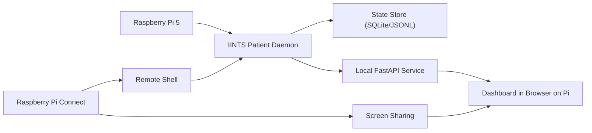

# Edge Hardware Profiles

IINTS supports two installation styles:

- a `full` workstation install for laptops and desktops
- a lighter `edge` install for always-on single-board computers and hybrid Linux boards

This page is the public support matrix for those edge targets.

## SBC Support Matrix

<table class="support-table">
  <thead>
    <tr>
      <th>Board</th>
      <th>Category</th>
      <th>Status</th>
      <th>Best fit</th>
      <th>Notes</th>
    </tr>
  </thead>
  <tbody>
    <tr>
      <td><code>Raspberry Pi 5 (8 GB)</code></td>
      <td>Desktop-class SBC</td>
      <td><span class="support-chip official">Officially Supported</span></td>
      <td>Expo rig, classroom demo, persistent digital patient</td>
      <td>Best balance of RAM, thermals, and Raspberry Pi Connect usability.</td>
    </tr>
    <tr>
      <td><code>Raspberry Pi 5 (16 GB)</code></td>
      <td>Desktop-class SBC</td>
      <td><span class="support-chip official">Officially Supported</span></td>
      <td>Heavier edge studies, optional local AI</td>
      <td>Extra headroom for long runs and model experiments.</td>
    </tr>
    <tr>
      <td><code>Raspberry Pi 5 (4 GB)</code></td>
      <td>Desktop-class SBC</td>
      <td><span class="support-chip supported">Supported, Not Official</span></td>
      <td>Lighter live runtime</td>
      <td>Works best with the <code>edge</code> profile and without full reporting.</td>
    </tr>
    <tr>
      <td><code>Arduino UNO Q (4 GB)</code></td>
      <td>Hybrid Linux + MCU board</td>
      <td><span class="support-chip supported">Supported, Not Official</span></td>
      <td>Hybrid Linux + MCU demo rig</td>
      <td>Strong phase-2 target because the STM32 side can drive LEDs and buzzers.</td>
    </tr>
    <tr>
      <td><code>Arduino UNO Q (2 GB)</code></td>
      <td>Hybrid Linux + MCU board</td>
      <td><span class="support-chip experimental">Experimental Only</span></td>
      <td>Minimal runtime experiments</td>
      <td>Too tight for a polished public baseline.</td>
    </tr>
    <tr>
      <td><code>Raspberry Pi Zero 2 W</code></td>
      <td>Compact SBC</td>
      <td><span class="support-chip unsupported">Not Supported</span></td>
      <td>None</td>
      <td>Memory budget is too small for a reliable IINTS edge runtime.</td>
    </tr>
    <tr>
      <td><code>Arduino UNO R4 / classic UNO</code></td>
      <td>Microcontroller board</td>
      <td><span class="support-chip unsupported">Not Supported</span></td>
      <td>None</td>
      <td>No Linux/Python runtime for the full SDK.</td>
    </tr>
  </tbody>
</table>

Status meanings:

<div class="support-legend">
  <div class="support-legend-item"><span class="support-chip official">Officially Supported</span><br />Recommended in the docs and safe to promise publicly.</div>
  <div class="support-legend-item"><span class="support-chip supported">Supported, Not Official</span><br />Expected to work, but not the primary public target.</div>
  <div class="support-legend-item"><span class="support-chip experimental">Experimental Only</span><br />Useful for internal R&amp;D, not for public commitments.</div>
  <div class="support-legend-item"><span class="support-chip unsupported">Not Supported</span><br />Do not advertise this as a full-SDK target.</div>
</div>

## Edge Architecture

This is the system story we want users to understand when they open the docs site:



What the pieces do:

- `IINTS Patient Daemon`: advances the virtual patient and algorithm state.
- `State Store`: keeps persistent runtime state for status, replay, and audit.
- `Local FastAPI Service`: exposes the live API and control surface.
- `Dashboard in Browser on Pi`: gives the live glucose view on the device itself.
- `Raspberry Pi Connect`: lets you present and control the Pi from a laptop without extra SSH/VNC setup.

## Install Profiles

### Full workstation install

Use this on laptops or desktops where you want the whole SDK:

```bash
python3 -m venv .venv
source .venv/bin/activate
python -m pip install -U pip
python -m pip install -U "iints-sdk-python35[full,mdmp]"
```

This includes:

- simulator
- certification
- AI review
- plotting
- PDF reporting
- posters
- CareLink visual workbench

### Edge install

Use this on Raspberry Pi or Linux-capable edge boards where the live patient runtime matters most:

```bash
python3 -m venv .venv
source .venv/bin/activate
python -m pip install -U pip
python -m pip install -U "iints-sdk-python35[edge,mdmp]"
```

This profile is designed around:

- core simulator
- SQLite state store
- FastAPI dashboard
- CLI control
- optional local AI review if Ollama is present

It intentionally avoids the heavier reporting stack by default.

## One-Line Edge Workflow

The new edge namespace ties the SBC story together:

```bash
iints edge setup --output-dir iints_edge_demo --board raspberry_pi
cd iints_edge_demo
./run_edge_patient.sh
iints edge status --workspace patient_runtime
iints edge bundle --workspace patient_runtime --output results/edge_runtime_bundle.zip
```

That gives you:

- a generated edge project scaffold
- a persistent patient runtime
- a kiosk-ready dashboard
- a ZIP bundle you can move back to a laptop for deeper analysis

## Raspberry Pi

Recommended public setup:

- `Raspberry Pi 5`
- `8 GB` RAM
- active cooling
- Raspberry Pi OS Desktop
- Raspberry Pi Connect

Typical live runtime flow:

```bash
iints patient start \
  --algo algorithms/example_algorithm.py \
  --workspace patient_runtime \
  --scenario-profile normal_day \
  --mode demo-time \
  --speed 60x
```

For a public booth or classroom setup, the `8 GB` Pi 5 is the default recommendation.

## Arduino UNO Q

UNO Q is different from a normal Raspberry Pi because it combines:

- a Linux-capable MPU
- an STM32 MCU

That makes a split design possible:

- Linux side runs the IINTS patient runtime
- MCU side drives LEDs and a buzzer for supervisor events

Export the bridge scaffold with:

```bash
iints patient export-uno-bridge --output-dir uno_q_bridge
```

That writes:

- `iints_supervisor_bridge.ino`
- `README.md`
- `bridge_protocol.txt`

The UNO Q story is strongest when the MCU becomes physical feedback:

- green LED: normal operation
- red LED: supervisor override
- buzzer: critical intervention

That is why UNO Q is marked `supported, not official` rather than ignored; it has real expo value.

## Auto-Start With systemd

After starting the patient once, export a service unit:

```bash
iints patient export-service --workspace patient_runtime
```

Then install it on the device:

```bash
sudo cp patient_runtime/iints-digital-patient.service /etc/systemd/system/iints-digital-patient.service
sudo systemctl daemon-reload
sudo systemctl enable iints-digital-patient.service
sudo systemctl start iints-digital-patient.service
```

If you want the update script and service file scaffolded automatically, start with:

```bash
iints edge setup --output-dir iints_edge_demo --board raspberry_pi
```

The generated folder already contains:

- `run_edge_patient.sh`
- `launch_kiosk.sh`
- `update_edge_runtime.sh`
- `patient_runtime/iints-digital-patient.service`
- `patient_runtime/iints-digital-patient.INSTALL.txt`

## Live Kiosk And Status

For the presentation layer:

```bash
iints patient kiosk --workspace patient_runtime
iints edge status --workspace patient_runtime
```

The kiosk view highlights:

- live glucose
- scenario profile
- active algorithm
- certification status
- realism review status
- one-click scenario reset buttons

## Hardware Benchmark

To gather technical numbers for a jury or documentation:

```bash
iints edge-benchmark \
  --algo algorithms/example_algorithm.py \
  --platform auto \
  --output-json results/edge_benchmark.json
```

This reports:

- steps per second
- mean step latency
- peak process memory
- dashboard response time
- API status response time

For edge documentation, keep the resulting JSON as a public hardware note. It gives you defensible numbers for:

- throughput
- memory footprint
- dashboard responsiveness

## Runtime Export Back To A Laptop

To move a live SBC run back to a workstation:

```bash
iints edge bundle --workspace patient_runtime --output results/edge_runtime_bundle.zip
```

That archive contains:

- `patient_state.db`
- `patient_runtime_config.json`
- `live_bundle/results.csv`
- manifests and audit files
- certification artifacts if present
- realism review markdown if present

## Scope

Edge deployments are still:

- research use only
- not medical devices
- not clinical treatment systems
