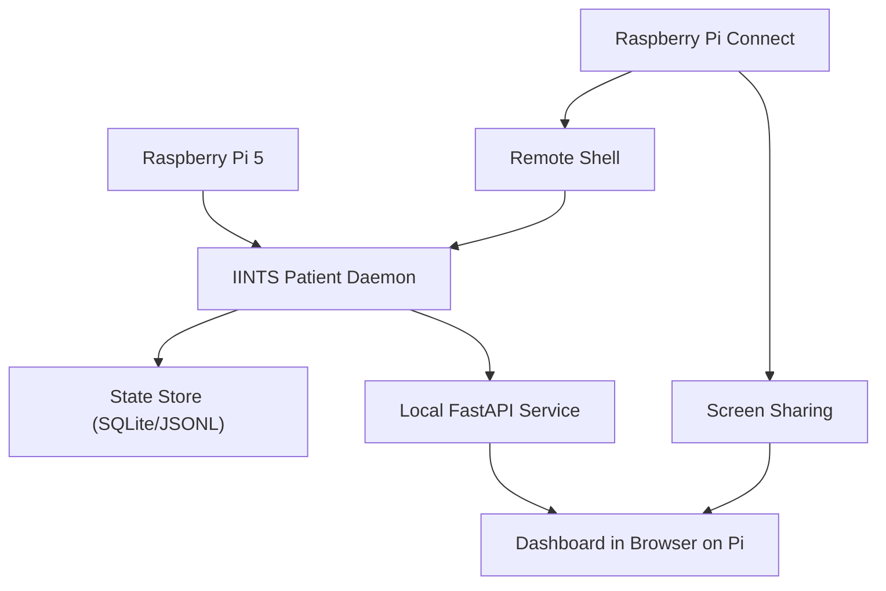

# Edge Hardware Profiles

IINTS supports two installation styles:

- a `full` workstation install for laptops and desktops
- a lighter `edge` install for always-on single-board computers and hybrid Linux boards

Use this page to choose a supported board, the right install profile, and a practical deployment pattern for edge use.

## SBC Support Matrix

<table class="support-table">
  <thead>
    <tr>
      <th>Board</th>
      <th>Status</th>
      <th>Best fit</th>
      <th>Notes</th>
    </tr>
  </thead>
  <tbody>
    <tr>
      <td><code>Pi 5 (8 GB)</code></td>
      <td><span class="support-chip official">Official</span></td>
      <td>Demo kiosk, digital patient</td>
      <td>Best all-round edge choice.</td>
    </tr>
    <tr>
      <td><code>Pi 5 (16 GB)</code></td>
      <td><span class="support-chip official">Official</span></td>
      <td>Edge studies, local AI</td>
      <td>More headroom for longer runs.</td>
    </tr>
    <tr>
      <td><code>Pi 5 (4 GB)</code></td>
      <td><span class="support-chip supported">Supported</span></td>
      <td>Lighter live runtime</td>
      <td>Best with the <code>edge</code> profile only.</td>
    </tr>
    <tr>
      <td><code>UNO Q (4 GB)</code></td>
      <td><span class="support-chip supported">Supported</span></td>
      <td>Hybrid demo rig</td>
      <td>Good if the MCU drives alerts.</td>
    </tr>
    <tr>
      <td><code>UNO Q (2 GB)</code></td>
      <td><span class="support-chip experimental">Experimental</span></td>
      <td>Minimal runtime tests</td>
      <td>Very limited headroom.</td>
    </tr>
    <tr>
      <td><code>Pi Zero 2 W</code></td>
      <td><span class="support-chip unsupported">Unsupported</span></td>
      <td>None</td>
      <td>Too little memory for a reliable runtime.</td>
    </tr>
    <tr>
      <td><code>UNO R4 / UNO</code></td>
      <td><span class="support-chip unsupported">Unsupported</span></td>
      <td>None</td>
      <td>No Linux/Python runtime.</td>
    </tr>
  </tbody>
</table>

Status meanings:

<div class="support-legend">
  <div class="support-legend-item"><span class="support-chip official">Official</span><br />Recommended default in the docs.</div>
  <div class="support-legend-item"><span class="support-chip supported">Supported</span><br />Expected to work, but not the main target.</div>
  <div class="support-legend-item"><span class="support-chip experimental">Experimental</span><br />Needs manual tuning and validation.</div>
  <div class="support-legend-item"><span class="support-chip unsupported">Unsupported</span><br />Not suitable for a full SDK deployment.</div>
</div>

## Edge Architecture

This diagram shows the default edge deployment layout:



What the pieces do:

- `IINTS Patient Daemon`: advances the virtual patient and algorithm state.
- `State Store`: keeps persistent runtime state for status, replay, and audit.
- `Local FastAPI Service`: exposes the live API and control surface.
- `Dashboard in Browser on Pi`: gives the live glucose view on the device itself.
- `Raspberry Pi Connect`: lets you present and control the Pi from a laptop without extra SSH/VNC setup.

## Install Profiles

### Full workstation install

Use this on laptops or desktops where you want the whole SDK:

```bash
python3 -m venv .venv
source .venv/bin/activate
python -m pip install -U pip
python -m pip install -U "iints-sdk-python35[full,mdmp]"
```

This includes:

- simulator
- certification
- AI review
- plotting
- PDF reporting
- posters
- CareLink visual workbench

### Edge install

Use this on Raspberry Pi or Linux-capable edge boards where the live patient runtime matters most:

```bash
python3 -m venv .venv
source .venv/bin/activate
python -m pip install -U pip
python -m pip install -U "iints-sdk-python35[edge,mdmp]"
```

This profile is designed around:

- core simulator
- SQLite state store
- FastAPI dashboard
- CLI control
- optional local AI review if Ollama is present

It intentionally avoids the heavier reporting stack by default.

## One-Line Edge Workflow

The new edge namespace ties the SBC story together:

```bash
iints edge setup --output-dir iints_edge_demo --board raspberry_pi
cd iints_edge_demo
iints edge up --project-dir .
iints edge status --project-dir .
iints edge bundle --project-dir . --output results/edge_runtime_bundle.zip
```

That gives you:

- a generated edge project scaffold
- a persistent patient runtime
- a kiosk-ready dashboard
- a ZIP bundle you can move back to a laptop for deeper analysis

## Raspberry Pi

Recommended starting setup:

- `Raspberry Pi 5`
- `8 GB` RAM
- active cooling
- Raspberry Pi OS Desktop
- Raspberry Pi Connect

Typical live runtime flow:

```bash
iints edge setup --output-dir iints_pi_demo --board raspberry_pi
cd iints_pi_demo
iints edge up --project-dir .
iints edge status --project-dir .
iints edge kiosk --project-dir .
```

For most users, the `8 GB` Pi 5 is the default recommendation.

## Arduino UNO Q

UNO Q combines:

- a Linux-capable side for the IINTS runtime
- an STM32 side for simple physical feedback

The recommended path is:

1. install the `edge` profile on the Linux side
2. generate a UNO Q scaffold with `iints edge setup --board uno_q`
3. start the Linux-side digital patient
4. flash the generated bridge sketch onto the STM32 side
5. run `iints edge bridge-test --port ...`
6. run `iints edge bridge-run --project-dir . --port ...`

Fastest scaffold command:

```bash
iints edge setup --output-dir iints_uno_q_demo --board uno_q
```

If you only need the bridge sketch:

```bash
iints edge hardware-bridge --board uno_q --output-dir uno_q_bridge
```

Use the dedicated guide for the full step-by-step flow:

- [Arduino UNO Q Setup](ARDUINO_UNO_Q.md)

UNO Q is still a secondary target. It is a good fit when you want visible hardware feedback on top of the Linux-side runtime, but it is not the default first install for most SDK users.

## Auto-Start With systemd

After starting the patient once, export a service unit:

```bash
iints edge service --project-dir .
```

Then install it on the device:

```bash
sudo cp patient_runtime/iints-digital-patient.service /etc/systemd/system/iints-digital-patient.service
sudo systemctl daemon-reload
sudo systemctl enable iints-digital-patient.service
sudo systemctl start iints-digital-patient.service
```

If you want the update script and service file scaffolded automatically, start with:

```bash
iints edge setup --output-dir iints_edge_demo --board raspberry_pi
```

The generated folder already contains:

- `run_edge_patient.sh`
- `launch_kiosk.sh`
- `update_edge_runtime.sh`
- `patient_runtime/iints-digital-patient.service`
- `patient_runtime/iints-digital-patient.INSTALL.txt`

## Live Kiosk And Status

For the presentation layer:

```bash
iints edge kiosk --project-dir .
iints edge status --project-dir .
```

The kiosk view highlights:

- live glucose
- scenario profile
- active algorithm
- certification status
- realism review status
- one-click scenario reset buttons

## Hardware Benchmark

To gather technical numbers for a deployment note or hardware comparison:

```bash
iints edge-benchmark \
  --algo algorithms/example_algorithm.py \
  --platform auto \
  --output-json results/edge_benchmark.json
```

This reports:

- steps per second
- mean step latency
- peak process memory
- dashboard response time
- API status response time

Keep the resulting JSON with your deployment notes. It gives you concrete numbers for:

- throughput
- memory footprint
- dashboard responsiveness

## Runtime Export Back To A Laptop

To move a live SBC run back to a workstation:

```bash
iints edge bundle --workspace patient_runtime --output results/edge_runtime_bundle.zip
```

That archive contains:

- `patient_state.db`
- `patient_runtime_config.json`
- `live_bundle/results.csv`
- manifests and audit files
- certification artifacts if present
- realism review markdown if present

## Scope

Edge deployments are still:

- research use only
- not medical devices
- not clinical treatment systems
