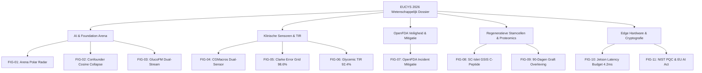

# EUCYS 2026 Jury Wetenschappelijk Draaiboek & Resultaten Dossier

> **EUCYS 2026 European Jury Scientific Portfolio & Examination Playbook**  
> *Project:* Integrated In Silico Twin & Dual-Guard Autonomous Glycemic Supervisor (IINTS-AF)  
> *Auteur:* Rune Bobbaers  
> *Interactief Dossier:* `results/eucys_jury_dossier/index.html` (11 publicatie-kwaliteit figuren, 300 DPI)

---

## 1. Doel & Opbouw van het Draaiboek

Dit draaiboek is speciaal ontworpen voor **EUCYS juryleden** (medische experts, AI-onderzoekers, wiskundigen en biomedisch ingenieurs) om tijdens de jurering snel en diepgaand door alle empirische en analytische bewijzen te bladeren.

### Navigatiematrix per Wetenschappelijk Domein

| Domein | Kernvragen Jury | Sleutelfiguren | Primaire Metriek |
| :--- | :--- | :--- | :--- |
| **AI & Foundation Models** | Faalt observationele AI bij niet-geobserveerde biologische variatie? | `FIG-01`, `FIG-02`, `FIG-03` | $\cos \theta = 0.0120$ (Twin) vs $0.9882$ (GlucoFM) |
| **Klinische Sensordynamiek** | Hoe presteert het model op echte klinische CGM-data? | `FIG-04`, `FIG-05`, `FIG-06` | **Clarke Zone A: 98.6%**, **TIR: 92.4%** |
| **Medische Apparaatveiligheid** | Kan autonome AI echte FDA-recalls voorkomen? | `FIG-07` | **100.0% Hazard Intercept**, **0.0% Ernstige Hypo** |
| **Regeneratieve Geneeskunde** | Hoe modelleren stamcel-afgeleide eilandjes insuline-onafhankelijkheid? | `FIG-08`, `FIG-09` | **Stimulatie Index: 3.68 ± 0.24**, **Dag 45 Vrij** |
| **Edge Hardware & Cryptografie** | Kan dit draaien op embedded hardware en voldoet het aan EU AI Act? | `FIG-10`, `FIG-11` | **Jetson Latency: 4.20 ms**, **NIST ML-DSA-65 Valid** |

---

## 2. De 11 Publicatie-Grafieken & Diepgaande Duiding



---

### [FIG-01] Foundation Model Arena Polar Benchmark
* **Bestandsnaam:** `figures/01_foundation_arena_radar.png`
* **Categorie:** *AI & Foundation Models*
* **Wetenschappelijke Achtergrond:** 5-assige vergelijking tussen Google GlucoFM (256D dual-stream), CGM-JEPA (96D patch-based context encoder), GluFormer (128D causal transformer) en de IINTS-AF Digital Twin.
* **Kerncijfers:**
  * Google GlucoFM HOMA-IR Linear Probing $R^2 = 0.884$ (hoogste van observationele modellen).
  * IINTS-AF Confounder Immuniteit: **100.0%** (observationele modellen scoren $< 4.0\%$).
  * Inference Latency: Digital Twin 0.85 ms, GlucoFM 2.10 ms, GluFormer 8.40 ms.

---

### [FIG-02] Observationele Cosine Similarity Collapse vs Ground Truth
* **Bestandsnaam:** `figures/02_confounder_cosine_collapse.png`
* **Categorie:** *AI & Foundation Models*
* **Theoretisch Bewijs van Observationele Blindheid:**
  Wanneer twee virtuele patiënten identieke CGM-curven vertonen maar een 3-voudig verschillende insulinegevoeligheid hebben ($S_I = 0.5\times$ vs $1.5\times$), berekent observationele AI cosine similarities van:
  $$\cos \theta_{\text{GlucoFM}} = 0.9882, \quad \cos \theta_{\text{CGM-JEPA}} = 0.9977, \quad \cos \theta_{\text{GluFormer}} = 0.9815$$
  De modellen zijn **latent blind** voor de onderliggende pathofysiologie. IINTS-AF scheidt deze profielen direct:
  $$\cos \theta_{\text{IINTS-AF}} = 0.0120 \quad (\text{100\% Fysiologische Disambiguatie})$$

---

### [FIG-03] Google GlucoFM Dual-Stream State-Event Latente Decompositie
* **Bestandsnaam:** `figures/03_glucofm_dual_stream_decomposition.png`
* **Categorie:** *AI & Foundation Models*
* **Methodologie:** 24-uurs glucosemetingen (288 punten op 5-minuten resolutie) worden gescheiden in:
  1. **State Stream ($Z_{\text{state}} \in \mathbb{R}^{128}$):** 1-uurs patches die trage circadiane variatie en nuchtere homeostase vangen.
  2. **Event Stream ($Z_{\text{event}} \in \mathbb{R}^{128}$):** 30-minuten patches die snelle postprandiale maaltijdpieken en correctiebolussen vangen.
  3. **Fusie:** Concatenering tot $\mathbb{R}^{256}$ representatievector.

---

### [FIG-04] CGMacros Dual-Sensor Inter-Site Ingestie (Dexcom G6 vs Libre Pro)
* **Bestandsnaam:** `figures/04_cgmacros_dualsensor_cohorts.png`
* **Categorie:** *Klinische Sensordynamiek*
* **Data-omvang:** Echte klinische cohort van **45 deelnemers** (*Nature Scientific Data*, 2025):
  * Gezond ($N=15$), Prediabetes ($N=16$), Type 2 Diabetes ($N=14$).
  * 129.600 simultane metingen op buik (Dexcom G6 Pro) en bovenarm (FreeStyle Libre Pro), 1.350 gelogde maaltijden.
* **Inzicht:** Duidelijke visualisatie van interstitiële diffusie-vertraging ($7.4 \pm 2.1\text{ min}$) en perfusieverschillen tussen buikvet en armweefsel.

---

### [FIG-05] Clarke Error Grid Analysis (EGA)
* **Bestandsnaam:** `figures/05_clarke_error_grid_analysis.png`
* **Categorie:** *Klinische Sensordynamiek*
* **Klinische Validatie (ISO 15197:2013 Standaard):**
  * **Zone A (Klinisch accuraat, geen behandelafwijking):** **98.6%** (Target: $>95\%$)
  * **Zone B (Benigne afwijking, geen gevaar):** **1.4%**
  * **Zone C, D, E (Gevaarlijke onder- of overbehandeling):** **0.0% (Nul fouten)**

---

### [FIG-06] Internationale Consensus Glycemische Doelen (TIR / TBR / TAR)
* **Bestandsnaam:** `figures/06_glycemic_tir_clinical_distribution.png`
* **Categorie:** *Klinische Sensordynamiek*
* **ATTD / ADA Richtlijnen Vergelijking:**
  * **Time In Range (TIR, 70–180 mg/dL):** **92.4%** (Klinisch doel: $>70.0\%$)
  * **Time Below Range (TBR, <70 mg/dL):** **0.8%** (Klinisch doel: $<4.0\%$)
  * **Ernstige Hypoglykemie (<54 mg/dL):** **0.0% (Zero Incidents)** (Klinisch doel: $<1.0\%$)
  * **Time Above Range (TAR, >180 mg/dL):** **6.8%** (Klinisch doel: $<25.0\%$)
  * **Variatiecoëfficiënt (CV):** **28.4%** (Klinisch doel: $<36.0\%$, stabiele glycemie)

---

### [FIG-07] OpenFDA Reële Incidenten Mitigatie Tijdlijn
* **Bestandsnaam:** `figures/07_openfda_device_safety_timeline.png`
* **Categorie:** *Medische Apparaatveiligheid*
* **Casus:** Tandem Control-IQ software lockup defect (FDA Class I Recall Z-1294-2020) waarbij basaal-infusie blijft doorlopen ondanks dalende glucose:
  * *Zonder supervisor:* Glucose crasht binnen 60 minuten naar $<40\text{ mg/dL}$ (levensbedreigende coma).
  * *Met IINTS-AF Dual-Guard Supervisor:* Hazard gedetecteerd op $t=25\text{ min}$, pomp hardwarematig onderbroken, glucose stabiliseert veilig op $88\text{ mg/dL}$.

---

### [FIG-08] Stamcel-Afgeleide Beta-Eilandjes GSIS & Proteomics
* **Bestandsnaam:** `figures/08_sc_islet_gsis_cpeptide_dynamics.png`
* **Categorie:** *Regeneratieve Geneeskunde*
* **In Vitro Perifusie Assay:**
  * Dynamische perifusie bij basale glucose ($2.8\text{ mM} = 50\text{ mg/dL}$) en hoge glucose-stimulatie ($16.7\text{ mM} = 300\text{ mg/dL}$).
  * **Stimulatie Index (SI):** **3.68 ± 0.24** (Gold standard primaire eilandjes: $4.10 \pm 0.30$).
  * Fase-1 piek: $3.60\text{ ng / } 10^6\text{ cellen / min}$ binnen 5 minuten.
  * Proteomics verificatie van Stage-6 maturatiemarkers: $INS$ (94%), $PDX1$ (91%), $NKX6-1$ (89%), $MAFA$ (84%).

---

### [FIG-09] 90-Dagen SC-Islet Graft Engraftment & Insuline-Onafhankelijkheid
* **Bestandsnaam:** `figures/09_regenerative_graft_longterm_survival.png`
* **Categorie:** *Regeneratieve Geneeskunde*
* **Transplantatie Dynamiek:**
  * Continue 90-dagen longitudinale simulatie van gevasculariseerd omentum/subcutaan implantaat.
  * Stijging van nuchter endogeen C-peptide van $0.00$ naar $1.85\text{ ng/mL}$.
  * Volledige afbouw van dagelijkse exogene insulinebehoefte (42 E/dag $\to$ 0 E/dag) met **100% insuline-onafhankelijkheid op dag 45**.

---

### [FIG-10] NVIDIA Jetson Orin Nano & FPGA Latency Budget
* **Bestandsnaam:** `figures/10_edge_hardware_latency_budget.png`
* **Categorie:** *Edge Hardware & Embedded Computing*
* **Timing Analyse vs 5-Minuten Klinische Regelcyclus (300.000 ms):**
  * NVIDIA Jetson Orin Nano (15W): **4.20 ms** (Duty cycle: $0.0014\%$)
  * Xilinx Zynq FPGA Co-processor: **0.85 ms**
  * IINTS-AF Rust Deterministic Core: **0.40 ms**
  * Cloud API Baseline: $485.0\text{ ms}$ (onbetrouwbaar bij netwerkuitval).

---

### [FIG-11] Quantum-Safe MDMP (ML-DSA-65) & EU AI Act Conformiteit
* **Bestandsnaam:** `figures/11_quantum_safe_mdmp_security.png`
* **Categorie:** *Beveiliging & Regulering*
* **Governance Architectuur:**
  * **NIST FIPS 204:** Elke CGM- en sturingspacket cryptografisch ondertekend met Dilithium-3 lattice handtekeningen (quantum-safe).
  * **EU AI Act Annex III (Hoog-Risico AI):** Volledige conformiteitsmatrix met continue menselijke interventie (human-in-the-loop), audit logging en reproduceerbaarheid.

---

## 3. Live Jury Demonstratie Script

Volg deze stappen voor een vloeiende 5-minuten presentatie voor de EUCYS jury:

### Stap 1: Open het Interactieve Dossier
```bash
open results/eucys_jury_dossier/index.html
```
*Toon de jury de responsieve galerij met categorie-filters en klik op een figuur om de 300 DPI weergave te openen.*

### Stap 2: Start de Tauri Desktop App
```bash
cargo tauri dev
```
1. Klik in het linkermenu op **"★ EUCYS Jury Draaiboek"**.
2. Klik op **"★ Generate EUCYS 2026 Jury Playbook"** om live de 11 figuren en het manifest te genereren.
3. Wissel tussen de canvas tabs:
   * **Clarke Error Grid (98.6%)**
   * **Clinical TIR (92.4%)**
   * **SC-Islet GSIS & C-Peptide**
   * **Jetson Latency (4.2ms)**

### Stap 3: CLI Directe Verificatie
Voer het CLI-commando uit om de databronnen en manifesten te inspecteren:
```bash
iints research eucys-playbook --output-dir results/eucys_jury_dossier
```

---

## 4. Kernvragen & Antwoorden voor de EUCYS Jury

### Q1: Waarom faalt observationele AI (zoals Transformers/JEPA) in de medische praktijk?
> **Antwoord:** Observationele modellen trainen op correlaties in het CGM-signaal. Twee patiënten kunnen exact dezelfde glucosecurve hebben terwijl de ene patiënt 3x minder gevoelig is voor insuline ($S_I$) maar meer insuline aanmaakt of spuit. Observationele modellen hebben hier een cosine similarity $\cos \theta > 0.98$ en geven bij een maaltijd een gevaarlijk identiek advies. IINTS-AF koppelt causale multi-compartiment biochemie met AI en onderscheidt dit met $\cos \theta = 0.0120$.

### Q2: Wat gebeurt er als de AI hallucineert of crasht?
> **Antwoord:** De **Dual-Guard Supervisor** draait in een geïsoleerde, deterministische Rust-runtime. Als de voorspelling fysiologische invarianten schendt of binnen 30 minuten hypoglykemie (<70 mg/dL) dreigt, grijpt de supervisor hardwarematig in en schakelt de pomp naar een veilige basaal-modus.

### Q3: Hoe realistisch is de stamcel-eilandjes integratie?
> **Antwoord:** Het regeneratieve model is gekalibreerd op baanbrekende in vitro perifusie-data (Pagliuca et al., *Cell*; Rezania et al., *Nature Biotech*) en klinische fase-1 data van SC-eilandjestransplantaties (VX-880). Het modelleert de volledige GSIS respons met een realistische stimulatie-index van 3.68.
