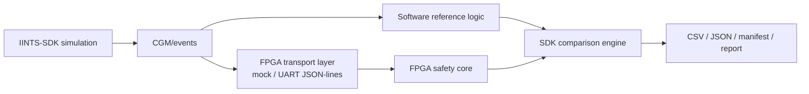

# FPGA Mode

FPGA mode lets IINTS run transparent, deterministic hardware-logic experiments beside the normal SDK simulator.

!!! warning "Research-only boundary"
    FPGA mode is for education, simulation, hardware verification demos, and pre-clinical research discussion. It is not a medical device, does not dose insulin, and must never be connected to real insulin delivery.

## What It Does

IINTS remains the digital-patient and evidence layer. The FPGA is treated as a hardware backend for one small logic block, such as a safety core or risk classifier.



The first implementation is a bench-only safety-core workflow:

| Input | Meaning |
| --- | --- |
| `glucose_mgdl` | Current simulated glucose value |
| `trend_mgdl_per_min` | Short-term simulated glucose trend |
| `sensor_status` | `OK`, `VALID`, or an error-like state |
| `meal_event` | Whether the scenario includes a meal marker |
| `insulin_event` | Whether the scenario includes an insulin marker |

| Output | Meaning |
| --- | --- |
| `NORMAL` | Inside the demo guard band |
| `WARNING` | Needs review because the event is near a risk boundary |
| `CRITICAL` | Hypoglycemia or a fast downward-risk condition |
| `SENSOR_ERROR` | Sensor/status input is not trustworthy |
| `CHECK_REQUIRED` | Human/reviewer check should be required |

## Quick Start

Check the mode:

```bash
iints fpga doctor
```

Create a lab workspace with an RTL scaffold, protocol file, safety contract, and demo scenario:

```bash
iints fpga setup --output-dir iints_fpga_lab
```

Run the mock FPGA flow:

```bash
cd iints_fpga_lab
iints fpga simulate \
  --events scenarios/night_hypo_risk.json \
  --output-dir reports/night_hypo_mock_run
```

Inspect the result:

```bash
iints fpga compare --run-dir reports/night_hypo_mock_run
iints fpga report --run-dir reports/night_hypo_mock_run
```

Or generate the complete demo bundle in one command:

```bash
iints fpga demo --output-dir results/fpga_demo
```

## Generated Lab

`iints fpga setup` writes:

| File | Purpose |
| --- | --- |
| `fpga_safety_contract.json` | Bench-only safety and comparison contract |
| `scenarios/fpga_demo_events.json` | Small deterministic event set for first testing |
| `scenarios/night_hypo_risk.json` | Golden demo scenario with a falling overnight glucose trend |
| `rtl/iints_fpga_safety_core.v` | Minimal Verilog risk-classifier scaffold |
| `fpga_protocol.json` | JSON-lines transport convention |
| `FPGA_STORY.md` | Short explanation for demos, jury questions, and future silicon/AI roadmap |
| `scripts/run_mock_fpga_demo.sh` | One-command local mock run |
| `README.md` | Human-readable lab instructions |

## Generated Run Artifacts

Every `simulate`, `run`, or `demo` flow writes:

| File | Purpose |
| --- | --- |
| `fpga_input_events.jsonl` | Normalized event stream sent to the hardware-style core |
| `events.csv` | Reviewer-friendly event table |
| `fpga_results.csv` | Row-by-row software-vs-FPGA comparison |
| `results.json` | Comparison summary plus rows in one machine-readable file |
| `fpga_comparison.json` | Pass/fail summary, mismatch count, and latency |
| `fpga_run_manifest.json` | Reproducibility manifest with scope and contract |
| `manifest.json` | Reviewer-friendly manifest alias |
| `fpga_report.md` | Reviewer-facing report for a demo or lab notebook |
| `report.md` | Reviewer-friendly report alias |

For `iints fpga demo --output-dir results/fpga_demo`, the most useful files are:

```text
results/fpga_demo/
  events.csv
  results.json
  manifest.json
  report.md
  lab/FPGA_STORY.md
```

## Golden Demo Scenario

The first golden scenario is `night_hypo_risk`.

It simulates a falling overnight glucose trend and asks whether the software reference and FPGA-style safety core agree on the risk transition from normal to warning/critical.

Use it when you need one clear sentence:

> In this demo, the SDK simulates a falling glucose trend during the night. The software reference and FPGA safety core both classify risk states, and the SDK generates an evidence report showing whether the hardware logic matches the reference.

## Mock Versus Serial

Mock mode runs without hardware and uses the SDK software reference as a hardware-style transport:

```bash
iints fpga simulate --transport mock --output-dir results/fpga_mock_run
```

Serial mode is intended for a future FPGA board or MCU bridge that speaks JSON-lines:

```bash
iints fpga simulate \
  --transport serial \
  --port /dev/ttyUSB0 \
  --baudrate 115200 \
  --events iints_fpga_lab/scenarios/fpga_demo_events.json \
  --output-dir results/fpga_serial_run
```

The serial device receives one normalized JSON event per line and should return one JSON object per line with `risk_label`, `risk_score`, and `check_required`.

## Why This Matters

FPGA mode is useful because medical-device education is not only about AI models. It is also about deterministic logic, safety checks, watchdog-like behavior, timing, verification, and reproducible evidence.

For EUCYS or a hardware demo, the strongest explanation is:

> IINTS can simulate a digital patient, send simplified events into a hardware-style safety core, compare the FPGA output against a software reference, and generate evidence when the two agree or diverge.

That keeps the project honest: the FPGA is not making medical decisions; it is demonstrating how safety-critical logic can be tested transparently.
