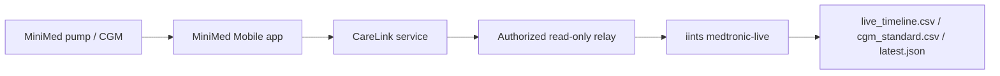

# Medtronic CareLink Live Bridge

This note describes the IINTS read-only live bridge for Medtronic/CareLink-style
diabetes data. It is built for authorized engineering, validation, and research
flows where a consented CareLink, care-partner, or mobile-app relay exposes pump
and CGM snapshots as JSON.

The SDK does not hardcode private CareLink or mobile app endpoints. Instead, it
polls a configured internal gateway and normalizes common CGM, meal, and insulin
event aliases into the IINTS universal schema.

## Intended Architecture



The relay is the compliance boundary. It should own identity, consent, audit
logging, tenant isolation, rate limits, and any official CareLink/mobile-app
integration details. The SDK only consumes a read-only JSON feed.

## Minimal Relay Contract

The relay endpoint can return a list directly or a JSON object with a `data`,
`entries`, `events`, `readings`, `sgs`, `sgvs`, or `timeline` array.

Example:

```json
{
  "data": [
    {
      "type": "sensor_glucose",
      "dateTime": "2026-05-25T10:00:00Z",
      "value": 122,
      "units": "mg/dL"
    },
    {
      "eventType": "meal",
      "eventTime": "2026-05-25T10:03:00Z",
      "carbInput": 35
    },
    {
      "eventType": "bolus",
      "eventTime": "2026-05-25T10:04:00Z",
      "bolusAmount": 3.2
    }
  ]
}
```

Supported aliases include:

- Timestamps: `timestamp`, `dateTime`, `eventTime`, `medicalDeviceTime`,
  `serverTime`
- Glucose: `sg`, `sgv`, `glucose`, `sensorGlucose`, `sensorGlucoseValue`
- Carbs: `carbs`, `carbohydrates`, `carbInput`, `carbGrams`, `mealCarbs`
- Insulin: `insulinDelivered`, `bolusAmount`, `bolusUnits`,
  `bolusVolumeDelivered`, `basalUnits`
- Units: `mg/dL` or `mmol/L`

Meal and insulin events are attached to the nearest glucose row within the
configured tolerance window, defaulting to 7.5 minutes.

## CLI Usage

```bash
export MEDTRONIC_CARELINK_TOKEN="..."

iints medtronic-live \
  --base-url https://internal-relay.example \
  --endpoint-path /carelink/live \
  --token-env MEDTRONIC_CARELINK_TOKEN \
  --device-id TEST-PUMP-001 \
  --samples 0 \
  --poll-seconds 60 \
  --output-dir results/medtronic_live
```

Outputs:

- `live_timeline.csv`: absolute timestamps plus glucose, carbs, insulin, source
- `cgm_standard.csv`: IINTS universal schema with relative minute timestamps
- `latest.json`: latest reading summary for dashboards or smoke tests

## Guardrails

- Use only authorized, consented, read-only sources.
- Keep bearer tokens in environment variables or secret files, not shell history.
- Do not use this feed for therapy decisions or device control.
- Keep the SDK behind an internal relay; do not embed private mobile endpoints in
  research scripts.
- Use HTTPS for non-local hosts. The CLI rejects embedded URL credentials, full
  endpoint URLs, and non-local plain HTTP.
