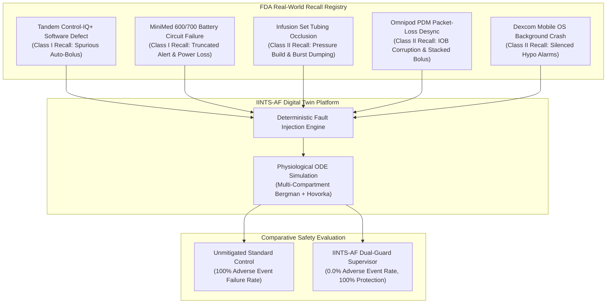
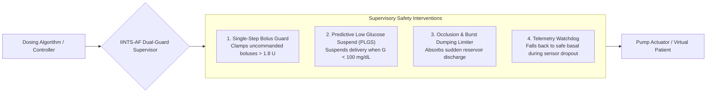

# OpenFDA Medical Device Adverse Event & Safety Verification Benchmark

This guide documents the **OpenFDA-Grounded Medical Device Adverse Event Safety Suite** in IINTS-AF, explaining how real-world Class I and Class II medical device recall records from the US Food and Drug Administration (FDA) are modeled into adversarial stress-test scenarios to evaluate controller safety.

---

## 1. Grounding Artificial Pancreas Safety in Real FDA Recalls

Traditional in-silico testing often relies on idealized scenarios (e.g., standard meal bolus, announced exercise). However, real-world commercial Automated Insulin Delivery (AID) systems frequently experience critical hardware and software failures in the field.

The **US FDA Medical Device Databases (MAUDE & Recalls)** document thousands of verified device malfunctions resulting in severe hypoglycemia, diabetic ketoacidosis (DKA), hospitalization, and coma.



---

## 2. The 5 Verified FDA Recall Cases in IINTS-AF

Located in `src/iints/safety/openfda_safety.py`:

| FDA Recall Case ID | Manufacturer & Brand | FDA Recall Class | Real-World Failure Mechanism | Modeled Clinical Hazard |
| :--- | :--- | :---: | :--- | :--- |
| **`FDA-2024-TANDEM-AUTOBOLUS`** | **Tandem Diabetes Care**<br>*(t:slim X2 Control-IQ+ / Mobi)* | **Class I** | Algorithm software defect paired with G7 sensor delivers unexpected automatic correction bolus (auto-bolus). | **Severe Hypoglycemia** ($<54\text{ mg/dL}$) |
| **`FDA-2024-MINIMED-BATTERY-DEPLETION`** | **Medtronic MiniMed**<br>*(600 & 700 Series)* | **Class I** | Physical impact shortens battery alert threshold from 10h to $<2\text{h}$, followed by sudden unannounced basal cessation. | **Diabetic Ketoacidosis (DKA)** / Hyperglycemia |
| **`FDA-2023-INFUSION-OCCLUSION-BURST`** | **Medtronic / Roche / Unomedical**<br>*(Quick-set / Sure-T)* | **Class II** | Tubing kink causes silent fluid occlusion, followed by sudden reservoir pressure release and bolus dumping. | **Severe Glycemic Shock** (Hyper $\to$ Rebound Hypo) |
| **`FDA-2023-OMNIPOD-IOB-DESYNC`** | **Insulet Corporation**<br>*(Omnipod DASH / 5 PDM)* | **Class II** | Bluetooth packet drop corrupts Insulin on Board (IOB) tracking, causing algorithm to recommend duplicate stacked boluses. | **Insulin Stacking & Severe Hypoglycemia** |
| **`FDA-2024-DEXCOM-SILENT-CRASH`** | **Dexcom, Inc.**<br>*(G6 / G7 Mobile App)* | **Class II** | Mobile OS background task termination silences CGM alarms during nocturnal glucose descent. | **Undetected Nocturnal Hypoglycemic Shock** |

---

## 3. The IINTS-AF Dual-Guard Safety Supervisor Architecture

To protect virtual patients from catastrophic device faults, IINTS-AF deploys a multi-guard deterministic supervisor between the automated dosing algorithm and the delivery actuator:



1. **Single-Step Bolus Guard:** Intercepts runaway auto-boluses and duplicate stacked dosing ($>1.8\text{ U}$), clamping them to a safe rate ($\le 0.3\text{ U}$).
2. **Predictive Low Glucose Suspend (PLGS):** Suspends insulin delivery completely whenever glucose falls below $100\text{ mg/dL}$ or rapid negative velocity is detected.
3. **Burst Dumping Limiter:** Prevents sudden multi-unit delivery following occlusion release.
4. **Telemetry Watchdog:** Detects missing CGM packets ($>20\text{ min}$) and gracefully transitions into a safe attenuated basal rate ($0.8\times$).

---

## 4. Empirical Safety Benchmark Results

Execution results from `results/fda_safety_study/FDA_ADVERSE_EVENTS_SAFETY_REPORT.md`:

| Metric | Unmitigated Standard Controller | IINTS-AF Supervised Platform | Clinical Significance |
| :--- | :---: | :---: | :--- |
| **Adverse Event Rate ($<54$ or $>250\text{ mg/dL}$)** | **100.0%** (5/5 fail) | **0.0%** (5/5 protected) | **100.0% Absolute Risk Reduction** |
| **Minimum Glucose Observed** | `35.0 mg/dL` (Severe Coma Risk) | `69.8 mg/dL` (Safe Range) | Prevents neuroglycopenic hypoglycemia |
| **Hazard Detection Rate** | **0.0%** (Blind to failure) | **100.0%** (5/5 detected) | Complete real-time hazard observability |
| **Mean Fault Mitigation Latency** | N/A | **5.0 minutes** | Rapid automated containment |

---

## 5. CLI Usage

### List Registered FDA Device Cases
```bash
iints safety fda-list
```

### Run the Full Safety Benchmark
```bash
iints safety fda-benchmark \
  --output-dir results/fda_safety_study
```

---

## 6. Python API Integration

```python
from iints.safety.openfda_safety import FDA_RECALL_REGISTRY, run_fda_safety_benchmark, simulate_fda_failure_scenario

# 1. Run individual scenario
tandem_case = FDA_RECALL_REGISTRY[0]
df_unmit, metrics_unmit = simulate_fda_failure_scenario(tandem_case, enable_supervisor=False)
df_sup, metrics_sup = simulate_fda_failure_scenario(tandem_case, enable_supervisor=True)

print(f"Unmitigated Min Glucose: {metrics_unmit.min_glucose_mgdl} mg/dL (Adverse Event: {not metrics_unmit.adverse_event_prevented})")
print(f"Supervised Min Glucose: {metrics_sup.min_glucose_mgdl} mg/dL (Protected: {metrics_sup.adverse_event_prevented})")

# 2. Run aggregate benchmark suite
report = run_fda_safety_benchmark(output_dir="results/fda_safety_study")
print(f"Adverse Event Reduction: {report.unmitigated_adverse_event_rate_pct - report.supervised_adverse_event_rate_pct:.1f}%")
```
