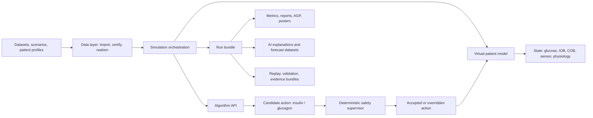
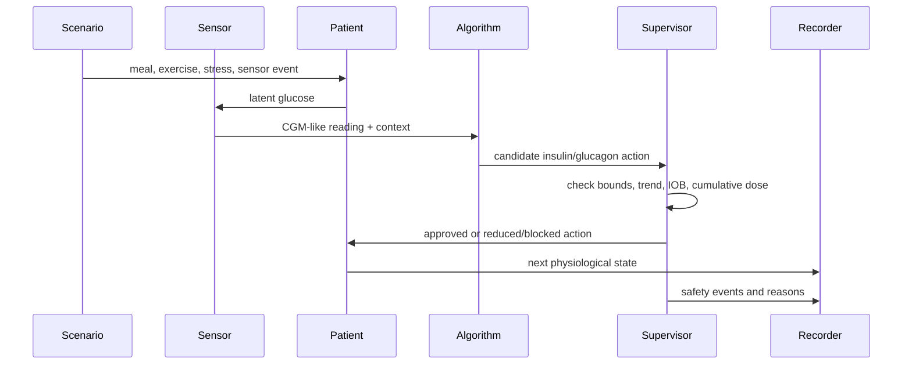
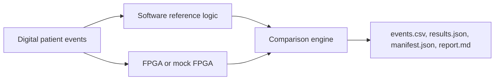

# IINTS-AF SDK Paper Technical Dossier

Last updated: 2026-06-14

This document is a paper-preparation dossier for IINTS-AF SDK. It collects the software architecture, research claims, scientific equations, data strategy, AI workflow, hardware workflow, reporting workflow, validation gates, limitations, and source trail in one place.

Research boundary:

IINTS-AF SDK is research and education software. It is not a medical device, not a treatment recommendation system, not a certified insulin pump controller, and not intended for real-time patient care or clinical dosing decisions.

## 1. One-Sentence Description

IINTS-AF SDK is an open-source research platform for simulating type 1 diabetes glucose-insulin scenarios, testing experimental insulin/glucagon algorithms behind deterministic safety gates, validating datasets, generating clinical-style reports, and training physiology-aware glucose forecasting models without exposing real patients to risk.

## 2. Paper-Ready Abstract Draft

Automated insulin delivery research requires safe ways to evaluate algorithms before they can affect real patients. IINTS-AF SDK provides a reproducible research environment for virtual patient simulation, algorithm benchmarking, deterministic safety supervision, data certification, clinical-style reporting, and physiology-aware glucose forecasting. The platform combines fast scenario simulation with mechanistic patient models inspired by Bergman and Hovorka glucose-insulin dynamics, CGM measurement models with lag/noise/drift/dropout, experimental hypoglycemia counterregulation, AGP-style reporting, and local AI tools for run explanation and glucose prediction. Algorithms can propose insulin or glucagon actions, but a separate deterministic safety supervisor validates actions before they affect the simulated patient. The SDK also includes dataset preparation workflows for real-world diabetes datasets, MDMP-style data quality and provenance checks, Jetson-based long-run training, Hugging Face model export, and hardware-facing FPGA/Pi/UNO Q research modes. IINTS-AF is not a clinical dosing system; its purpose is to make diabetes technology research more transparent, reproducible, auditable, and discussable before any real-world clinical deployment.

## 3. Core Research Question

Primary question:

Can an open-source, safety-first simulation SDK make risky or unrealistic diabetes-algorithm behavior visible before algorithms are tested near real patients?

Secondary questions:

- Can deterministic safety supervision reduce unsafe simulated insulin or glucagon actions proposed by experimental algorithms?
- Can richer physiology models improve the realism of virtual glucose traces compared with simple curve-only simulators?
- Can AGP-style reports and explainable events make simulation output understandable to clinicians, juries, and researchers?
- Can physiology-aware neural losses reduce impossible glucose predictions compared with pure MSE training?
- Can local hardware and edge devices run transparent research logic while the SDK preserves traceability and safety boundaries?

## 4. Contributions

Main contributions:

- A unified CLI and Python SDK for diabetes-algorithm simulation, data preparation, safety validation, reports, and AI experiments.
- A separated architecture where candidate algorithms propose actions but a deterministic supervisor remains a hard safety gate.
- Multiple patient model families, from simple transparent models to ODE-based Bergman/Hovorka-style research models.
- CGM sensor simulation with blood-to-interstitial lag, colored noise, drift, dropout, and compression-low artifacts.
- Experimental hypoglycemia science layer: counterregulation, HAAF memory, exogenous glucagon PK/PD, renal clearance.
- AGP-style reports with time-in-range metrics, modal-day glucose profile, daily glucose profiles, PNG/SVG exports, and XAI event logs.
- MDMP-style data quality, provenance, source, and EU AI Pact-oriented review workflows.
- A dedicated glucose forecast workflow with physiology-informed regularization (legacy config name `PINN`), subject-level splits, HF export, and Jetson long training.
- Edge and hardware workflows for Raspberry Pi, Arduino UNO Q, Pico pump lab, Jetson endurance mode, and FPGA safety-core experiments.
- A deterministic momentum-based safety supervisor that can override AI/controller proposals using transparent glucose trajectory, IOB mass-balance, and dose-window rules.
- Discrete pump-device error simulation, including micro-stepper dose quantization, rotor-slip-style missed/extra steps, and occlusion/dropout abstraction.
- OpenAPS-style IOB/COB feature extraction during real-data preparation so glucose forecasting models see patient state, not only raw CGM.
- Jetson-compatible AutoML/fine-tuning loops that mutate hyperparameters continuously on low-power edge hardware and promote only safer/better candidates.

## 5. System Architecture

### 5.1 High-Level Flow



### 5.2 Key Source Modules

| Area | Main paths | Responsibility |
| --- | --- | --- |
| CLI | `src/iints/cli/cli.py` | Public command interface for runs, demos, reports, data, AI, edge, FPGA, updates, delete workflows |
| Orchestration | `src/iints/highlevel.py` | One-command workflows and run bundle creation |
| Simulator | `src/iints/core/simulator.py` | Time-step loop, stress events, patient updates, safety calls, XAI events |
| Patient models | `src/iints/core/patient/` | Custom, Bergman, Hovorka, profiles, factory |
| Device models | `src/iints/core/devices/models.py` | CGM sensor lag/noise/drift/dropout/compression behavior |
| Algorithm API | `src/iints/api/`, `src/iints/core/algorithms/` | Algorithm contracts and built-in experimental controllers |
| Safety | `src/iints/core/safety/`, `src/iints/core/supervisor.py` | Deterministic safety bounds and override reasons |
| Data | `src/iints/data/` | Importers, data contracts, MDMP, realism references, synthetic mirror |
| Analysis | `src/iints/analysis/` | Clinical metrics, reports, posters, study analysis, AGP export |
| AI | `src/iints/ai/`, `src/iints/research/` | Local LLM explanation, glucose predictor, controller training, HF export |
| Hardware | `src/iints/live_patient/`, `src/iints/jetson/`, `src/iints/templates/` | Pi, UNO Q, Pico, Jetson, FPGA and long-run workflows |
| Validation | `src/iints/validation/`, `tests/` | Replay, golden benchmark, safety contracts, regression and realism tests |

### 5.3 One Simulation Step



## 6. Design Principles

| Principle | Meaning in the SDK |
| --- | --- |
| Simulate before hardware | Algorithms are tested against virtual patients before any bench device or physical actuator is involved. |
| Separate proposal from permission | An algorithm may suggest insulin/glucagon, but the supervisor decides what is allowed in simulation. |
| Prefer traceable artifacts | Runs produce CSV, JSON manifests, reports, audit records, source manifests, and optional AI explanations. |
| Keep AI advisory | LLMs explain and summarize; numeric predictors forecast; deterministic rules still guard actions. |
| Respect dataset access | Raw gated datasets such as full OhioT1DM stay outside git and are prepared locally. |
| Make uncertainty visible | Reports should show limitations, realism score, safety events, and physiology assumptions. |

## 6A. Jury-Grade Technical Differentiators

These are the details that make the SDK stronger than a collection of scripts.

### 6A.1 Deterministic Safety Supervisor

The central safety idea is separation of authority:

```text
AI / controller proposes -> supervisor verifies -> simulator applies
```

The supervisor is deterministic and transparent. It does not trust an LLM, neural model, PID controller, MPC controller, or custom algorithm blindly.

Important mechanisms:

- hard hypoglycemia cutoff
- severe-hypoglycemia emergency stop
- maximum bolus cap
- maximum 60-minute insulin cap
- maximum IOB cap
- predicted hypoglycemia guard
- formal trend/glucose safety contract
- pharmacodynamic stacking prevention
- momentum-based bifurcation risk check

Momentum-based bifurcation risk:

$$
v_G = \frac{G_t - G_{t-\Delta t}}{\Delta t}
$$

$$
G_{momentum,30} = G_t + 30v_G
$$

If the no-new-insulin momentum trajectory crosses the severe-low threshold, the supervisor blocks additional insulin:

$$
G_{momentum,30} \leq G_{severe\_low} \Rightarrow u_I = 0
$$

This is important for medical-device-style thinking because it catches a dangerous branch in the future trajectory rather than only reacting to the current glucose value.

Pharmacodynamic IOB clearance:

$$
B_{safe} = \max(0, IOB_{max} - IOB_t)
$$

If a proposed bolus exceeds the remaining IOB budget:

$$
u_I^{approved} = \min(u_I^{proposed}, B_{safe})
$$

PD stacking prevention:

$$
r_{PD} = e^{-(G_t - G_{target})/50}
$$

When active insulin is already present and glucose is not very high, the supervisor reduces additional insulin using an exponential pharmacodynamic damping term.

### 6A.2 Pump-Device Physics and Bench Hardware Simulation

The SDK models not only the patient and the CGM sensor, but also pump-delivery imperfections.

Implemented pump-device features:

- maximum delivery per step
- discrete micro-stepper dose quantization
- rotor-slip-style missed or extra steps
- stochastic dropout/occlusion abstraction
- delivery status and reason logging

Micro-stepper quantization:

$$
n_{steps} = round\left(\frac{u_{requested}}{q}\right)
$$

$$
u_{delivered} = n_{steps}q
$$

where `q` is the pump quantization unit.

Rotor slip / missed-step abstraction:

```text
for each intended micro-step:
  with probability p_slip:
    miss one step or add one extra step
```

Occlusion/dropout abstraction:

$$
u_{delivered}=0
$$

with status `occlusion` when a pump-dropout event is sampled.

Paper-safe wording:

The current implementation is a discrete delivery-error and occlusion abstraction. It is not a full Johnson-Cook material stress-strain fracture model. If future work adds tube-wall material failure, plunger deformation, or catheter mechanics, Johnson-Cook-style mechanics can be introduced as a separate validated hardware model.

### 6A.3 OpenAPS-Style IOB and COB Feature Extraction

Raw CGM is not enough for glucose prediction. The model needs state variables that describe insulin and carbohydrate still active in the body.

During AZT1D, OhioT1DM, and HUPA-UCM preparation, the SDK derives:

- IOB: insulin on board
- COB: carbs on board

The IOB update uses an OpenAPS-style bilinear/exponential approximation:

$$
IOB_t = IOB_{t-1}\exp\left(-\frac{\Delta t \ln 2}{0.5DIA}\right) + insulin_t
$$

COB uses an exponential absorption decay:

$$
COB_t = COB_{t-1}\exp\left(-\frac{\Delta t}{T_{carb}}\right) + carbs_t
$$

This is a key data-engineering contribution because it converts event logs into physiological context that a forecasting model can learn from.

### 6A.4 Pharmacokinetic Feed-Forward Control

The PID controller includes a pharmacokinetic feed-forward term to reduce integral windup when insulin is already active.

Instead of only reacting to current glucose error:

$$
e_t = G_t - G_{target}
$$

the integral update is damped by IOB:

$$
I_{term,t} = clamp(I_{term,t-1} + e_t - k_{PK}IOB_t)
$$

This makes the controller less likely to keep accumulating insulin demand while previous insulin is still absorbing.

### 6A.5 Professional CLI and SDK Packaging

The `iints` command matters scientifically because it makes experiments reproducible for other researchers.

Examples:

- `iints demo eucys`
- `iints study-ready`
- `iints presets run`
- `iints report --style agp`
- `iints data certify`
- `iints research glucose-model train`
- `iints research glucose-model jetson-train-hf`
- `iints fpga demo`
- `iints edge quickstart`
- `iints update`
- `iints delete`

This turns the project into a reusable SDK rather than a set of local notebooks.

### 6A.6 Jetson AutoML Factory

The Jetson training system is designed for low-power edge hardware.

Key ideas:

- one trial runs in a child process
- failed trials are logged instead of crashing the whole run
- memory is released between trials
- CUDA cache is emptied when available
- thread counts are capped for Jetson stability
- hyperparameters mutate across trials
- only complete candidates with metrics can become champion
- Hugging Face warm-start training can continue from an existing model

The older local AutoML loop mutates:

- learning rate
- hidden size
- number of recurrent layers
- dropout
- PINN weight
- batch size and epochs

The newer HF-first Jetson command adds a safer promotion gate:

$$
score = MAE + w_{phys}V_{phys} + w_{hypo}V_{hypo}
$$

This means the Jetson does not simply chase lower average error. It also penalizes physiological violations and missed hypoglycemia.

## 7. Patient Model Families

### 7.1 Custom Patient Model

The custom patient model is a fast transparent simulator used for demos, regression tests, and large scenario sweeps. It tracks glucose, insulin-on-board, carbs-on-board, meal absorption, exercise state, and basic homeostatic drift. Its value is interpretability and speed, not maximum physiological detail.

### 7.2 Bergman-Style ODE Model

The Bergman model is an ODE-based minimal-model extension with gut absorption, subcutaneous insulin absorption, glucagon states, and HAAF memory.

Internal states:

| Symbol | Meaning |
| --- | --- |
| `G` | plasma glucose concentration in mg/dL |
| `X` | remote insulin action |
| `I` | plasma insulin concentration |
| `Q_sto1`, `Q_sto2` | stomach carbohydrate compartments |
| `Q_gut` | intestinal carbohydrate available for absorption |
| `S1`, `S2` | subcutaneous insulin depots |
| `Y1`, `Y2` | subcutaneous glucagon depots |
| `Gamma` | plasma glucagon |
| `x_gluc` | glucagon action on endogenous glucose production |
| `HAAF` | bounded hypoglycemia-associated autonomic failure memory |

Core glucose equation implemented in research form:

$$
\frac{dG}{dt} = -(p_1^{eff} + X)G + p_1^{eff}G_b^{eff} + R_a + D_{dawn} - U_{exercise} - F_R
$$

Remote insulin action:

$$
\frac{dX}{dt} = -p_2X + p_3^{eff}(I - I_{ref})
$$

where \(I_{ref}\) is the pump-supported fasting insulin concentration derived
from configured basal delivery, insulin distribution volume and clearance.
The deviation is deliberately not clipped at zero, so basal interruption can
reduce the remote action state.

Plasma insulin:

$$
q_{sec}=\gamma M_{graft}\max(G-h,0)V_I
$$

$$
\frac{dI}{dt}=-nI+\frac{q_{sec}(1-f_{subq})+R_{a,I}}{V_I}
$$

Subcutaneous insulin absorption:

$$
\frac{dS_1}{dt}=u_I+q_{sec}f_{subq}-k_aS_1
$$

$$
\frac{dS_2}{dt} = k_aS_1 - k_aS_2
$$

$$
R_{a,I} = k_aS_2
$$

Meal compartments:

$$
\frac{dQ_{sto1}}{dt} = -k_{solid}Q_{sto1}
$$

$$
\frac{dQ_{sto2}}{dt} = k_{solid}Q_{sto1} - k_{empty}Q_{sto2}
$$

$$
\frac{dQ_{gut}}{dt} = k_{empty}Q_{sto2} - k_{abs}Q_{gut}
$$

Rate of appearance:

$$
R_a = \frac{k_{abs}Q_{gut}}{V_G}
$$

### 7.3 Hovorka-Style 19-State ODE Model

The Hovorka-style model is the richer experimental physiology engine. It separates accessible and non-accessible glucose, insulin depots, plasma insulin, insulin action channels, meal compartments, stress/exercise pseudo-hormones, glucagon PK/PD, HAAF memory, and GLUT4 exercise state.

Internal states:

| Index | State | Meaning |
| ---: | --- | --- |
| 0 | `Q1` | accessible glucose mass |
| 1 | `Q2` | non-accessible glucose mass |
| 2 | `S1` | subcutaneous insulin depot 1 |
| 3 | `S2` | subcutaneous insulin depot 2 |
| 4 | `I` | plasma insulin |
| 5 | `x1` | insulin action on glucose distribution |
| 6 | `x2` | insulin action on glucose disposal |
| 7 | `x3` | insulin action on endogenous glucose production |
| 8 | `D1` | stomach solid carbohydrate |
| 9 | `D2` | stomach liquid carbohydrate |
| 10 | `D3` | gut carbohydrate |
| 11 | `H_stress` | stress hormone pseudo-state |
| 12 | `H_exercise` | exercise pathway pseudo-state |
| 13 | `Y1` | subcutaneous glucagon depot 1 |
| 14 | `Y2` | subcutaneous glucagon depot 2 |
| 15 | `Gamma` | plasma glucagon |
| 16 | `x_gluc` | glucagon action on EGP |
| 17 | `HAAF` | repeated-low memory state |
| 18 | `GLUT4_active` | exercise-driven GLUT4/NIMGU state |

Accessible glucose concentration:

$$
G = \frac{Q_1}{V_G}
$$

Mass balance:

$$
\frac{dQ_1}{dt} =
-(NIMGU + F_R) - x_1Q_1 + k_{12}Q_2 + EGP_0\max(0, 1 - x_3 + x_{gluc}) + U_G
$$

$$
\frac{dQ_2}{dt} = x_1Q_1 - (k_{12} + x_2)Q_2
$$

Insulin absorption and plasma kinetics:

$$
\frac{dS_1}{dt} = u_I - \frac{S_1}{t_{max,I}}
$$

$$
\frac{dS_2}{dt} = \frac{S_1}{t_{max,I}} - \frac{S_2}{t_{max,I}}
$$

$$
U_I = \frac{S_2}{t_{max,I}}
$$

$$
\frac{dI}{dt} = \frac{U_I}{V_I} - k_eI
$$

Insulin action:

$$
\frac{dx_1}{dt} = -k_{a1}x_1 + k_{b1}I
$$

$$
\frac{dx_2}{dt} = -k_{a2}x_2 + k_{b2}I
$$

$$
\frac{dx_3}{dt} = -k_{a3}x_3 + k_{b3}I
$$

where:

$$
k_{b1}=S_{IT}k_{a1}S_{overall}, \quad
k_{b2}=S_{ID}k_{a2}S_{overall}, \quad
k_{b3}=S_{IE}k_{a3}S_{overall}
$$

### 7.4 Meal Absorption and GLP-1 Feedback

The Hovorka-style model uses three carbohydrate compartments:

$$
\frac{dD_1}{dt} = -k_{solid}D_1
$$

$$
\frac{dD_2}{dt} = k_{solid}D_1 - k_{empt}D_2
$$

$$
\frac{dD_3}{dt} = k_{empt}D_2 - k_{abs}D_3
$$

$$
U_G = k_{abs}D_3A_G
$$

The gastric emptying rate is modulated by a nonlinear gut-glucose feedback term:

$$
k_{empt} = k_{empt,base}\frac{1}{1 + (D_3 / 20000)^2}
$$

This approximates GLP-1/incretin slowing of gastric emptying. It is a research abstraction, not a full hormone assay model.

### 7.5 Stress, Illness, and Exercise

Stress hormone state:

$$
\frac{dH_{stress}}{dt} = \frac{target_{stress} - H_{stress}}{20}
$$

Exercise pathway state:

$$
\frac{dH_{exercise}}{dt} = \frac{target_{exercise} - H_{exercise}}{10}
$$

Stress reduces insulin sensitivity and raises endogenous glucose production:

$$
S_{stress} = 1 - 0.7H_{stress}
$$

$$
EGP_{stress} = 1 + 0.5H_{stress}
$$

Exercise increases effective insulin sensitivity:

$$
S_{exercise} = 1 + 2H_{exercise}
$$

Overall sensitivity multiplier:

$$
S_{overall} = S_{stress}S_{exercise}
$$

### 7.6 GLUT4 and Non-Insulin-Mediated Glucose Uptake

Exercise activates a GLUT4/NIMGU state:

$$
\frac{dGLUT4}{dt} = k_{act}H_{exercise}(1 - GLUT4) - k_{deact}GLUT4
$$

Non-insulin-mediated glucose uptake:

$$
NIMGU = F_{01c}(1 + 1.5GLUT4)
$$

This lets exercise lower glucose even when insulin is not the only driver.

### 7.7 Dawn Phenomenon and Circadian EGP

The Hovorka-style model gates circadian EGP behind `dawn_phenomenon_strength`.

Phase:

$$
\phi = \frac{2\pi(t_{day} - t_{dawn,mid})}{1440}
$$

Wave:

$$
C(\phi) = 0.15\cos(\phi) + 0.05\cos(2\phi)
$$

Circadian EGP multiplier:

$$
EGP_{circadian} = 1 + s_{dawn}C(\phi)
$$

This is intentionally off or weak unless enabled so default runs do not drift from hidden always-on oscillators.

## 8. Hypoglycemia Defense Layer

### 8.1 Endogenous Rescue

When glucose is low:

$$
\Delta_{hypo} = \max(0, 70 - G)
$$

Rescue response:

$$
R_{rescue} = 1 + \frac{\Delta_{hypo}}{10}(1 - HAAF)
$$

Effective endogenous glucose production is increased by rescue response, stress, circadian state, and glucagon action.

### 8.2 HAAF Memory

Hypoglycemia-associated autonomic failure is represented as a bounded memory state:

$$
\frac{dHAAF}{dt} =
k_{build}\Delta_{hypo}(1 - HAAF) - k_{decay}HAAF
$$

The default conceptual decay is slow, approximately one day:

$$
k_{decay} = \frac{1}{24 \cdot 60}
$$

Interpretation:

- Repeated lows increase `HAAF`.
- High `HAAF` blunts future rescue response.
- This is an experimental research state, not a clinical hypo-awareness diagnosis.

### 8.3 Exogenous Glucagon PK/PD

Subcutaneous glucagon model:

$$
\frac{dY_1}{dt} = u_G - \frac{Y_1}{t_{max,G}}
$$

$$
\frac{dY_2}{dt} = \frac{Y_1}{t_{max,G}} - \frac{Y_2}{t_{max,G}}
$$

Plasma appearance:

$$
U_{\Gamma} = \frac{Y_2}{t_{max,G}}
$$

$$
\frac{d\Gamma}{dt} = \frac{U_{\Gamma}}{V_{\Gamma}} - k_{e,G}\Gamma
$$

Glucagon effect:

$$
\frac{dx_{gluc}}{dt} = -k_{a,G}x_{gluc} + S_Gk_{a,G}\Gamma
$$

### 8.4 Renal Glucose Clearance

Instead of a hard cutoff, renal glucose loss uses a smooth threshold:

$$
z = G - 162
$$

$$
softplus(z) = 10\log(1 + e^{z/10})
$$

For Bergman-style concentration:

$$
F_R = 0.003 \cdot softplus(G - 162)
$$

For Hovorka-style mass:

$$
F_R = 0.003V_G \cdot softplus(G - 162)
$$

This keeps the ODE differentiable and avoids unrealistic vertical discontinuities.

## 9. CGM Sensor Model

The algorithm can see a CGM-like measurement rather than perfect latent glucose.

### 9.1 Blood-to-ISF Lag

The sensor layer models interstitial fluid as a low-pass filtered delayed signal:

$$
\tau_{ISF}\frac{dISF}{dt} = BG_{lagged} - ISF
$$

Euler update:

$$
ISF_{t+\Delta t} = ISF_t + \alpha(BG_{lagged} - ISF_t)
$$

where:

$$
\alpha = \min(\Delta t / \tau_{ISF}, 1)
$$

### 9.2 Colored Noise

AR(1) noise:

$$
\epsilon_t = \phi\epsilon_{t-1} + \eta_t
$$

where:

$$
\eta_t \sim N(0, \sigma\sqrt{1-\phi^2})
$$

Long-memory approximation:

$$
\epsilon_t = \sum_i c_i(t)
$$

with several AR components at different time scales, approximating fractional-noise-like drift without claiming exact fBM sampling.

### 9.3 Drift, Dropout, and Compression Lows

Sensor reading:

$$
CGM = ISF + bias + drift + noise - compression\_offset
$$

Dropout holds the previous reading for a sampled duration. Compression-low artifacts subtract a temporary offset when glucose is low and the event is sampled.

## 10. Safety Supervisor

The safety supervisor is conceptually separate from the experimental algorithm.

Typical checks:

- maximum bolus per step
- maximum insulin per hour
- maximum insulin-on-board
- falling glucose trend
- predicted or current hypoglycemia
- implausible sensor values
- severe low and critical-stop conditions
- glucagon safety caps in dual-hormone simulations

For glucagon:

- block non-finite or negative requests
- block or reduce requests above configured glucose thresholds
- cap maximum per step
- cap maximum per hour
- record the safety reason

The paper phrasing should be:

"IINTS-AF evaluates candidate controller behavior under a deterministic safety wrapper. The wrapper is not proof of clinical safety, but it makes simulated unsafe proposals observable and auditable."

## 11. AI Roles in the SDK

The SDK intentionally separates three AI roles.

| Role | Model type | Purpose | Safety boundary |
| --- | --- | --- | --- |
| Explanation assistant | local LLM / Mistral or Ministral through Ollama/API | summarize runs, explain anomalies, generate markdown reports | advisory language only |
| Glucose predictor | numeric time-series model | forecast future glucose values/trends | evaluated by physiology and hypo metrics; not dosing authority |
| Experimental controller | compact policy / MPC / imitation model | propose simulated actions for experiments | always wrapped by deterministic supervisor |

## 12. Physics-Informed Glucose Prediction

### 12.1 Dataset Contract

The glucose forecasting workflow produces:

```text
models/iints-glucose-forecast-v0/dataset/
  glucose_training_dataset.csv
  glucose_dataset_manifest.json
  glucose_model_config.yaml
  MODEL_INTENT.md
```

Typical input columns include:

- glucose
- delivered insulin
- active insulin / IOB
- carbs / COB
- time of day
- activity/stress features when present
- subject/source identifiers for leakage-safe splits

### 12.2 Forecasting Objective

Given a history window:

$$
X_{t-H:t}
$$

predict a future horizon:

$$
\hat{Y}_{t+1:t+K}
$$

The model is evaluated by horizon-specific error, hypoglycemia detection, physiological violations, and source/subject splits.

### 12.3 Physiology-Informed Regularization (Legacy `PINN` Name)

This loss combines ordinary forecast error with explicit support-envelope penalties. It is not a full PINN because it does not minimize residuals of the physiological ODE system:

$$
L = MSE(\hat{Y}, Y) + \lambda L_{phys}
$$

Absolute glucose bounds:

$$
L_{bounds} =
10E[\max(0, 20-\hat{Y})^2] +
10E[\max(0, \hat{Y}-600)^2]
$$

Rate-of-change:

$$
ROC = \frac{\hat{Y}_{t+1} - G_t}{\Delta t}
$$

$$
L_{roc} =
5E[\max(0, ROC - ROC_{max})^2] +
5E[\max(0, -ROC - ROC_{max})^2]
$$

IOB/COB consistency:

$$
L_{rise} = 2E[\max(0, ROC - 2) \cdot 1_{IOB>1} \cdot 1_{COB<5}]
$$

$$
L_{drop} = 2E[\max(0, -ROC - 2) \cdot 1_{COB>10} \cdot 1_{IOB<0.5}]
$$

Total physiology penalty:

$$
L_{phys} = L_{bounds} + L_{roc} + L_{rise} + L_{drop}
$$

### 12.4 Model Comparison Gate

The Jetson/HF training workflow promotes candidates using a composite lower-is-better score:

$$
score = MAE + w_{phys}V_{phys} + w_{hypo}V_{hypo}
$$

where:

- `MAE` is mean absolute prediction error.
- `V_phys` is any-physiology-violation percentage.
- `V_hypo` is missed-hypoglycemia rate percentage.

A candidate is not promoted just because MSE improves; it must avoid unsafe or impossible behavior.

## 13. MPC and Hybrid AI Control

The experimental MPC controller keeps an internal physiological reference model and searches for an insulin action sequence that minimizes predicted risk.

Generic MPC objective:

$$
\min_{u_{0:N-1}}
\sum_{k=1}^{N}
\left[
w_g(G_k - G_{target})^2
+ w_{hypo}\max(0, G_{low} - G_k)^2
+ w_{hyper}\max(0, G_k - G_{high})^2
+ w_u u_k^2
+ w_{\Delta u}(u_k-u_{k-1})^2
\right]
$$

Subject to:

$$
0 \le u_k \le u_{max}
$$

and simulator/supervisor constraints.

The LLM/AI layer can be given MPC outputs as context, but the action must remain research-only and supervisor-gated.

## 14. Explainable AI Events

The simulator emits plain-language explainable events when clinically relevant patterns occur.

Examples:

- meal response: glucose starts rising after carbs are on board
- faster-than-expected absorption: observed glucose exceeds earlier heuristic forecast
- hypo risk: active insulin plus falling trend
- supervisor intervention: safety gate blocked or reduced a risky action

Outputs:

```text
agp_assets/xai_events.txt
agp_assets/xai_events.json
```

These events are intended for review, demos, report indexing, and future training data, not for clinical care.

## 15. Data Layer and MDMP

The data layer handles:

- CareLink import
- Nightscout import
- Tidepool import
- generic CSV import
- standard schema mapping
- dataset contracts
- MDMP certification
- synthetic mirror creation
- corruption-for-study
- realism validation
- source manifests
- EU AI Pact review

MDMP-style goals:

- verify data contract compliance
- record source/provenance metadata
- identify missing required columns
- generate validation grades
- export visualizer HTML
- support future auditability and governance

## 16. Real Data Strategy

Recommended role split:

| Dataset | Role |
| --- | --- |
| OhioT1DM | strong external benchmark for glucose prediction |
| AZT1D | real-world AID training/evaluation source |
| HUPA-UCM | multimodal free-living training/evaluation source |
| DCLP3/iDCL | closed-loop external validation |
| Loop / Tidepool / OpenAPS | real-world AID context when access and terms allow |
| T1DEXI | exercise-aware stress testing |
| simulator teacher runs | controller-policy labels and controlled counterfactuals |

Important rule:

Raw controlled-access datasets must not be committed to GitHub. The SDK should store preparation code, redacted manifests, quality reports, and derived local artifacts under gitignored folders.

## 17. Reporting and Visual Evidence

### 17.1 Standard Run Bundle

Typical run output:

```text
results/<run>/
  results.csv
  metadata.json
  run_manifest.json
  safety_report.json
  clinical_report.pdf
  audit/
  ai/
```

### 17.2 AGP-Style Reports

AGP-style reporting includes:

- glucose statistics
- time in very low / low / target / high / very high
- mean glucose
- GMI-style summary where available
- coefficient of variation
- AGP-style modal-day plot
- daily glucose profiles
- PNG and SVG assets
- XAI event export

Time-in-range bands:

| Band | Range |
| --- | --- |
| Very low | `<54 mg/dL` |
| Low | `54-69 mg/dL` |
| Target | `70-180 mg/dL` |
| High | `181-250 mg/dL` |
| Very high | `>250 mg/dL` |

Single-day caution:

A one-day report cannot produce a true multi-day AGP percentile profile. The SDK labels this as an AGP-style single-day view and recommends multi-day data for full AGP interpretation.

### 17.3 Poster and Study Outputs

The SDK can generate:

- poster PNGs
- study summaries
- EUCYS result folders
- clinical-style PDF reports
- AGP reports
- benchmark tables
- evidence bundles
- source manifests

## 18. Demo Modes

The SDK demo command is designed around audience-specific storytelling:

| Command | Audience | Purpose |
| --- | --- | --- |
| `iints demo doctor` | clinician feedback | clinical safety discussion and feedback questions |
| `iints demo eucys` | science jury | normal day -> stress test -> risk scenario -> supervisor |
| `iints demo booth` | public demo | visual digital-patient story |

The intended narrative is:

1. Diabetes decisions are risky and context-dependent.
2. The SDK creates a virtual patient and repeatable scenarios.
3. Algorithms propose actions.
4. The safety supervisor checks those actions.
5. The SDK generates reproducible reports and evidence.

## 19. Edge, Jetson, and Hardware

### 19.1 Raspberry Pi / UNO Q

The edge workflow aims for one-command setup after SDK install:

- install runtime dependencies
- create folders
- configure services
- generate local demo project
- set up bridge scripts
- support status, reset, stop, update, and offline bundle commands

### 19.2 Jetson

Jetson workflows:

- endurance runs
- theory stress lab
- research export
- glucose predictor dataset generation
- local long training
- Hugging Face warm-start fine-tuning
- champion promotion based on safety-aware score

Long training flow:

```text
HF base model
  -> local champion
  -> trial config
  -> train candidate
  -> compare champion vs candidate
  -> promote only if composite score improves
  -> optional HF PR/direct upload
```

### 19.3 FPGA Mode

FPGA mode is bench-only research. It demonstrates deterministic hardware safety logic, not insulin dosing.

Flow:



Allowed FPGA output labels:

- `NORMAL`
- `WARNING`
- `CRITICAL`
- `SENSOR_ERROR`
- `CHECK_REQUIRED`

Research value:

- deterministic safety-core demos
- software-vs-hardware comparison
- latency and mismatch logging
- pathway toward transparent medical-device logic education

## 20. Validation Strategy

Validation layers:

| Layer | Examples |
| --- | --- |
| Unit tests | patient models, safety config, sensor model, input validators |
| Property tests | supervisor invariants and numeric guards |
| CLI tests | demos, reports, imports, edge commands, glucose model commands |
| Regression tests | metrics and PDF report stability |
| Realism tests | presets against reference envelopes |
| Replay/golden tests | deterministic run reproduction |
| Data tests | MDMP contracts, registry security, importers |
| Hardware tests | mock FPGA, UNO Q bridge, Jetson endurance |
| Type/lint checks | mypy, flake8 |
| Security checks | pip-audit and cloud-client restrictions |

Important validation claim:

Passing SDK tests means the research software behaves as expected. It does not mean the model is clinically validated for treatment.

## 21. Main Features Inventory

Simulation:

- virtual patient scenarios
- meal, exercise, stress, sensor error, ratio-change events
- configurable time step and duration
- deterministic seeds
- multiple patient profiles and presets
- basal/bolus/carb/insulin action tracking
- insulin and glucagon support in research simulations

Safety:

- deterministic insulin supervisor
- glucagon research safety caps
- critical-stop behavior
- safety reports
- replay and safety contracts

Data:

- CareLink, Nightscout, Tidepool, CSV import
- OhioT1DM preparation
- AZT1D and HUPA-UCM preparation
- dataset manifests
- MDMP certification
- EU AI Pact review
- realism references and validators

AI:

- local LLM reporting
- run preparation payloads
- glucose predictor training
- PINN loss
- HF export bundle
- Jetson HF fine-tuning
- controller dataset building
- imitation and neural controller workflows
- MPC-style experimental controller support

Reports:

- clinical PDF
- AGP-style PDF
- PNG/SVG AGP assets
- posters
- study analysis
- EUCYS result bundle
- XAI events

Hardware:

- Pi digital patient
- UNO Q setup
- Pico pump lab
- Jetson endurance
- FPGA safety core
- edge services and kiosk/demo modes

Developer:

- plugin system
- patient model registry
- algorithm registry
- docs generation
- update and delete commands
- reproducible project scaffolding

## 22. Possible Paper Structure

Recommended sections:

1. Introduction
2. Related Work
3. Research-Only Safety Boundary
4. Software Architecture
5. Technical Differentiators
6. Virtual Patient, Pump, and Sensor Modeling
7. Deterministic Safety Supervisor
8. Data Certification and Realism Validation
9. Glucose Forecasting Model
10. Reporting and Explainability
11. Edge, Jetson, and Hardware Research Modes
12. Experiments
13. Results
14. Limitations
15. Future Work
16. Conclusion

Suggested figures:

- architecture diagram
- one simulation step sequence
- patient model state diagram
- deterministic supervisor decision diagram
- momentum bifurcation-risk sketch
- micro-stepper pump quantization sketch
- AGP-style report screenshot
- safety intervention example
- Jetson HF training workflow
- Jetson AutoML mutation/champion loop
- FPGA comparison workflow

Suggested tables:

- module map
- patient model states
- safety supervisor rules
- pump-device error abstractions
- OpenAPS-derived IOB/COB features
- Jetson AutoML hyperparameters
- datasets and roles
- predictor metrics
- feature comparison against baseline tools

## 23. Experiments To Run for the Paper

Minimum useful experiments:

- baseline preset realism across multiple seeds
- meal-stress scenario with and without supervisor
- falling-glucose scenario with active insulin
- sensor dropout/compression-low scenario
- stress/illness glucose rise without meal
- exercise-induced glucose drop
- HAAF repeated-hypo experiment
- dual-hormone glucagon rescue simulation
- momentum-based bifurcation supervisor case where current glucose is safe but 30-minute trajectory is unsafe
- PD clearance case where high IOB reduces or blocks a bolus
- micro-stepper pump quantization and occlusion/dropout bench simulation
- OpenAPS-style IOB/COB derivation check on OhioT1DM/AZT1D/HUPA-UCM rows
- AGP report generation from multi-day simulation
- glucose predictor MSE vs band-weighted vs PINN comparison
- Jetson long-training champion promotion log
- FPGA mock comparison with zero mismatches

Recommended metrics:

- TIR, TBR, TAR
- mean glucose
- coefficient of variation
- peak lag after meals
- median meal rise
- safety interventions count
- insulin reduction/block reasons
- forecast MAE/RMSE by horizon
- missed hypo rate
- false hypo alarm rate
- physiological violation rate
- runtime/latency
- reproducibility hash/manifest completeness

## 24. Limitations

Scientific limitations:

- The models are research approximations, not personalized clinical digital twins.
- HAAF, counterregulation, GLP-1, GLUT4, renal clearance, and circadian terms are experimental abstractions.
- Parameter values require calibration and external validation.
- CGM sensor behavior is not vendor-specific.
- Simulator realism depends on real data calibration and reference envelopes.

AI limitations:

- Low MAE does not guarantee medically useful behavior.
- Subject leakage must be avoided through subject-level splits.
- Real patient data must not be uploaded without explicit permission and de-identification.
- LLM explanations may sound plausible but must be grounded in run artifacts.

Hardware limitations:

- FPGA, Pico, Pi, and UNO Q modes are bench/research workflows.
- Hardware outputs must not be connected to real insulin delivery.
- Latency and deterministic logic are useful research signals, not clinical certification.

Regulatory limitations:

- The SDK is not CE marked, FDA cleared, or clinically certified.
- Reports are educational/research artifacts.
- No output should be used to dose insulin or glucagon in real life.

## 25. Key Paper Claims That Are Safe To Make

Safe:

- "The SDK simulates virtual diabetes scenarios for research and education."
- "The SDK separates candidate controller proposals from deterministic safety supervision."
- "The SDK generates reproducible run artifacts, reports, and source manifests."
- "The SDK includes physiology-inspired ODE models and CGM measurement artifacts."
- "The SDK supports glucose-forecast research with physiology-aware loss functions."
- "The SDK can help identify risky simulated algorithm behavior before hardware or clinical use."

Avoid:

- "Clinically validated."
- "Safe for patients."
- "Medical device."
- "Can recommend insulin."
- "Predicts glucose accurately for any real patient."
- "Equivalent to a certified artificial pancreas simulator."

## 26. Important Commands

Quick demo:

```bash
iints demo eucys --output-dir results/live_demo
```

Study-ready bundle:

```bash
iints study-ready --algo algorithms/example_algorithm.py --output-dir results/study_ready
```

AGP-style report:

```bash
iints report results.csv --style agp --bundle-dir results/agp_report --png --svg
```

Prepare OhioT1DM locally:

```bash
iints research prepare-ohio \
  --input-dir /path/to/OhioT1DM-volledig \
  --splits train \
  --output data_packs/public/ohio_t1dm_full/processed/ohio_train.csv \
  --report data_packs/public/ohio_t1dm_full/processed/ohio_train_quality_report.json
```

Build glucose model dataset:

```bash
iints research glucose-model build-dataset \
  --input data_packs/public/ohio_t1dm_full/processed/ohio_train.csv \
  --labels ohio_full \
  --profile long \
  --history-minutes 360 \
  --horizon-minutes 120 \
  --output-dir models/iints-glucose-forecast-v0/dataset
```

Train glucose model:

```bash
iints research glucose-model train \
  --data models/iints-glucose-forecast-v0/dataset/glucose_training_dataset.csv \
  --config models/iints-glucose-forecast-v0/dataset/glucose_model_config.yaml \
  --output-dir models/iints-glucose-forecast-v0 \
  --epochs 220 \
  --batch-size 256 \
  --export-hf
```

Jetson HF long training:

```bash
iints research glucose-model jetson-train-hf \
  --dataset models/iints-glucose-forecast-v0/dataset/glucose_training_dataset.csv \
  --dataset-manifest models/iints-glucose-forecast-v0/dataset/glucose_dataset_manifest.json \
  --work-dir models/jetson_hf_training \
  --max-trials 0 \
  --epochs 8 \
  --batch-size 64 \
  --timeout-minutes 45 \
  --cooldown-seconds 20 \
  --upload-mode none
```

FPGA demo:

```bash
iints fpga demo --output-dir results/fpga_demo
```

## 27. Source Trail

Core physiology and simulator references:

- Bergman et al., "Quantitative estimation of insulin sensitivity." DOI: https://doi.org/10.1152/ajpendo.1979.236.6.E667
- Hovorka et al., "Nonlinear model predictive control of glucose concentration in subjects with type 1 diabetes." DOI: https://doi.org/10.1088/0967-3334/25/4/010
- Dalla Man, Rizza, Cobelli, "Meal simulation model of the glucose-insulin system." DOI: https://doi.org/10.1109/TBME.2007.893506
- Visentin et al., "The University of Virginia/Padova Type 1 Diabetes Simulator Matches the 2014 DMMS.R." DOI: https://doi.org/10.1177/1932296818757747
- Mujahid et al., "Generative deep learning for the development of a type 1 diabetes simulator." DOI: https://doi.org/10.1038/s43856-024-00476-0

Hypoglycemia and dual-hormone references:

- Gerich, Davis, Lorenzi, "Hormonal mechanisms of recovery from insulin-induced hypoglycemia in man." DOI: https://doi.org/10.1152/ajpendo.1979.236.4.E380
- Cryer, "Mechanisms of Hypoglycemia-Associated Autonomic Failure in Diabetes." DOI: https://doi.org/10.1056/NEJMra1215228
- Cryer, "Hypoglycemia-associated autonomic failure in diabetes." DOI: https://doi.org/10.1016/B978-0-444-53491-0.00023-7
- Lv, Breton, Farhy, "Pharmacokinetics modeling of exogenous glucagon in type 1 diabetes mellitus patients." DOI: https://doi.org/10.1089/dia.2013.0150
- Haidar et al., "Glucose-responsive insulin and glucagon delivery in adults with type 1 diabetes." DOI: https://doi.org/10.1503/cmaj.121265
- Haidar et al., "Pharmacokinetics of Insulin Aspart and Glucagon in Type 1 Diabetes during Closed-Loop Operation." DOI: https://doi.org/10.1177/193229681300700610

Exercise, dawn, renal, sensor, and reporting references:

- Riddell et al., "Exercise management in type 1 diabetes: a consensus statement." DOI: https://doi.org/10.1016/S2213-8587(17)30014-1
- Campbell et al., "Pathogenesis of the Dawn Phenomenon in Patients with Insulin-Dependent Diabetes Mellitus." DOI: https://doi.org/10.1056/NEJM198506063122302
- Richter and Hargreaves, "Exercise, GLUT4, and skeletal muscle glucose uptake." DOI: https://doi.org/10.1152/physrev.00038.2012
- Naslund et al., "GLP-1 slows solid gastric emptying..." DOI: https://doi.org/10.1152/ajpregu.1999.277.3.R910
- Hummel et al., "Physiology of renal glucose handling via SGLT1, SGLT2 and GLUT2." DOI: https://doi.org/10.1007/s00125-018-4656-5
- DeFronzo et al., "Characterization of Renal Glucose Reabsorption in Response to Dapagliflozin." DOI: https://doi.org/10.2337/dc13-0387
- Wentholt et al., "How glucose sensors can facilitate therapy in diabetes management." DOI: https://doi.org/10.1089/dia.2004.6.615
- Mandelbrot and Van Ness, "Fractional Brownian Motions, Fractional Noises and Applications." DOI: https://doi.org/10.1137/1010093
- International Diabetes Center, "Guide to Understanding the Ambulatory Glucose Profile Report." Source: https://www.healthpartners.com/institute/wp-content/uploads/2025/05/Ambulatory-Glucose-Profile-Report-Overview.pdf

Guidelines and metrics:

- ADA Standards of Care 2026, "Glycemic Goals and Hypoglycemia." DOI: https://doi.org/10.2337/dc26-S006
- ADA Standards of Care 2026, "Diabetes Technology." DOI: https://doi.org/10.2337/dc26-S007
- Battelino et al., "Clinical Targets for Continuous Glucose Monitoring Data Interpretation." DOI: https://doi.org/10.2337/dci19-0028

Datasets:

- Marling and Bunescu, "OhioT1DM Dataset for Blood Glucose Level Prediction: Update 2020." Source: http://ceur-ws.org/Vol-2675/paper2.pdf
- OhioT1DM dataset page: https://webpages.charlotte.edu/rbunescu/data/ohiot1dm/OhioT1DM-dataset.html
- AZT1D Mendeley dataset: https://data.mendeley.com/datasets/gk9m674wcx/1
- HUPA-UCM Mendeley dataset: https://data.mendeley.com/datasets/3hbcscwz44/1
- Jaeb public diabetes datasets: https://public.jaeb.org/datasets/
- NIDDK DCLP3/iDCL repository: https://repository.niddk.nih.gov/studies/dclp3/

## 28. Related SDK Documentation

Use these pages as source material while writing the paper:

- `docs/ARCHITECTURE_OVERVIEW.md`
- `docs/PHYSIOLOGY_REFERENCE.md`
- `docs/HYPOGLYCEMIA_SCIENCE_MODEL.md`
- `docs/GLUCOSE_MODEL.md`
- `docs/LOCAL_AI_RESEARCH.md`
- `docs/SOURCE_LIBRARY.md`
- `docs/EVIDENCE_BASE.md`
- `docs/REAL_DATA_REALISM.md`
- `docs/COMMAND_REFERENCE.md`
- `docs/FPGA_MODE.md`
- `docs/JETSON_AUTOML_FACTORY.md`
- `docs/EU_AI_PACT_GOVERNANCE.md`

## 29. Final Paper Positioning

The strongest framing is not "this SDK replaces medical devices." It is:

"IINTS-AF SDK is a reproducible, open-source research environment that makes diabetes algorithm behavior inspectable under realistic simulated stress, deterministic safety gates, data provenance checks, and clinical-style reports."

The core insight:

Diabetes algorithms should be tested not only on average glucose error, but also on physiology, safety, data provenance, explainability, and edge-case behavior.
