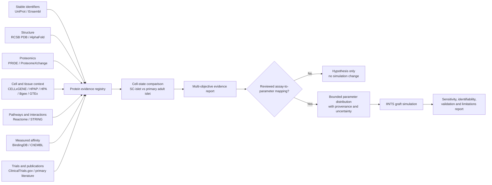

# Regenerative Islet Research

## Purpose and boundary

IINTS-AF can become a useful computational workbench for studying
stem-cell-derived islets, graft survival, and protein-level evidence. Its role
must remain precise:

> IINTS-AF can organize evidence, compare cell states, generate hypotheses,
> propagate uncertainty, and stress-test transparent graft models. It cannot
> discover or validate a treatment by itself.

This module is for pre-clinical research and education. It does not design a
clinical therapy, prescribe treatment, predict transplant success for a person,
or replace cell-biological, immunological, toxicological, animal, or clinical
validation.

The research question is therefore not "which protein cures type 1 diabetes?"
It is:

> Which measurable molecular and cellular properties distinguish a mature,
> glucose-responsive, stress-resistant, immunologically manageable, and
> growth-controlled stem-cell-derived islet graft from an inadequate or unsafe
> graft?

## What current evidence supports

The field has shown that cell replacement can restore measurable islet
function, but the central engineering and safety problems are not solved.

- A 2025 phase 1-2 study of the allogeneic stem-cell-derived product
  zimislecel reported restored islet function in a small, short-term cohort.
  Participants received immunosuppression, so this does not solve immune
  rejection or establish long-term safety and durability. See the
  [NEJM report](https://www.nejm.org/doi/10.1056/NEJMoa2506549) and
  [NCT04786262](https://clinicaltrials.gov/study/NCT04786262).
- A separate 2025 first-in-human report found short-term survival of
  gene-edited allogeneic donor islet cells without immunosuppression in one
  person. It was a single proof-of-concept recipient, the published follow-up
  was 12 weeks, and the cells were donor islets rather than a validated
  stem-cell-derived product. It must not be generalized into a cure claim. See
  the [NEJM report](https://www.nejm.org/doi/10.1056/NEJMoa2503822).
- Stem-cell-derived islets can achieve advanced glucose-responsive function,
  but metabolic and transcriptional differences from primary adult islets can
  remain. See the [Nature Biotechnology maturation study](https://www.nature.com/articles/s41587-022-01219-z).
- Single-nucleus RNA and chromatin analysis has identified incomplete lineage
  specification and off-target enterochromaffin-like states in SC-islets. See
  the [Nature Cell Biology multi-omics study](https://www.nature.com/articles/s41556-023-01150-8).
- Immune-evasion candidates such as the IFN/JAK/STAT-CXCL10 axis have
  pre-clinical evidence, but reduced immune visibility can create competing
  risks involving infection surveillance, NK-cell recognition, and abnormal
  cell growth. See the
  [whole-genome CRISPR screen](https://pmc.ncbi.nlm.nih.gov/articles/PMC9481918/).

These findings support a multi-objective research platform. They do not support
one protein, one structure, or one model score as a therapeutic answer.

## Why AlphaFold is one layer, not the answer

AlphaFold is valuable for structural hypotheses, domain inspection, mutation
localization, and identifying regions where a predicted model is uncertain.
AlphaFold pLDDT and PAE represent prediction confidence. They do not measure:

- expression or protein abundance;
- post-translational modification or proteoforms;
- secretion, trafficking, or membrane localization;
- binding affinity or kinetic rate constants;
- pathway causality;
- beta-cell identity, maturation, or glucose-stimulated insulin secretion;
- immune rejection, tumorigenicity, graft survival, or patient benefit.

IINTS-AF therefore applies this hard rule:

\[
\mathrm{pLDDT},\mathrm{PAE}\;\not\Rightarrow\;
\text{physiological parameter, efficacy, or safety}
\]

An AlphaFold observation may create a testable structural hypothesis. It may
not automatically alter a patient or graft simulation.

## Proposed evidence architecture



The review gate between the evidence report and simulation is deliberate. It
prevents a database score, language model, or attractive protein structure from
becoming an unsupported physiological constant.

## Core protein panels

The bundled registry is stored in
`src/iints/data/regenerative_protein_panels.json`. UniProt accessions are used
as stable protein identifiers; gene symbols are labels, not primary keys.

| Panel | Initial proteins | Question |
| --- | --- | --- |
| Beta-cell identity and function | INS, PDX1, NKX6-1, MAFA, GCK, ABCC8, KCNJ11, PCSK1, PCSK2, SLC30A8 | Are cells correctly specified, mature, and able to sense glucose, process proinsulin, and secrete insulin? |
| Immune visibility and evasion | B2M, CIITA, CXCL10, CD274, CD47, HLA-E | How are T cells and NK cells engaged, and what surveillance risks accompany reduced immune visibility? |
| Stress survival and graft support | HIF1A, VEGFA, HSPA5, TXNIP, NFE2L2 | Can cells tolerate hypoxia, ER stress, oxidative stress, inflammation, and delayed vascularization? |
| Residual pluripotency and growth safety | POU5F1, NANOG, SOX2, MKI67 | Are undifferentiated or abnormally proliferating cells detectable and controlled over time? |

These are evidence panels, not intervention recommendations. A marker may be
useful for measurement without being a safe or effective engineering target.

Python callers can inspect a panel and its required evidence sources without
performing any automatic efficacy scoring:

```python
from iints.research.regenerative_islet import build_regenerative_evidence_plan

plan = build_regenerative_evidence_plan("beta_cell_identity_and_function")
print(plan.to_dict())
```

## Proteomics dataset ingestion (PRIDE / MaxQuant / DIA-NN)

To transform raw or processed mass spectrometry matrices into the strict comparator contract, use `iints research regenerative import-proteomics`:

```bash
# 1. Ingest MaxQuant proteinGroups.txt
iints research regenerative import-proteomics \
  --input-file data/maxquant/proteinGroups.txt \
  --sample-metadata data/sample_annotations.csv \
  --source-id PXD001539 \
  --format maxquant \
  --output-csv data/standardized_islet_proteomics.csv

# 2. Ingest DIA-NN / Spectronaut report.tsv
iints research regenerative import-proteomics \
  --input-file data/diann/report.tsv \
  --sample-metadata data/sample_annotations.csv \
  --source-id PXD064528 \
  --format diann \
  --output-csv data/standardized_islet_proteomics.csv

# 3. Ingest wide matrix (TSV/CSV with sample columns)
iints research regenerative import-proteomics \
  --input-file data/matrix.tsv \
  --sample-metadata data/sample_annotations.csv \
  --source-id PXD001539 \
  --format wide_matrix \
  --output-csv data/standardized_islet_proteomics.csv
```

Sample metadata files (`sample_annotations.csv` / `.tsv` / `.json`) define sample-level experimental groups:
```csv
sample_id,group,batch_id,source_id
SC_Sample_1,sc_islet,batch_A,PXD001539
SC_Sample_2,sc_islet,batch_A,PXD001539
SC_Sample_3,sc_islet,batch_B,PXD001539
Primary_Sample_1,primary_islet,batch_A,PXD001539
Primary_Sample_2,primary_islet,batch_A,PXD001539
Primary_Sample_3,primary_islet,batch_B,PXD001539
```

## Current comparator workflow

The SDK includes a descriptive SC-islet versus reference-islet protein
comparator:

```bash
iints research regenerative panels

iints research regenerative compare \
  --dataset data/standardized_islet_proteomics.csv \
  --panel beta_cell_identity_and_function \
  --normalization-note "Joint median normalization within one experiment" \
  --output-dir results/regenerative/protein_comparison
```

The input is a protein-level CSV or Parquet table. It requires these columns:

| Column | Meaning |
| --- | --- |
| `gene_symbol` | Protein-coding gene symbol matching a bundled panel |
| `group` | Experimental group; defaults are `sc_islet` and `primary_islet` |
| `sample_id` | Independent biological sample identifier |
| `value` | Finite protein-level abundance after documented preprocessing |
| `unit` | Measurement unit or normalized-intensity label |
| `scale` | Exactly `linear` or `log2` |
| `source_id` | Dataset or study provenance identifier |
| `batch_id` | Strongly recommended batch identifier |

Peptide rows must be aggregated to one protein-level value per gene and sample
before comparison. Units and scales must match between groups. The comparator
does not normalize unrelated studies automatically; different `source_id`
sets force a `review_required` result.

Outputs include:

- `protein_comparison.csv` with medians, descriptive log2 differences, sample
  counts, and bootstrap intervals when both groups have at least three samples;
- `comparison_report.json` with input hash, provenance, warnings, panel
  coverage, and explicit non-clinical boundaries;
- `comparison_report.md` for scientific review;
- `comparison_forest.html` when Plotly is installed.

A forest plot is used instead of a radar chart. A radar chart can conceal
missing proteins, mix unrelated scales, and visually imply that the axes form
one validated biological score.

The comparator deliberately does not calculate proposed shortcuts such as
`MAFA / (CHGA + TPH1)`: CHGA is a broad neuroendocrine marker and can be
present in desired endocrine cells, so placing it in an "immaturity"
denominator is not defensible. It also does not collapse PD-L1, CD47, HLA, and
NK-cell risk into one immune score. Those observations remain separate until
validated functional immune assays support a specific model.

## Evidence tiers

Every observation should retain its source, organism, cell line or donor,
assay, units, batch, processing method, and uncertainty. IINTS-AF should not
collapse unlike evidence into one confidence number.

| Tier | Evidence | Permitted conclusion |
| --- | --- | --- |
| 1 | Peer-reviewed human clinical evidence | Translational observation within the exact studied population, intervention, dose, site, follow-up, and co-treatment |
| 2 | Primary human islet or human ex-vivo evidence | Human biological relevance under the tested assay conditions |
| 3 | Human stem-cell-derived islet in-vitro evidence | Cell-product behavior for the tested line, protocol, stage, batch, and challenge |
| 4 | In-vivo animal or humanized-model evidence | Pre-clinical graft behavior within that model; not direct patient efficacy |
| 5 | Association, network, predicted structure, or in-silico model | Hypothesis generation only |

Contradictory findings remain visible. Missing evidence remains missing; it is
not imputed by a local AI model.

## Multi-objective evaluation

A single "cure score" would hide dangerous trade-offs. The workbench should
retain a vector of outcomes:

\[
\mathbf{y}=\left[
I_{identity},
F_{GSIS},
R_{stress},
V_{vascular},
E_{immune},
S_{growth}
\right]
\]

where each component has its own assay definition, uncertainty, and evidence
tier. Candidate hypotheses are compared as a Pareto set rather than ranked by
an arbitrary weighted sum. For example, improved immune evasion cannot cancel
evidence of uncontrolled proliferation.

## Rules for connecting assays to simulation

Only a measurable assay with a reviewed mapping may affect the transplant
model. The mapping must be bounded, unit-aware, versioned, and uncertainty
preserving:

\[
\theta_{model}\sim
p\left(\theta\mid y_{assay},\;context,\;provenance,\;uncertainty\right)
\]

Examples of potentially defensible future mappings are:

| Measured evidence | Possible model state or parameter | Required validation |
| --- | --- | --- |
| Dynamic GSIS or perifusion curve, C-peptide, proinsulin/insulin ratio | secretion capacity, glucose threshold, secretion delay | Independent primary-islet benchmark and repeated lines/batches |
| Viability under quantified hypoxia | hypoxia death-rate distribution | Oxygen measurement, exposure duration, cell density, and external validation |
| Cytokine or immune-cell challenge survival | inflammatory or adaptive death-rate distribution | Defined effector cells, donor replication, cytokine concentrations, and in-vivo comparison |
| Perfusion, vascular density, or oxygen recovery | vascularization and oxygen time constants | Placement-specific longitudinal graft data |
| Longitudinal residual-pluripotency and proliferation assays | safety gate only | It must never be traded against glucose performance |

The following mappings remain forbidden:

- pLDDT or PAE to insulin sensitivity, graft function, or therapy efficacy;
- STRING confidence to a causal effect size;
- one protein abundance measurement to a patient outcome;
- ClinVar classification to an effect size without functional evidence;
- language-model text to a numerical model parameter;
- an immune-evasion marker to a safety conclusion.

## Data stack

The first reproducible evidence bundle should combine complementary sources:

1. **Canonical protein identity:** UniProt sequence, isoform, domain, location,
   and reviewed annotation.
2. **Structure:** experimental complexes from RCSB PDB first; AlphaFold models
   and confidence where experimental structures are absent.
3. **Proteomics:** PRIDE/ProteomeXchange abundance and subcellular evidence.
   Useful starting records are
   [PXD001539](https://proteomecentral.proteomexchange.org/dataset/PXD001539),
   a quantitative human beta-cell proteome, and
   [PXD064528](https://proteomecentral.proteomexchange.org/ui?pxid=PXD064528),
   a cross-species subcellular islet atlas. The latter concerns type 2 diabetes
   remodeling and must not be mislabeled as direct type 1 diabetes evidence.
4. **Cell state:** CELLxGENE/HPAP and published SC-islet versus primary-islet
   single-cell and multi-omic references.
5. **Pathway context:** Reactome and STRING. STRING edges can represent several
   evidence channels and are not automatically physical binding or causality.
6. **Measured interactions:** BindingDB and ChEMBL, preserving assay type and
   units. Kd, Ki, IC50, and EC50 must not be silently interchanged.
7. **Translational state:** ClinicalTrials.gov and peer-reviewed clinical
   publications, with intervention, immunosuppression, sample size, follow-up,
   adverse events, and funding retained.

Raw patient-level, donor-level, or restricted data must not be committed to the
public GitHub repository. The MDMP layer should record licenses, consent and use
constraints, checksums, transformations, and source versions.

## First experiments for IINTS-AF

### 1. Maturity gap benchmark

Compare primary adult human beta cells with several SC-islet stages and batches
using identity, glucose-sensing, proinsulin-processing, secretion, and off-target
cell-state evidence. Hold out entire cell lines and differentiation batches;
randomly splitting cells from the same batch would create leakage.

### 2. Stress-resilience benchmark

Compare baseline, hypoxia, ER-stress, oxidative-stress, and inflammatory
conditions. Report function and viability together. A condition that preserves
insulin output briefly while increasing stress or death markers is not an
improvement.

### 3. Immune trade-off map

Build separate evidence axes for T-cell activation, NK-cell activation,
chemokine signaling, complement, graft function, and long-term growth safety.
Do not optimize for "invisibility" alone.

### 4. Assay-to-graft sensitivity study

After independent review of a mapping, propagate a distribution rather than a
point estimate through `iints.research.stem_cell_transplant`. Report which graft
conclusions are robust and which are dominated by uncertain parameters.

### 5. Safety-panel gate

Residual pluripotency, unexpected cell identity, abnormal proliferation, and
longitudinal growth must be hard gates. Better glucose metrics cannot override
a failed safety gate.

## Implementation roadmap

### Phase 0 - now present

- machine-readable, validated protein panels;
- stable UniProt identifiers;
- explicit evidence-source requirements;
- code-level rejection of direct protein-to-physiology mappings;
- tests that preserve AlphaFold and causality boundaries;
- unit-aware SC-islet versus reference protein comparison with provenance,
  missingness, replication, and cross-source review gates;
- machine-readable and Markdown comparison reports plus an optional forest
  plot;
- the existing transparent multi-compartment graft simulator.

### Phase 1 - evidence connectors

- read-only provider adapters for UniProt, RCSB PDB, AlphaFold, PRIDE,
  ProteomeXchange, CELLxGENE, Reactome, STRING, BindingDB, ChEMBL, and
  ClinicalTrials.gov;
- immutable raw response, normalized record, request parameters, timestamp,
  source version, license, and checksum;
- cache and offline replay so an analysis is reproducible.

### Phase 2 - cell-state comparison

- extend the current protein comparator beyond descriptive abundance;
- primary-human-islet reference profiles;
- SC-islet stage, line, batch, and challenge metadata;
- single-cell quality control, pseudobulk summaries, donor-aware statistics,
  and off-target cell detection;
- proteomic and transcriptomic evidence kept as separate modalities.

### Phase 3 - reviewed model bridge

- an assay-to-parameter registry with units, equations, parameter bounds,
  source evidence, reviewer, and version;
- uncertainty propagation, global sensitivity, and parameter-identifiability
  analysis;
- no mapping when evidence is unknown, conflicting, or context-mismatched.

### Phase 4 - external validation

- preregistered endpoints and locked analysis plans;
- leave-one-line, leave-one-batch, and leave-one-dataset-out validation;
- independent wet-lab and transplant-science collaborators;
- comparison against primary human islets and external graft studies;
- versioned negative results and failure cases, not only successful figures.

## What IINTS-AF should not build automatically

The SDK should not generate actionable gene-editing recipes, wet-lab protocols,
clinical dose recommendations, patient selection, or autonomous treatment
plans. Local AI may summarize cited evidence and identify contradictions, but
it may not invent measurements, assign physiological constants, or approve a
hypothesis.

## Success criteria

This direction is successful when an external researcher can answer:

- Which exact data and evidence support each claim?
- Is an observation structural, molecular, cellular, pre-clinical, or clinical?
- Which cell line, batch, donor, assay, and context produced it?
- What contradictory or missing evidence remains?
- Which assumptions connect an assay to the IINTS graft model?
- How sensitive is the conclusion to those assumptions?
- Did every identity, immune, function, stress, and growth-safety gate pass?

That would make IINTS-AF a transparent hypothesis and validation workbench for
regenerative diabetes research, rather than a system that overclaims a cure.
