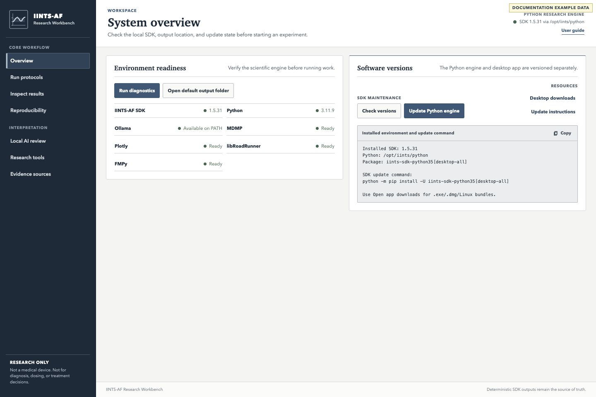
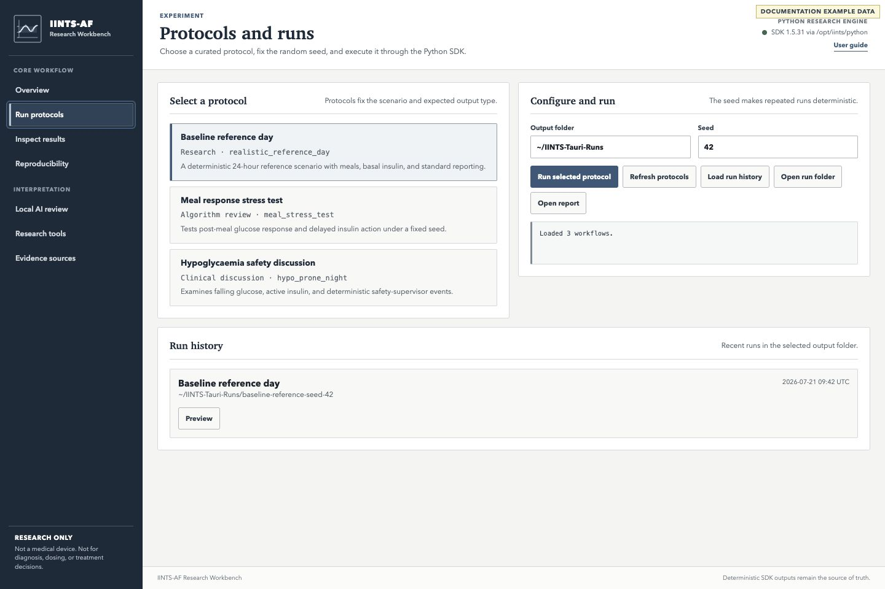
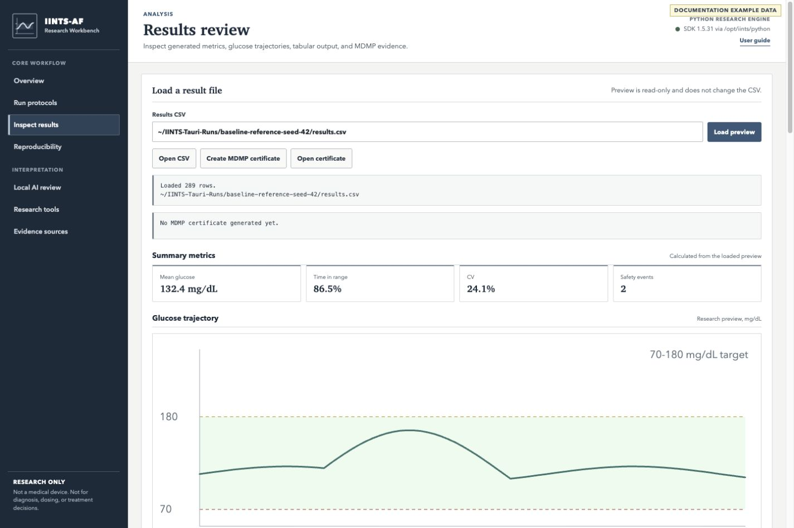
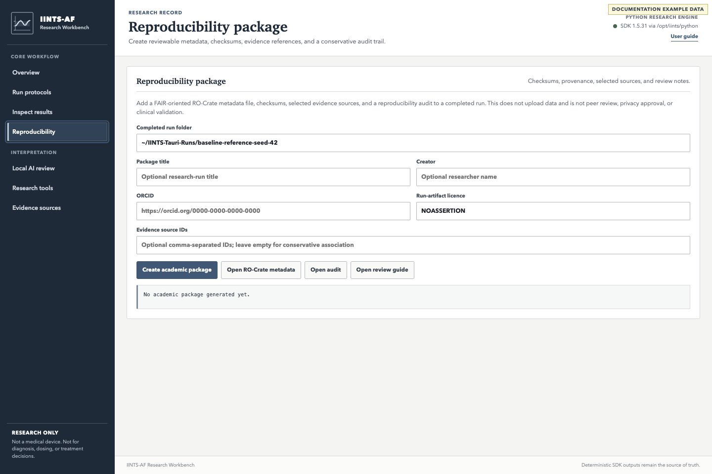
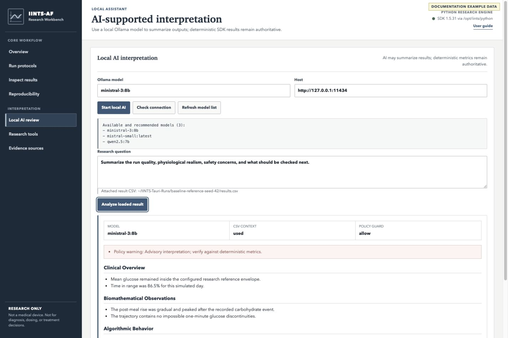
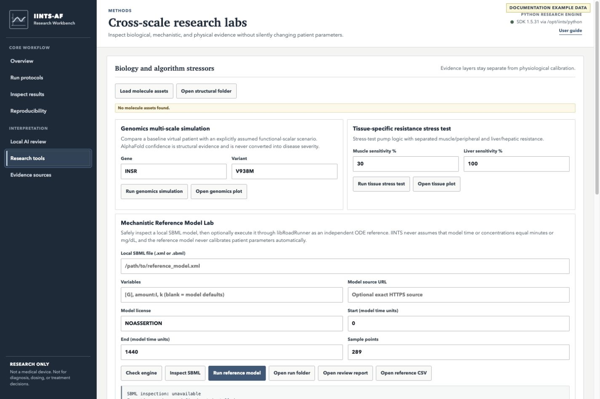
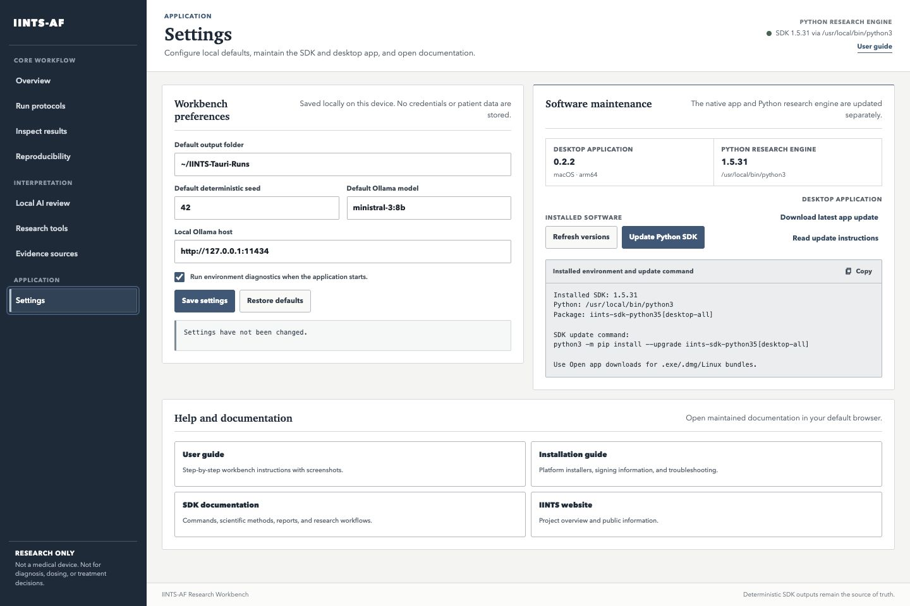

# Research Workbench User Guide

The IINTS-AF Research Workbench is the native desktop interface for the Python SDK. It helps you run a protocol, inspect its outputs, create reproducibility evidence, and request a local AI review without reimplementing scientific logic in the app.

!!! warning "Research scope"
    IINTS-AF is research and education software. It is not a medical device and must not be used for diagnosis, insulin dosing, treatment decisions, or real-time patient care.

!!! info "About the screenshots"
    The screenshots below use a labelled documentation fixture. The values illustrate the interface only; they are not study results or validation evidence.

## Install And Open

Use the current native beta installer for your platform:

| Platform | Installer |
| --- | --- |
| Windows | [Download `.exe`](https://github.com/python35/IINTS-SDK/releases/download/tauri-beta-latest/IINTS-AF-Research-Workbench-windows-x64-setup.exe) |
| macOS | [Download `.dmg`](https://github.com/python35/IINTS-SDK/releases/download/tauri-beta-latest/IINTS-AF-Research-Workbench-macos.dmg) |
| Linux | [Download `.AppImage`](https://github.com/python35/IINTS-SDK/releases/download/tauri-beta-latest/IINTS-AF-Research-Workbench-linux-x64.AppImage) |

The native app delegates calculations to the Python SDK. If the overview reports that the Python engine is unavailable, install or update it once:

```bash
python -m pip install --upgrade "iints-sdk-python35[desktop-all]"
```

You can also use **Settings → Update Python SDK**. The app opens a terminal with a fixed update command so the operation remains visible.

### Native interaction

The installed app deliberately behaves like a desktop workbench rather than a website:

- labels, navigation, and buttons cannot be accidentally selected or dragged
- inputs, logs, AI answers, result values, and tables remain selectable for research work
- the browser context menu is suppressed outside those copyable data areas
- scientific charts appear immediately without decorative drawing animations
- embedded browser developer tools are disabled in the packaged application

These interface rules do not restrict access to generated artifacts; files remain available in the selected output folder.

## The Normal Workflow

Use the left navigation in this order:

1. **Overview** — verify the local engine and optional tools.
2. **Run protocols** — choose a protocol, output folder, and deterministic seed.
3. **Inspect results** — review metrics, the glucose trace, and CSV rows.
4. **Reproducibility** — create checksums, metadata, and an audit package.
5. **Local AI review** — optionally ask Ollama to summarize the loaded result.
6. **Research tools** — use independent biology, equation-model, or device-physics tools.
7. **Evidence sources** — inspect connector status and open official resources.
8. **Settings** — save local defaults, check versions, update software, and open help.

## 1. Check The Environment



Select **Run diagnostics** before a new experiment. A normal ready environment shows:

- the installed IINTS-AF SDK version
- the Python version used by the app bridge
- whether Ollama is available
- readiness of optional modules such as MDMP, Plotly, libRoadRunner, and FMPy

Missing optional modules do not always block a normal simulation. They only block the feature that depends on them.

Equivalent terminal check:

```bash
iints doctor
python -c "import iints; print(iints.__version__)"
```

## 2. Run A Protocol



1. Select one protocol in the left panel.
2. Choose an output folder you can archive later.
3. Record the seed. The default `42` is suitable for a reproducible first run.
4. Select **Run selected protocol**.
5. Wait until the status field reports completion or a recorded error.

Do not compare runs unless their protocol, SDK version, patient profile, time step, and seed policy are recorded.

The app calls the same SDK engine used by CLI workflows. A typical command-line equivalent is:

```bash
iints presets run \
  --name realistic_reference_day \
  --algo algorithms/example_algorithm.py \
  --seed 42 \
  --output-dir results/reference_day_seed_42
```

The exact equivalent command can differ by curated desktop protocol. Treat the generated run configuration as the authoritative record.

## 3. Inspect Results



After a desktop protocol completes, the app loads its `results.csv` automatically. You can also paste an existing CSV path and select **Load preview**.

Review these parts together:

- **Result status** — confirms the file and row count that were loaded.
- **Summary metrics** — compact orientation metrics, not a complete analysis.
- **Glucose trajectory** — a bounded visual preview with the configured 70–180 mg/dL reference band.
- **Tabular preview** — the first bounded rows from the source CSV.
- **MDMP certificate** — data-contract checks for the selected CSV.

The preview is read-only. It must not silently interpolate, repair, or overwrite the source CSV.

Useful CLI checks:

```bash
iints report --results-csv path/to/results.csv --style agp
iints data certify data_contract.yaml path/to/results.csv --quick
```

Read [Understand A Run](RUN_OUTPUTS.md) before using a preview as evidence in a study.

## 4. Create A Reproducibility Package



Open **Reproducibility** after loading a completed run.

1. Confirm the completed run folder.
2. Add a descriptive package title.
3. Add the researcher name and ORCID when appropriate.
4. Leave the run-artifact licence as `NOASSERTION` unless you know which licence applies to every exported artifact.
5. Add explicit evidence source IDs only when those sources support the run.
6. Select **Create academic package**.

The package stays local. It adds RO-Crate metadata, checksums, a source snapshot, and an audit report. A successful export is not peer review, privacy approval, or clinical validation.

Equivalent CLI command:

```bash
iints research academic-bundle path/to/completed_run
```

See [Academic Research Workbench](ACADEMIC_RESEARCH_WORKBENCH.md) for artifact definitions.

## 5. Use Local AI Review



Local AI is optional and advisory.

1. Open **Local AI review**.
2. Select or type an Ollama model name.
3. Keep the host at `http://127.0.0.1:11434` for a local server.
4. Select **Start local AI**. The app starts Ollama when possible and prepares the selected model.
5. Confirm that the correct result CSV is attached below the question.
6. Write a focused research question.
7. Select **Analyze loaded result**.

The answer is separated into model metadata, policy status, warnings, headings, and lists. Verify every numerical or physiological claim against deterministic SDK outputs.

Example questions:

```text
Which deterministic metrics should I inspect before accepting this run as realistic?
```

```text
Summarize the glucose pattern, list possible simulation artifacts, and identify claims that cannot be supported by this CSV alone.
```

Do not ask the model for dosing or treatment advice. Read [AI Safety Gates](LOCAL_AI_SAFETY_GATES.md) for the enforced boundaries.

## 6. Use Research Tools



The **Research tools** workspace contains independent evidence and stress-test layers:

| Tool | Use | Important boundary |
| --- | --- | --- |
| AlphaFold assets | inspect protein structure and PAE confidence | confidence is not disease severity |
| Genomics stressor | compare an explicit functional-scalar scenario | unknown variants are not assigned an effect automatically |
| Tissue resistance | separate muscle and liver sensitivity assumptions | a stress test is not patient calibration |
| SBML/libRoadRunner | execute an independent equation model | external units are not assumed to be mg/dL or minutes |
| COPASI | inspect sensitivity and identifiability tasks | configured tasks and bounds require review |
| OpenCOR/CellML | validate an independent physiology model | imported models remain separate evidence |
| FMI/FMPy | inspect or run reviewed device-physics models | FMUs can contain native code and require explicit trust |
| BindingDB | retrieve measured affinity records | Ki, Kd, IC50, pLDDT, and in-vivo effect are distinct evidence types |

Start with **Check all engines**. Open only the lab you need, and preserve the generated evidence bundle with the study record.

## 7. Evidence Sources

The **Evidence sources** workspace describes whether a connector is:

- **Integrated** — the SDK can retrieve or generate a bounded evidence artifact.
- **Partial** — only part of the workflow is implemented.
- **Portal** — the app opens the official external resource.
- **Planned** — no functioning integration exists yet.

Opening a portal does not import its content into a simulation. External evidence must be cited, reviewed, licensed appropriately, and connected to a claim explicitly.

## 8. Configure And Maintain The App



Open **Settings** to maintain the workbench without mixing application controls into a scientific run.

### Local preferences

You can set:

- the default output folder
- the default deterministic seed
- the default local Ollama model
- the local Ollama host
- whether diagnostics run at startup

Select **Save settings** to apply these values to the Run and Local AI workspaces. Preferences are stored only in the app's local browser storage. The Settings panel does not store tokens, passwords, patient data, or run results. Ollama hosts are restricted to `localhost`, `127.0.0.1`, or `::1`.

### Software updates

The desktop app and Python SDK have separate version records:

- **Update Python SDK** opens a terminal and runs a fixed, Rust-owned package update command. The app does not accept arbitrary shell text.
- **Download latest app update** opens the stable `tauri-beta-latest` GitHub release. Install the new signed installer for your platform after closing the current app.
- **Refresh versions** checks the native app and the Python engine independently.

The beta deliberately does not replace its own executable silently. This keeps downloads, signatures, and release notes visible until a signed Tauri self-updater is introduced and audited.

### Help

The same workspace links to this user guide, installation troubleshooting, the complete SDK documentation, and [iints.org](https://iints.org/).

## Common Problems

| Message or symptom | What to do |
| --- | --- |
| Python bridge unavailable | update the Python engine from Settings, then restart the app |
| Protocol list is empty | run diagnostics, verify the SDK installation, then select Refresh protocols |
| CSV preview fails | confirm the path exists and points to a supported results CSV |
| Ollama not found | install Ollama once, then select Start local AI |
| Model is missing | choose Refresh model list or allow Start local AI to pull the selected model |
| Optional research engine missing | install or configure only the engine required for that lab |
| macOS blocks the beta | follow the signed-build and Gatekeeper guidance in [Desktop App Installation](APP_INSTALL.md) |

## Keep A Reviewable Record

For every result you intend to discuss or publish, preserve:

```text
run-folder/
├── results.csv
├── config.json or run metadata
├── clinical or research report
├── safety and audit events
├── MDMP artifacts when used
└── academic_bundle/
    ├── ro-crate-metadata.json
    ├── checksums
    └── academic audit
```

The interface is a workbench, not the scientific authority. The Python SDK output, recorded configuration, deterministic checks, and source evidence remain the basis for interpretation.
