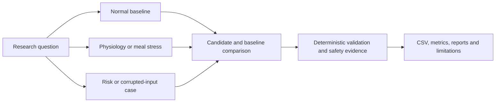

# Project and Research Question

## Motivation

Automated insulin-delivery research combines software, physiology, noisy sensor
data and safety-critical decisions. A controller can improve an average metric
while still producing dangerous edge cases. A polished graph can also hide
unrealistic rates of change, missing data, excessive interventions or a
favourable choice of seed.

IINTS-AF was built to make those problems inspectable. It treats a simulation
run as a complete research object: protocol, inputs, model, candidate decision,
safety decision, raw outputs, validation and interpretation.

## Primary research question

> Can an open-source simulation workbench make risky or unrealistic
> diabetes-algorithm behaviour visible and reproducible before an algorithm is
> considered for real-world testing?

## Hypothesis

An algorithm that reacts to incomplete glucose context can produce questionable
actions in stress or failure scenarios. A separate deterministic safety layer,
combined with reproducible scenarios and evidence artifacts, should make at
least part of this behaviour detectable, blockable and reviewable.

## Experimental structure

## Main contribution

The project contribution is the research workflow around algorithms, not a
claim that one controller solves diabetes:

1. Define a patient, scenario, seed and algorithm.
2. Run a mechanistic or transparent virtual-patient model.
3. Keep the candidate algorithm separate from safety authority.
4. Record candidate and delivered actions.
5. Validate data and physiological plausibility.
6. Compare baselines over a locked matrix.
7. Export raw evidence and human-readable reports.
8. Allow AI to explain the evidence without changing it.

## Why this is different from one notebook

| Notebook-only risk | IINTS-AF response |
| --- | --- |
| Hidden state and manual cells | Versioned CLI/SDK workflows and fixed seeds |
| One attractive run | Scenario, patient, algorithm and seed matrices |
| Black-box output | Candidate action, safety action and intervention reason |
| Metrics without raw evidence | CSV traces, manifests, reports and validation files |
| AI-generated interpretation | Deterministic metrics first; LLM explanation second |
| Unclear data provenance | Source manifests, hashes, contracts and MDMP reports |
| Demo code disconnected from research | The demo runs the packaged SDK workflow |

## Scope of the work

The SDK covers four connected research areas.

### 1. Simulation

Virtual patients expose latent glucose, insulin action, meal absorption and
selected research extensions. A sensor model converts latent glucose into a
CGM-like observation.

### 2. Algorithm and safety experiments

Baselines, experimental controllers and forecasting models can be tested, but
the deterministic supervisor remains a separate authority in simulated action
paths.

### 3. Data and AI research

The SDK can prepare diabetes datasets, derive context features, train glucose
forecasting models and compare models with both numerical and physiological
checks.

### 4. Evidence and communication

Runs can produce clinical-style reports, AGP-style assets, posters, audit
artifacts and a structured evidence bundle for independent review.

## Claim ladder

The project uses a claim ladder to prevent results from being overstated.

| Level | Claim that may be made |
| --- | --- |
| Implemented | The code path exists and is covered by tests or inspectable output |
| Verified in software | Expected behaviour was observed under specified test conditions |
| Calibrated in a dataset | Parameters or metrics were compared with a documented dataset |
| Externally validated | Performance was tested on an independent population or reference simulator |
| Clinically validated | Requires clinical and regulatory evidence outside the present project |

Most IINTS-AF claims are at the first two levels. Some data and realism
workflows reach the calibration level. The project does not claim clinical
validation.

## Success criteria for EUCYS

The EUCYS presentation is successful when a reviewer can answer:

- What was tested?
- Which equations and parameters produced the virtual state?
- What did the candidate propose?
- Did the safety layer change it?
- Which output proves that?
- Can the run be reproduced?
- Which limitations prevent a clinical claim?
