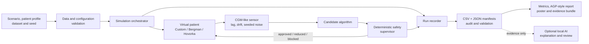
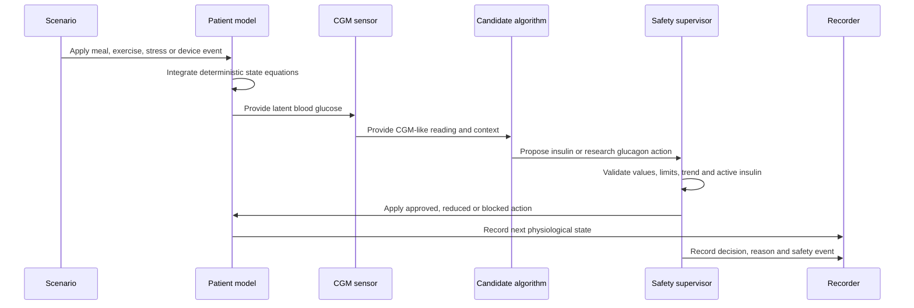
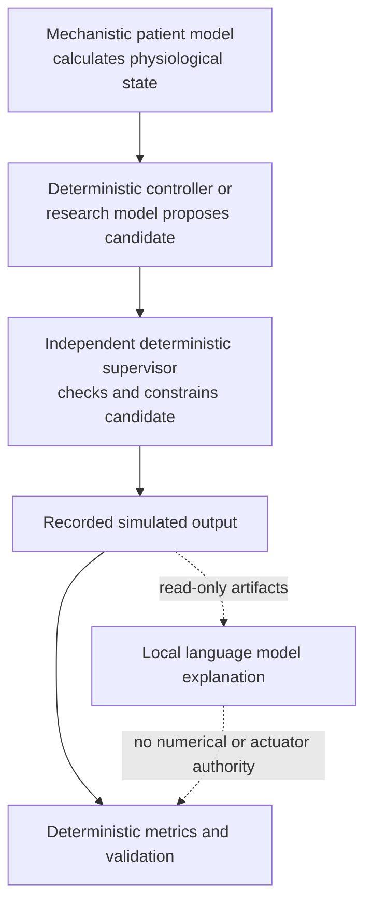
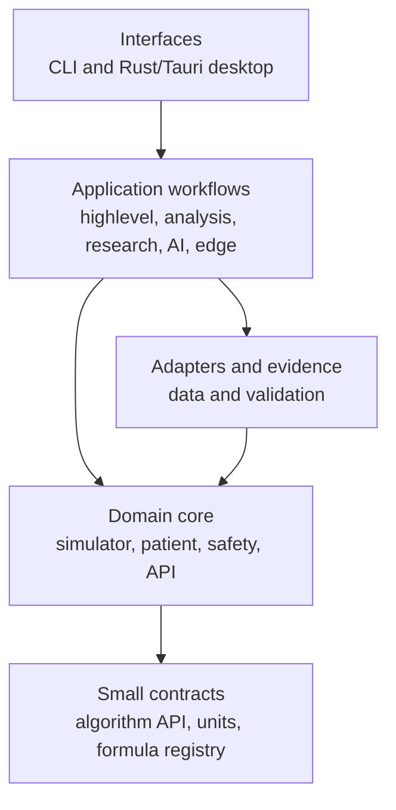
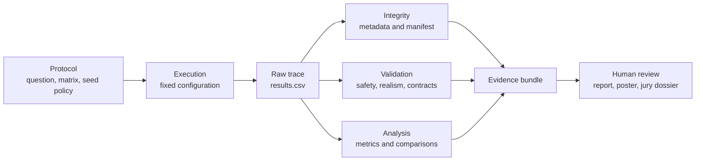
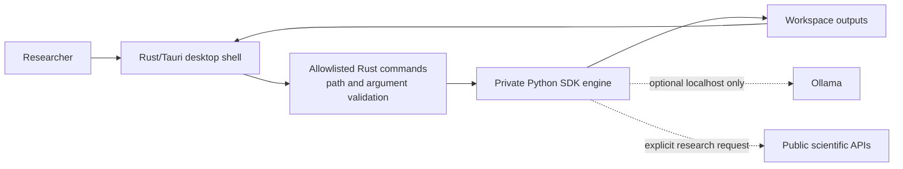
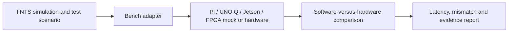

# System Architecture

## Architectural principle

The most important separation in IINTS-AF is:

> The patient model calculates state, a candidate algorithm proposes an action,
> deterministic safety logic decides what is allowed in the simulation, and
> reporting consumes the resulting evidence afterward.

No language model is part of the numerical physiology solver or final simulated
action authority.

## End-to-end architecture

<!-- diagram:system-architecture -->

## One simulation step

<!-- diagram:simulation-step -->

The exact ordering depends on the selected workflow, but the authority boundary
does not change: an experimental proposal cannot bypass deterministic
validation.

## Numeric authority

<!-- diagram:numeric-authority -->

Authority order:

1. Explicit model code calculates physiological state.
2. Deterministic or learned algorithms may calculate a candidate.
3. The supervisor validates, clamps or rejects the candidate.
4. Metric code calculates results from recorded traces.
5. A language model may explain supplied values but may not replace them.

## Source-layer architecture

| Layer | Important paths | Responsibility |
| --- | --- | --- |
| Domain core | `src/iints/core/`, `src/iints/api/` | Patient state, simulator, algorithm contract and deterministic safety |
| Data and validation | `src/iints/data/`, `src/iints/validation/` | Imports, contracts, realism, replay and evidence checks |
| Application workflows | `src/iints/highlevel.py`, `src/iints/analysis/`, `src/iints/research/`, `src/iints/ai/` | Run orchestration, reports, studies and optional research AI |
| Edge adapters | `src/iints/live_patient/`, `src/iints/jetson/` | Bench-only hardware and endurance workflows |
| Interfaces | `src/iints/cli/`, `apps/iints-tauri/`, `src/iints_desktop/` | User interaction without redefining domain rules |

The core is intentionally dependency-light. It must not import the CLI,
reporting UI, training orchestration or hardware presentation layer. The
repository checks these boundaries with
`tools/ci/check_architecture_boundaries.py`.

## Evidence lifecycle

<!-- diagram:evidence-lifecycle -->

Typical artifacts:

| Artifact | What it proves |
| --- | --- |
| `results.csv` | The recorded state, observations, events and actions |
| `run_metadata.json` | Patient, scenario, algorithm, duration, step and seed |
| `run_manifest.json` | File inventory and integrity information |
| `audit/` or safety report | Candidate versus accepted action and intervention reason |
| `validation_report.json` | Deterministic checks and warnings |
| `realism_report.json` | Plausibility comparison against a documented reference |
| `report.pdf` / AGP-style assets | Human-readable interpretation of the same trace |
| `sources_manifest.json` | Scientific and data-source context |

## Desktop application boundary

<!-- diagram:desktop-bridge -->

The desktop application is an interface to the same Python SDK. It should not
contain a second physiology implementation. Rust/Tauri narrows desktop command
execution and file access; Python remains the research engine.

## Hardware boundary

All hardware paths are research and bench-only. They may demonstrate protocols,
timing, deterministic safety logic or edge execution. They are not authorised
to deliver medication to a person.

## Failure containment

| Failure | Required response |
| --- | --- |
| Missing or invalid model checkpoint | Fail closed or use a documented deterministic fallback |
| Non-finite physiology or prediction | Reject, terminate or flag; never silently continue |
| Sensor dropout or invalid glucose | Mark observation invalid and invoke configured safety behaviour |
| AI unavailable | Preserve the run; omit optional explanation |
| AI contradicts a metric | Deterministic artifact remains authoritative |
| Optional scientific API unavailable | Preserve cached/local work and report the missing context |
| Report generation fails | Keep raw trace, metadata and validation artifacts |
