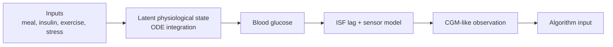

# Scientific Model and Formula Registry

## Scientific rule

The equations in this chapter are not calculated by a language model. They are
registered as immutable documentation in
`src/iints/core/formula_registry.py` and evaluated by deterministic Python code.
The local AI receives the registry only as read-only explanation context.

Registry version: `iints-formula-registry-v6` 
Registered formulas: `15`

!!! note "What 'implemented' means"
    Implemented means that the equation or stated approximation exists in the
    cited runtime path. It does not mean that every parameter has been
    clinically identified for every patient, or that the combined model is a
    certified clinical simulator.

## Model families

| Model | Purpose | Strength | Limitation |
| --- | --- | --- | --- |
| Custom patient | Fast scenario sweeps and transparent demos | Simple, fast and inspectable | Lower physiological detail |
| Bergman-style model | Compact glucose-insulin ODE research | Familiar minimal-model structure | Extensions go beyond the original minimal model |
| Hovorka-style model | Richer compartmental research physiology | Separates glucose mass, insulin depots and action channels | More parameters and stronger calibration burden |

## State and observation separation

This distinction matters: the algorithm can observe delayed and noisy CGM-like
data while the simulator preserves a separate latent physiological state.

## Formula catalogue

### F01 - Bergman-style glucose concentration balance

\[
\frac{dG}{dt}
=-(p_{1,\mathrm{eff}}+X)G
+p_{1,\mathrm{eff}}G_{b,\mathrm{eff}}
+R_a+D_{\mathrm{dawn}}-U_{\mathrm{exercise}}-F_R
\]

**Meaning:** glucose moves toward an effective basal state, remote insulin
action lowers glucose, and meal, dawn, exercise and renal terms add or remove
glucose.

**Units:** \(G\) in mg/dL; rates in mg/dL/min. 
**Runtime:** `src/iints/core/patient/bergman_model.py:_ode` 
**Boundary:** a research extension of the Bergman minimal-model structure.

### F02 - Remote insulin action

\[
\frac{dX}{dt}
=-p_2X+p_{3,\mathrm{eff}}(I-I_{\mathrm{ref}})
\]

**Meaning:** plasma insulin relative to the pump-supported fasting reference
does not act instantly; it builds a slower remote action state that also decays
over time. The signed deviation preserves loss of action during basal
interruption.

**Units:** \(X\) in 1/min; \(I\) in mU/L. 
**Runtime:** `src/iints/core/patient/bergman_model.py:_ode`

### F03 - Plasma insulin balance with optional experimental secretion

\[
\frac{dI}{dt}
=-nI
+\frac{q_{\mathrm{sec}}(1-f_{\mathrm{subq}})+R_{a,I}}{V_I},
\qquad
q_{\mathrm{sec}}=\gamma M_{\mathrm{graft}}\max(G-h,0)V_I
\]

**Meaning:** plasma insulin is cleared, subcutaneous insulin appears through
the absorption chain, and an optional experimental graft term can be enabled.

**Units:** \(I\) in mU/L; \(R_{a,I}\) in mU/min; \(V_I\) in L. 
**Runtime:** `src/iints/core/patient/bergman_model.py:_ode` 
**Boundary:** the graft term is disabled by default for T1D profiles and is an
experimental abstraction, not a transplant outcome predictor.

### F04 - Two-depot subcutaneous insulin absorption

\[
\begin{aligned}
\frac{dS_1}{dt}
&=u_I+\gamma M_{\mathrm{graft}}\max(G-h,0)f_{\mathrm{subq}}-kS_1\\
\frac{dS_2}{dt}
&=kS_1-kS_2\\
U_I&=kS_2
\end{aligned}
\]

**Meaning:** delivered insulin enters two subcutaneous depots before reaching
the plasma/effect model, creating a physiological delay.

**Units:** depot mass in mU; input and appearance in mU/min. 
**Runtime:** `bergman_model.py:_ode`, `hovorka_model.py:_ode` 
**Boundary:** the absorption time constant is a configured research parameter,
not a molecule-level diffusion simulation.

### F05 - Three-compartment meal absorption

\[
\begin{aligned}
\frac{dD_1}{dt}&=-k_{\mathrm{solid}}D_1\\
\frac{dD_2}{dt}&=k_{\mathrm{solid}}D_1-k_{\mathrm{empt}}D_2\\
\frac{dD_3}{dt}&=k_{\mathrm{empt}}D_2-k_{\mathrm{abs}}D_3\\
U_G&=k_{\mathrm{abs}}D_3A_G
\end{aligned}
\]

**Meaning:** carbohydrate passes through solid stomach, liquid stomach and gut
compartments before appearing as glucose.

**Units:** carbohydrate mass in mg; appearance in mg/min or concentration rate
after volume scaling. 
**Runtime:** `bergman_model.py:_ode`, `hovorka_model.py:_ode` 
**Boundary:** inspired by published meal models, but not a complete digestive
or incretin model.

### F06 - Hovorka-style glucose mass balance

\[
\begin{aligned}
\frac{dQ_1}{dt}
&=-(\mathrm{NIMGU}+F_R)-x_1Q_1+k_{12}Q_2\\
&\quad+\mathrm{EGP}_0\max(0,1-x_3+x_{\mathrm{gluc}})+U_G\\
\frac{dQ_2}{dt}
&=x_1Q_1-(k_{12}+x_2)Q_2
\end{aligned}
\]

\[
G=\frac{Q_1}{V_{G,\mathrm{dL}}}
\]

**Meaning:** accessible and non-accessible glucose masses exchange glucose
while insulin action, endogenous production, meals, exercise-related uptake and
renal loss alter the balance.

**Units:** \(Q_1,Q_2\) in mg; fluxes in mg/min; \(G\) in mg/dL. 
**Runtime:** `src/iints/core/patient/hovorka_model.py:_ode` 
**Boundary:** Hovorka-style research RHS with explicitly documented
extensions.

### F07 - Hovorka insulin-action channels

\[
\begin{aligned}
\frac{dx_1}{dt}&=-k_{a1}x_1+k_{b1}I\\
\frac{dx_2}{dt}&=-k_{a2}x_2+k_{b2}I\\
\frac{dx_3}{dt}&=-k_{a3}x_3+k_{b3}I
\end{aligned}
\]

**Meaning:** insulin effects on distribution, disposal and endogenous glucose
production have separate response channels and time constants.

**Runtime:** `src/iints/core/patient/hovorka_model.py:_ode` 
**Boundary:** configured sensitivity scalars are scenario assumptions. Protein
confidence or ClinVar classification is not allowed to calculate these values.

### F08 - Stress and exercise modifiers

\[
\begin{aligned}
\frac{dH_{\mathrm{stress}}}{dt}
&=\frac{H_{\mathrm{stress,target}}-H_{\mathrm{stress}}}{20}\\
\frac{dH_{\mathrm{exercise}}}{dt}
&=\frac{H_{\mathrm{exercise,target}}-H_{\mathrm{exercise}}}{10}\\
S_{\mathrm{overall}}
&=(1-0.7H_{\mathrm{stress}})(1+2H_{\mathrm{exercise}})\\
\mathrm{EGP}_{\mathrm{stress}}
&=1+0.5H_{\mathrm{stress}}
\end{aligned}
\]

**Meaning:** scenario inputs pass through first-order pseudo-hormone states
instead of changing sensitivity instantaneously.

**Units:** dimensionless states; time constants in minutes. 
**Runtime:** `src/iints/core/patient/hovorka_model.py:_ode` 
**Boundary:** this is a stress/exercise abstraction, not a measured cortisol or
adrenaline assay model.

### F09 - Exercise-driven GLUT4/NIMGU state

\[
\begin{aligned}
\frac{d\mathrm{GLUT4}}{dt}
&=k_{\mathrm{act}}H_{\mathrm{exercise}}(1-\mathrm{GLUT4})
-k_{\mathrm{deact}}\mathrm{GLUT4}\\
\mathrm{NIMGU}
&=F_{01c}(1+1.5\,\mathrm{GLUT4})
\end{aligned}
\]

**Meaning:** exercise can increase non-insulin-mediated glucose uptake through
a bounded activation state.

**Runtime:** `src/iints/core/patient/hovorka_model.py:_ode` 
**Boundary:** educational systems-level approximation, not a cell-level
translocation simulation.

### F10 - Circadian and dawn EGP multiplier

\[
\begin{aligned}
\phi
&=\frac{2\pi(t_{\mathrm{day}}-t_{\mathrm{dawn,mid}})}{1440}\\
C(\phi)
&=0.15\cos(\phi)+0.05\cos(2\phi)\\
\mathrm{EGP}_{\mathrm{circadian}}
&=1+s_{\mathrm{dawn}}C(\phi)
\end{aligned}
\]

**Meaning:** a small gated Fourier series can modulate endogenous glucose
production by time of day.

**Runtime:** `src/iints/core/patient/hovorka_model.py:_ode` 
**Boundary:** off or weak by default; it is not a personalised circadian model.

### F11 - Endogenous hypoglycaemia rescue multiplier

\[
\begin{aligned}
\Delta_{\mathrm{hypo}}&=\max(0,70-G)\\
R_{\mathrm{rescue}}
&=1+\frac{\Delta_{\mathrm{hypo}}}{10}(1-\mathrm{HAAF})
\end{aligned}
\]

**Meaning:** low glucose can increase endogenous rescue, while a high HAAF
memory state blunts the response.

**Runtime:** `bergman_model.py:_ode`, `hovorka_model.py:_ode` 
**Boundary:** captures a concept of counterregulation; it is not a diagnostic
model of hypo awareness.

### F12 - HAAF memory

\[
\begin{aligned}
\frac{d\mathrm{HAAF}}{dt}
&=k_{\mathrm{build}}\Delta_{\mathrm{hypo}}(1-\mathrm{HAAF})
-k_{\mathrm{decay}}\mathrm{HAAF}\\
k_{\mathrm{decay}}&=\frac{1}{24\cdot60}
\end{aligned}
\]

**Meaning:** repeated low-glucose exposure increases a bounded memory state
that slowly decays.

**Units:** dimensionless state; rates in 1/min. 
**Runtime:** `bergman_model.py:_ode`, `hovorka_model.py:_ode` 
**Boundary:** research memory only; never report it as a patient diagnosis.

### F13 - Exogenous glucagon PK/PD

\[
\begin{aligned}
\frac{dY_1}{dt}&=u_G-\frac{Y_1}{t_{\max,G}}\\
\frac{dY_2}{dt}&=\frac{Y_1}{t_{\max,G}}-\frac{Y_2}{t_{\max,G}}\\
\frac{d\Gamma}{dt}
&=\frac{Y_2/t_{\max,G}}{V_\Gamma}-k_{eG}\Gamma\\
\frac{dx_{\mathrm{gluc}}}{dt}
&=-k_{aG}x_{\mathrm{gluc}}+S_Gk_{aG}\Gamma
\end{aligned}
\]

**Meaning:** a research glucagon request passes through two subcutaneous
depots, plasma appearance and a slower action state affecting endogenous
glucose production.

**Runtime:** `bergman_model.py:_ode`, `hovorka_model.py:_ode` 
**Boundary:** dual-hormone simulation only; not a real pump recommendation.

### F14 - Smooth renal glucose clearance

\[
\begin{aligned}
\operatorname{softplus}_s(z)
&=s\ln(1+e^{z/s})\\
z&=G-162\\
F_R&=c\,\operatorname{softplus}_s(G-162)
\end{aligned}
\]

**Meaning:** glucose loss above an approximate renal threshold increases
smoothly instead of switching on at a discontinuous hard cutoff.

**Runtime:** `src/iints/core/patient/physiology.py:smooth_threshold_excess`,
`bergman_model.py:_ode`, `hovorka_model.py:_ode` 
**Boundary:** the threshold and splay are configurable research
approximations.

### F15 - CGM blood-to-ISF observation

\[
\begin{aligned}
\tau_{\mathrm{ISF}}\frac{d\mathrm{ISF}}{dt}
&=\mathrm{BG}_{\mathrm{lagged}}-\mathrm{ISF}\\
\mathrm{ISF}_{\mathrm{next}}
&=\mathrm{ISF}+\alpha(\mathrm{BG}_{\mathrm{lagged}}-\mathrm{ISF})\\
\mathrm{CGM}
&=\mathrm{ISF}+b+d+\varepsilon-o_{\mathrm{compression}}
\end{aligned}
\]

**Meaning:** the algorithm sees a delayed interstitial signal with configured
bias, drift, seeded noise and optional compression artifact rather than perfect
blood glucose.

**Units:** mg/dL. 
**Runtime:** `src/iints/core/devices/models.py:SensorModel.read` 
**Boundary:** models qualitative CGM behaviour; it does not reproduce a named
commercial sensor exactly.

## Numerical solution and reproducibility

The ODE-based models use `scipy.solve_ivp` over simulator steps. Runtime guards
check finite values and constrain implausible transitions. Controlled
stochastic components, such as sensor noise or synthetic populations, use
explicit seeds and preserved local random state.

The same configuration, software version and seed should reproduce the same
run path. Reproducibility is checked through replay and golden-vector tests, but
floating-point and dependency changes must still be recorded in manifests.

## Scientific sources behind the registry

The main foundations are:

1. Bergman et al., minimal-model insulin sensitivity,
   [DOI 10.1152/ajpendo.1979.236.6.E667](https://doi.org/10.1152/ajpendo.1979.236.6.E667).
2. Hovorka et al., nonlinear model predictive control and T1D physiology,
   [DOI 10.1088/0967-3334/25/4/010](https://doi.org/10.1088/0967-3334/25/4/010).
3. Dalla Man et al., meal glucose-insulin model,
   [DOI 10.1109/TBME.2007.893506](https://doi.org/10.1109/TBME.2007.893506).
4. Cryer, hypoglycaemia-associated autonomic failure,
   [DOI 10.1056/NEJMra1215228](https://doi.org/10.1056/NEJMra1215228).
5. Hummel et al., renal glucose handling,
   [DOI 10.1007/s00125-018-4656-5](https://doi.org/10.1007/s00125-018-4656-5).
6. Richter and Hargreaves, exercise and GLUT4,
   [DOI 10.1152/physrev.00038.2012](https://doi.org/10.1152/physrev.00038.2012).

The complete source legend and the validation wording are maintained in
[Scientific Evidence and Source Legend](../EVIDENCE_BASE.md).

## How to explain the mathematics to a jury

Use this sequence:

1. Food does not enter the blood instantly; it passes through meal
   compartments.
2. Delivered insulin does not act instantly; it passes through subcutaneous and
   action compartments.
3. The patient model calculates hidden physiological state.
4. The sensor adds interstitial delay and measurement effects.
5. The algorithm sees the sensor observation, not perfect glucose.
6. Fixed safety rules check the proposed action.
7. Every value shown in the report comes from recorded deterministic output,
   not from an LLM.
