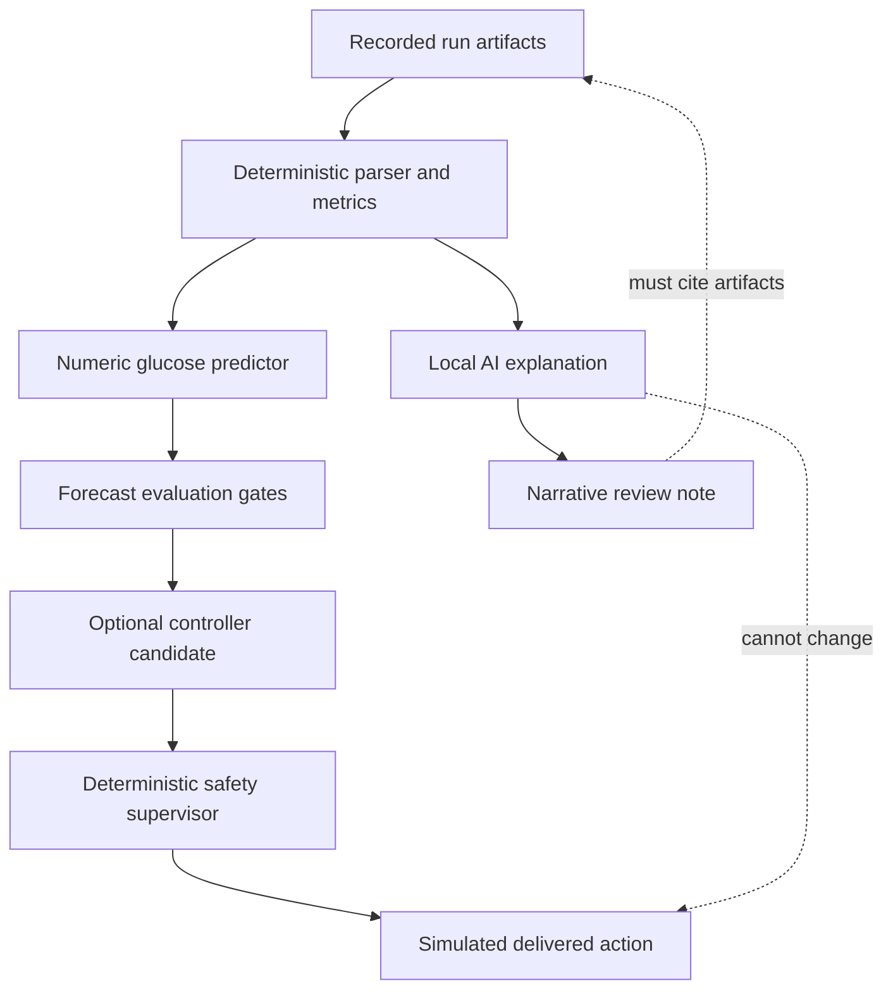
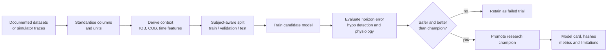
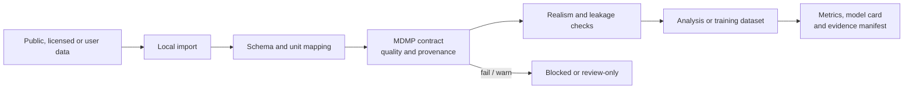
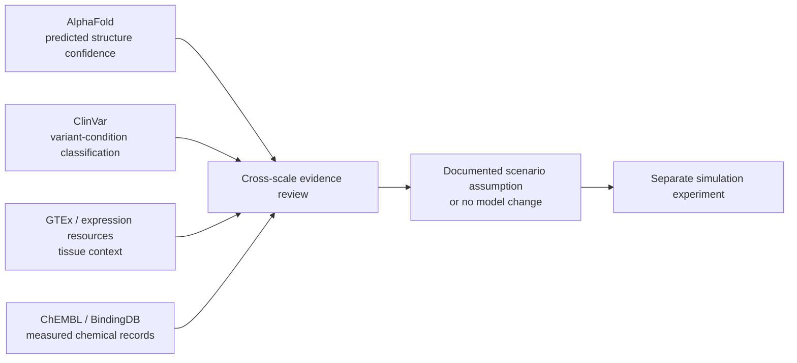

# AI, Data and Evidence

## Four AI roles, four different boundaries

IINTS-AF uses the word "AI" for several research activities that must not be
confused.

| Role | Input | Output | Authority |
| --- | --- | --- | --- |
| Run explanation | Completed run artifacts and deterministic metrics | Plain-language review notes | Advisory only |
| Glucose forecasting | Time-series history and context features | Future glucose estimate and uncertainty | Research prediction only |
| Experimental control | Simulated state, prediction or MPC context | Candidate simulated action | Must pass deterministic supervisor |
| Research-data assistance | Collections of run artifacts or datasets | Index, summary and anomaly shortlist | Cannot alter source evidence |

## AI authority diagram

<!-- diagram:ai-boundary -->


The language model is never asked to derive a missing formula, calculate a
clinical metric or invent a dose. If its narrative conflicts with a CSV or JSON
artifact, the artifact wins.

## Local Ollama mode

The local explanation assistant can use an Ollama-hosted Mistral/Ministral
model. The intended order is:

1. Parse and validate the run deterministically.
2. Calculate metrics in code.
3. Select bounded, non-sensitive evidence.
4. Ask the local model to explain the supplied evidence.
5. Save the explanation separately from the source run.
6. Mark uncertainty, missing context and non-medical-use boundaries.

AI unavailability must not invalidate the run. It only removes an optional
review layer.

## Glucose forecasting workflow



The SDK's physics-informed loss can penalise impossible glucose ranges,
excessive rate of change and selected IOB/COB inconsistencies. These penalties
are regularisers; they do not turn a neural network into a clinically validated
physiological model.

## Data lifecycle

<!-- diagram:data-lifecycle -->


### Data rules

- Raw controlled or private datasets stay outside the public Git repository.
- Every derived dataset should retain a source label, transformation record and
  split policy.
- Subject-level splitting is preferred when subject identifiers exist.
- Row-level random splitting must be disclosed because it can leak
  subject-specific patterns.
- Missing columns are never silently invented for scientific evaluation.
- Synthetic data must remain labelled synthetic.

## MDMP certification

The MDMP layer evaluates whether data meets an explicit research contract. A
certificate may contain hashes, contract version, grade, warnings and quality
results. It is evidence of a specific automated check, not a clinical
endorsement.

Typical checks include:

- required columns and units
- monotonic timestamps and expected intervals
- missingness and duplicate records
- finite values and configured ranges
- source and transformation provenance
- privacy-sensitive fields
- physiological rate-of-change warnings

## Cross-scale biology tools

The workbench can retrieve public reference context from tools such as
AlphaFold DB, ClinVar, GTEx, STRING, ChEMBL, BindingDB and pathway resources.
They add biological context, but they do not automatically calibrate the whole
patient.



### Strict interpretation boundaries

| Source | May support | Must not be inferred automatically |
| --- | --- | --- |
| AlphaFold pLDDT | Local prediction confidence | Binding affinity, disease severity or insulin sensitivity |
| PAE | Relative-position uncertainty | Clinical effect of a variant |
| ClinVar | Submitted variant-condition classification context | A quantitative retained-function scalar |
| GTEx | Tissue-level expression context | Whole-body flux or personalised insulin need |
| STRING | Association and interaction context | Causal signalling strength |
| ChEMBL / BindingDB | Chemical and measured activity/affinity records | Patient-level PK/PD without a validated translation model |

Unknown or uncertain variants do not alter physiology unless an explicit,
reviewed functional scalar is supplied as a scenario assumption. This prevents
an attractive molecular visual from becoming an unjustified patient-level
claim.

## Hardware and edge research

| Path | Academic purpose | Boundary |
| --- | --- | --- |
| Raspberry Pi / UNO Q | Local digital-patient and protocol demonstrations | No medication actuation |
| Jetson | Long simulation, training and reproducibility experiments | Research model promotion only |
| FPGA mode | Compare deterministic software logic with hardware logic | Bench-only labels and evidence |
| Pico pump lab | Quantisation, timing and failure-state education | No connection to a real infusion system |

## Reproducibility package

A strong AI or data result should include:

```text
experiment/
  protocol.md
  config.yaml
  dataset_manifest.json
  split_manifest.json
  training_report.json
  model_hashes.json
  horizon_metrics.csv
  hypo_detection_metrics.csv
  physiological_violation_metrics.csv
  limitations.md
```

The model checkpoint alone is not sufficient evidence.

## Privacy and governance

The SDK is designed for local-first research:

- local files remain local unless the user explicitly exports or uploads them
- Ollama can run without sending run evidence to an external language-model API
- network research tools are explicit workflows, not hidden background calls
- personal or controlled-access data must not be bundled into public releases
- reports should use study identifiers rather than direct identifiers

These engineering measures support research governance, but they are not
automatic legal or regulatory compliance. Each real study still needs its own
ethics, data-protection and institutional review.
