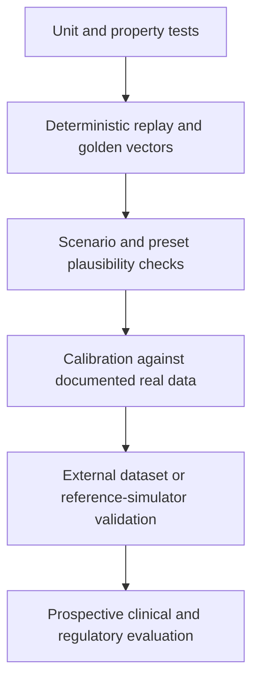

# Results, Validation and Limitations

## How results should be read

A simulation result has three different questions:

1. **Software correctness:** did the code execute the specified experiment?
2. **Physiological plausibility:** does the trace behave within documented
   research envelopes?
3. **Clinical validity:** would the result generalise safely to people?

IINTS-AF tests the first question extensively and provides tools for the second.
It does not establish the third.

## Locked EUCYS benchmark

The maintained EUCYS benchmark bundle contains:

| Dimension | Value |
| --- | ---: |
| Patient profiles | 6 |
| Scenario families | 4 |
| Study arms | 3 |
| Algorithm paths | 5 |
| Seeds | 10 |
| Total runs | 3600 |

The three study arms test clean certified input, deliberately corrupted
uncertified input, and a supervisor-off ablation.

## Aggregate study-arm results

Source: `research/eucys_pack/assets/EUCYS_RESULTS_TABLE.csv`.

| Study arm | Runs | Mean TIR 70-180 | Mean time below 70 | Mean time above 180 | Mean supervisor interventions |
| --- | ---: | ---: | ---: | ---: | ---: |
| Clean, certified | 1200 | 90.30% | 6.45% | 3.25% | 177.19 |
| Corrupted, uncertified | 1200 | 73.19% | 3.69% | 23.12% | 219.72 |
| Supervisor-off ablation | 1200 | 80.78% | 3.88% | 15.35% | 198.02 |

Weighted across the equally sized arms, mean TIR is approximately `81.42%`.
The clean-versus-corrupted TIR difference is approximately `17.11` percentage
points.

## What the benchmark supports

The benchmark supports these narrow claims:

- the SDK can execute a large locked matrix over profiles, scenarios,
  algorithms, arms and seeds
- clean and deliberately corrupted data conditions produce measurably
  different outcomes
- algorithm and safety-event trade-offs are exported in reviewable tables
- a result can be traced back to protocol and run artifacts
- the platform exposes undesirable outcomes instead of hiding them

## What the benchmark does not support

The benchmark does not prove:

- that the candidate algorithm is clinically safe
- that a high TIR compensates for excessive time below range
- that every supervisor intervention is appropriate
- that the virtual population represents a clinical population
- that the same performance will occur on an external dataset or certified
  simulator
- that the simulator can be used to determine a real dose

## Findings that require investigation

Scientific honesty is a feature of the platform. The existing table contains
important warning signals:

### Low-glucose burden

The clean arm reports `6.45%` mean time below 70 mg/dL. That is not a result to
present as satisfactory control. It requires investigation by profile,
scenario, algorithm and seed.

### Severe-low run counts

The artifact records severe-low exposure in many runs. The exact event
definition and duration must be checked before interpretation. This means the
benchmark is useful as a failure-discovery dataset, not as proof of safety.

### Intervention burden

Mean intervention counts are high. Possible explanations include aggressive
candidate behaviour, unsuitable controller-patient pairing, overly sensitive
safety settings, event-count semantics or repeated interventions during one
episode. The next analysis should report interventions per hour and group
adjacent events into episodes.

### Ablation interpretation

The supervisor-off arm cannot be interpreted only from TIR. Removing a guard
can change control behaviour and event counting in non-obvious ways. Safety
ablations should compare matched proposals, delivered actions, low-glucose
events and termination reasons.

## Validation ladder

<!-- diagram:validation-ladder -->

IINTS-AF currently operates primarily in levels A-C, with research workflows
for level D. Levels E and F are future independent work.

## Software validation

The repository includes:

- unit tests for patient models, sensors, safety, algorithms and data contracts
- property tests for selected safety invariants and numeric guards
- deterministic replay and golden benchmark workflows
- regression tests for metrics and reports
- static typing and lint checks
- architecture-boundary checks
- docs builds and desktop smoke tests
- dependency and security scanning

Passing these checks means that the software behaves according to its specified
tests. It is not clinical validation.

## Physiological plausibility checks

A convincing glucose trace should be checked for:

| Check | Example failure |
| --- | --- |
| Finite and bounded values | NaN, negative concentration or explosive solver state |
| Rate of change | Impossible one-minute vertical jump |
| Meal timing | Peak before carbohydrate appearance |
| Insulin timing | Immediate glucose fall before absorption/action delay |
| Sensor behaviour | Perfect blood-glucose observation despite configured CGM lag |
| Basal stability | Flat line caused by a broken or inactive model |
| Event visibility | Meal or delivered insulin absent from the output |
| Seed robustness | One attractive seed hiding unstable outcomes |
| Population spread | Every virtual patient behaving identically |

## Real-data calibration protocol

The recommended calibration sequence is:

1. Keep raw data local and record dataset access terms.
2. Standardise timestamp, glucose, insulin, carbohydrate and context units.
3. Split by subject before fitting parameters.
4. Calibrate only identifiable parameter groups.
5. Preserve a held-out subject set.
6. Compare distributional metrics, event response and rate-of-change, not only
   mean squared error.
7. Report confidence intervals and failure subgroups.
8. Freeze calibrated profiles before comparing algorithms.

OhioT1DM can support forecasting and behaviour calibration, but it does not
contain every latent physiological state. Unobserved quantities must not be
presented as directly measured.

## Priority next experiments

| Priority | Experiment | Why |
| --- | --- | --- |
| P0 | Decompose severe-low runs by profile, scenario, algorithm and seed | Identify the source of the current safety signal |
| P0 | Group supervisor events into episodes and normalise per hour | Make intervention burden interpretable |
| P1 | Post-meal peak timing and width against held-out CGM days | Test meal absorption realism |
| P1 | Exercise onset, delayed hypo and recovery edge cases | Stress the exercise abstraction |
| P1 | Sensor lag, dropout and compression-low challenge set | Separate controller failure from observation failure |
| P1 | Renal threshold/splay sensitivity analysis | Test robustness of the high-glucose extension |
| P1 | HAAF build, saturation and recovery sweeps | Prevent unrealistic one-episode saturation |
| P2 | External reference-simulator comparison | Test model structure beyond internal regression |
| P2 | Prospective clinician review of scenario semantics | Improve medical interpretability |

## Limitations register

| Limitation | Current mitigation | Remaining risk |
| --- | --- | --- |
| Model parameters may not represent an individual | Profiles, calibration tools and explicit metadata | Population validity remains uncertain |
| Research extensions combine sources | Formula registry and per-formula validation notes | Coupled behaviour may be under-validated |
| CGM model is generic | Configurable lag, noise and artifacts | No exact vendor equivalence |
| Safety rules are deterministic but hand-designed | Audit reasons and ablation studies | Rules can still be wrong or incomplete |
| AI explanations may hallucinate | Evidence-first prompts and no numeric authority | Human review remains necessary |
| Benchmark contains concerning low-glucose outcomes | Failure is preserved and reported | Controller/profile tuning still required |
| External biology tools are cross-scale context | Strict no-auto-calibration boundary | Users may still overinterpret visuals |
| Desktop and hardware expand attack surface | Rust allowlists, tests and local-first design | Ongoing security maintenance required |

## Strongest defensible conclusion

> IINTS-AF demonstrates a reproducible and inspectable way to run
> pre-clinical diabetes-technology experiments, expose failure cases and
> separate algorithm proposals from deterministic safety checks. The current
> evidence supports research use and further validation, not clinical use.
