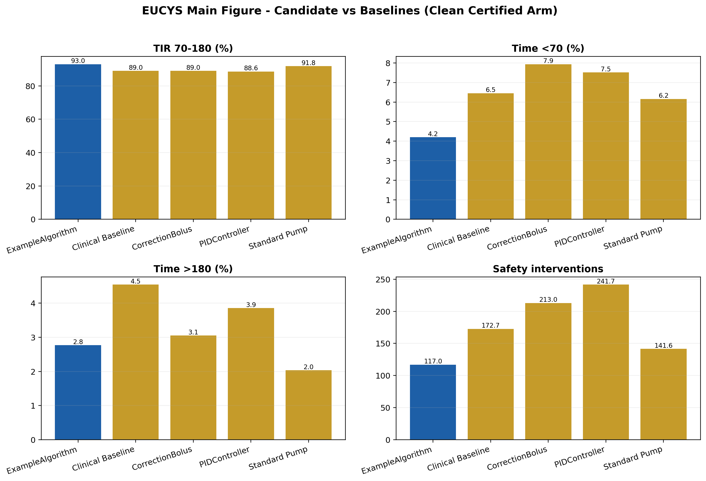

# EUCYS Jury Dossier

**Project:** IINTS-AF SDK 
**Author:** Runebob Baers 
**Purpose:** A browsable scientific and technical guide for EUCYS review 
**Software snapshot:** IINTS-AF SDK `1.5.33`

!!! warning "Research boundary"
    IINTS-AF is an open-source research and educational simulator. It is not a
    medical device, does not provide treatment advice, and must not control a
    real insulin or glucagon delivery system.

## The project in one sentence

IINTS-AF is a transparent research workbench for creating virtual diabetes
scenarios, testing experimental algorithms behind deterministic safety checks,
and turning every run into evidence that another person can inspect.

## How to browse this dossier

| Chapter | What it answers | Best reader |
| --- | --- | --- |
| [Project and research question](01_PROJECT_AND_QUESTION.md) | Why was IINTS-AF built and what is being tested? | Everyone |
| [System architecture](02_SYSTEM_ARCHITECTURE.md) | How do scenarios, physiology, algorithms, safety and reports connect? | Software and engineering judges |
| [Scientific model and formulas](03_SCIENTIFIC_MODEL.md) | Which equations are actually implemented, and what are their limits? | Mathematics, biology and medical judges |
| [AI, data and evidence](04_AI_DATA_AND_EVIDENCE.md) | What may AI do, how is data handled, and where do external biology tools fit? | AI and data judges |
| [Results, validation and limitations](05_RESULTS_VALIDATION_AND_LIMITATIONS.md) | What has been measured, what remains uncertain, and what must not be claimed? | Scientific judges |
| [Live demonstration runbook](06_DEMO_RUNBOOK.md) | What should be shown and said during the demonstration? | Presenter |
| [Jury quick reference](07_JURY_QUICK_REFERENCE.md) | What are the short answers to likely questions? | Presenter and judges |
| [Evidence map](08_EVIDENCE_MAP.md) | Where can each claim be checked in code, tests, outputs and literature? | Reviewers |

## The 60-second explanation

Type 1 diabetes technology must react to glucose, meals, insulin already active
in the body, exercise, sensor delay and uncertainty. Testing a new algorithm
near a real person is therefore not the right first step.

IINTS-AF creates a virtual patient and repeatable scenarios. An experimental
algorithm proposes an action, but a separate deterministic supervisor can
reduce, block or flag that action. The SDK records the raw trace, settings,
safety events, metrics and reports. Optional local AI may explain those
artifacts, but it cannot invent measurements, solve the physiological equations
or bypass the safety layer.

The scientific goal is not to prove that a controller is clinically safe. The
goal is to make assumptions, failures and trade-offs visible before any
clinical claim is considered.

## What is implemented

| Layer | Current capability |
| --- | --- |
| Virtual patient | Fast transparent model plus Bergman-style and Hovorka-style research ODE models |
| Disturbances | Meals, insulin, exercise, stress, circadian effects, sensor artifacts and experimental glucagon paths |
| Observation | CGM-like blood-to-interstitial lag, bias, drift, seeded noise and dropout |
| Algorithms | Baselines and experimental control or forecasting workflows |
| Safety | Deterministic input validation, dose constraints, intervention reasons and replay checks |
| Data | Import, standardisation, MDMP-style contracts, realism review and provenance artifacts |
| Evidence | CSV, JSON manifests, validation output, clinical-style reports, AGP-style assets and posters |
| Interfaces | Python SDK, CLI, Rust/Tauri desktop workbench and bench-only hardware adapters |

## What is not established

- Clinical validity for treatment decisions.
- Equivalence to a certified virtual-patient simulator.
- Safety for real insulin or glucagon delivery.
- Exact patient-specific physiology from a genetic, protein or tissue database.
- Generalisable AI performance without independent external validation.
- Proof that a realistic-looking curve represents a real patient.

## Current evidence snapshot

The maintained EUCYS benchmark artifact contains `3600` locked simulation runs:
six patient profiles, four scenario families, three study arms, five algorithm
paths and ten seeds. Its main scientific value is the auditable matrix and its
failure evidence, not a claim that every glucose outcome is clinically
acceptable.

The aggregate arm table reports:

| Study arm | Runs | Mean TIR 70-180 | Mean time below 70 | Mean time above 180 |
| --- | ---: | ---: | ---: | ---: |
| Clean, certified input | 1200 | 90.30% | 6.45% | 3.25% |
| Corrupted, uncertified input | 1200 | 73.19% | 3.69% | 23.12% |
| Supervisor-off ablation | 1200 | 80.78% | 3.88% | 15.35% |

These values require cautious interpretation. In particular, the low-glucose
burden and high intervention counts are reasons for further investigation, not
evidence of clinical safety. See
[Results, validation and limitations](05_RESULTS_VALIDATION_AND_LIMITATIONS.md).

## Recommended reading paths

**Five-minute jury path**

1. Read this page.
2. View the architecture diagram.
3. Read the numeric-authority rule.
4. View the result and limitation table.
5. Keep the jury quick reference open.

**Technical review path**

1. Read all architecture diagrams.
2. Check the 15-formula registry.
3. Follow the claim-to-code evidence map.
4. Inspect the benchmark CSV and run manifest.
5. Review the governance and test boundaries.

**Live-demo path**

1. Rehearse the [demo runbook](06_DEMO_RUNBOOK.md).
2. Run `iints demo eucys --output-dir results/eucys_live`.
3. Open the poster before opening code or folders.
4. Show one safety event and its underlying evidence.
5. End with limitations and the next experiment.
