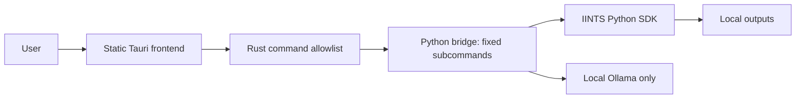

# Tauri Desktop Threat Model

The Tauri app is a native shell around the Python SDK. It must remain a narrow, audited command boundary.

## Assets

- User-selected results CSV files.
- Run output folders and reports.
- MDMP certificates and local signing keys.
- Local Ollama prompts and answers.
- Python SDK installation path.
- Desktop release binaries.

## Trust Boundaries

## Allowed Boundary

The app may:

- call fixed Tauri commands;
- call `python -m iints_desktop.tauri_bridge` with fixed subcommands;
- read user-provided result paths through Python SDK logic;
- create local reports, previews, and MDMP certificates;
- contact local Ollama when the user starts or checks local AI.

## Forbidden by Default

The app must not add without review:

- Tauri shell plugin;
- broad filesystem plugin;
- broad HTTP plugin;
- automatic updater plugin;
- remote web content;
- arbitrary command execution from frontend input;
- silent upload of results or health data.

## STRIDE-Style Risks

| Threat | Example | Control |
| --- | --- | --- |
| Spoofing | Fake Python executable | Prefer explicit `IINTS_PYTHON`; display Python path in status |
| Tampering | Modified result CSV | MDMP certificate, hashes, run manifests |
| Repudiation | No record of what was run | Desktop run history and run manifest |
| Information disclosure | Private CGM data exposed | Local-first processing, no broad plugins, privacy docs |
| Denial of service | Long simulation freezes UI | Async Rust bridge, future progress events |
| Elevation of privilege | Shell injection through UI | No shell plugin, no shell strings, `Command` with argument vectors |

## Release Hardening

Before Tauri becomes the default app:

- run Rust formatting and build checks in CI;
- add Cargo dependency audit;
- sign and notarize macOS builds;
- sign Windows builds with timestamping;
- publish checksums for downloads;
- keep auto-update disabled until signed update verification is ready.
