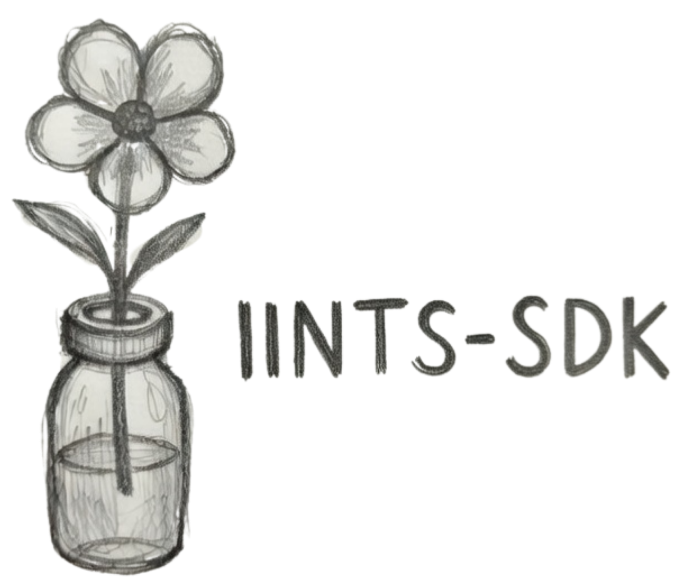

# IINTS-AF SDK Documentation

<div class="iints-hero">
  
  <div>
    <strong>Safety-first insulin algorithm research SDK</strong><br/>
    Simulation, validation, and audit-ready reporting.
  </div>
</div>

<div class="iints-actions">
  <a href="PLAIN_LANGUAGE_GUIDE/" class="iints-action">Start</a>
  <a href="MDMP/" class="iints-action">MDMP</a>
  <a href="https://github.com/python35/IINTS-SDK/tree/main/examples/demos" class="iints-action">Demos</a>
</div>

## Start Here

Use this order if you are new:

1. **Plain Language Guide**: concept overview.
2. **Technical README**: architecture + command reference.
3. **MDMP (Draft)**: data quality protocol and compliance grading.

## Quick Paths

<div class="iints-grid">
  <div class="iints-card">
    <h3>Run a First Simulation</h3>
    <p>Create a scaffold and execute a baseline scenario.</p>
  </div>
  <div class="iints-card">
    <h3>Validate Data (MDMP)</h3>
    <p>Apply a contract, compute grade, and export reproducible report artifacts.</p>
  </div>
  <div class="iints-card">
    <h3>Build Audit Outputs</h3>
    <p>Generate JSON/CSV/PDF/HTML outputs for research review.</p>
  </div>
  <div class="iints-card">
    <h3>Use Demos and Notebooks</h3>
    <p>Follow concrete end-to-end examples in scripts and notebook tutorials.</p>
  </div>
</div>

## Core Commands

```bash
# 1) Quick scaffold + baseline run
iints quickstart --project-name iints_quickstart
cd iints_quickstart
iints presets run --name baseline_t1d --algo algorithms/example_algorithm.py

# 2) Study-ready package
iints study-ready --algo algorithms/example_algorithm.py --output-dir results/study_ready

# 3) MDMP validation + dashboard
iints mdmp template --output-path mdmp_contract.yaml
iints mdmp validate mdmp_contract.yaml data/my_cgm.csv --output-json results/mdmp_report.json
iints mdmp visualizer results/mdmp_report.json --output-html results/mdmp_dashboard.html
```

## Scope

- Research use only.
- Not a medical device.
- No clinical dosing advice.
