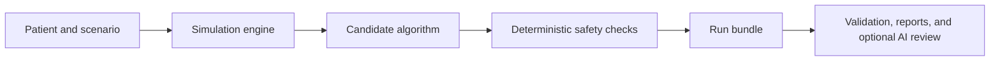

# IINTS-AF SDK

IINTS-AF is an open-source research SDK for building reproducible diabetes-technology experiments. It combines virtual patients, glucose and insulin scenarios, candidate algorithms, deterministic safety checks, data-quality tools, and research reports in one workflow.

It is designed for **simulation, education, benchmarking, and pre-clinical software research**.

!!! warning "Research boundary"
    IINTS-AF is not a medical device. It must not be used for insulin dosing, diagnosis, treatment decisions, or real-time patient care.

## Start In The Right Place

| Your goal | Start here | You will learn to |
| --- | --- | --- |
| Learn the SDK from the beginning | [Learning Path](LEARNING_PATH.md) | install, run, inspect, and validate an experiment |
| Get one result quickly | [First Run](QUICKSTART.md) | verify the installation and create a demo bundle |
| Use the desktop interface | [Desktop App](DESKTOP_APP.md) | run workflows and inspect outputs without memorising CLI commands |
| Work with data or local AI | [Workflow Hub](WORKFLOWS.md) | choose the correct data, AI, study, or reporting route |
| Understand the scientific assumptions | [Scientific Workflow](SCIENTIFIC_WORKFLOW.md) | separate implementation, evidence, calibration, and limitations |
| Contribute code | [Developer Portal](DEVELOPER_PORTAL.md) | navigate the architecture and run the required checks |

## How The SDK Works


```mermaid
flowchart LR
    A["Patient and scenario"] --> B["Simulation engine"]
    B --> C["Candidate algorithm"]
    C --> D["Deterministic safety checks"]
    D --> E["Run bundle"]
    E --> F["Validation, reports, and optional AI review"]
```

The important separation is:

1. **The simulator** computes the virtual physiological state.
2. **The candidate algorithm** proposes an experimental action.
3. **The safety layer** applies fixed, reviewable limits.
4. **The evidence layer** records inputs, outputs, versions, and checks.
5. **The optional AI layer** explains validated results; it is not the source of numerical truth.

Read [Core Concepts](CORE_CONCEPTS.md) for the vocabulary used throughout the documentation.

## First Installation

IINTS-AF supports Python 3.10 through 3.14.

```bash
python3 -m venv .venv
source .venv/bin/activate
python -m pip install --upgrade pip
python -m pip install "iints-sdk-python35[full,mdmp]"

iints doctor --smoke-run
iints demo quick --output-dir results/first_run
```

On Windows PowerShell, activate the environment with:

```powershell
.venv\Scripts\Activate.ps1
```

See [Installation](INSTALLATION.md) for source installs, optional research dependencies, and platform-specific help.

## What You Can Build

- deterministic virtual-patient simulations
- repeatable scenario and algorithm comparisons
- glucose-data quality and MDMP certification artifacts
- AGP-style research reports, study summaries, and evidence bundles
- local Ollama-assisted explanations of completed runs
- glucose forecasting experiments with explicit evaluation gates
- bench-only Raspberry Pi, Pico, UNO Q, Jetson, and FPGA workflows
- interactive structural-biology and genomics research demonstrations

Each advanced feature has its own limitations. The documentation distinguishes between **implemented behavior**, **scientific inspiration**, **empirical calibration**, and **clinical validation**. Those terms are not interchangeable.

## A Good First Session

1. Complete the [First Run](QUICKSTART.md).
2. Read [Core Concepts](CORE_CONCEPTS.md).
3. Learn how to [Understand A Run](RUN_OUTPUTS.md).
4. Complete the [First Workflow](GETTING_STARTED.md).
5. Choose a specialised route from the [Workflow Hub](WORKFLOWS.md).

For the project website, visit [iints.org](https://iints.org). For source code and issues, use [GitHub](https://github.com/python35/IINTS-SDK).
