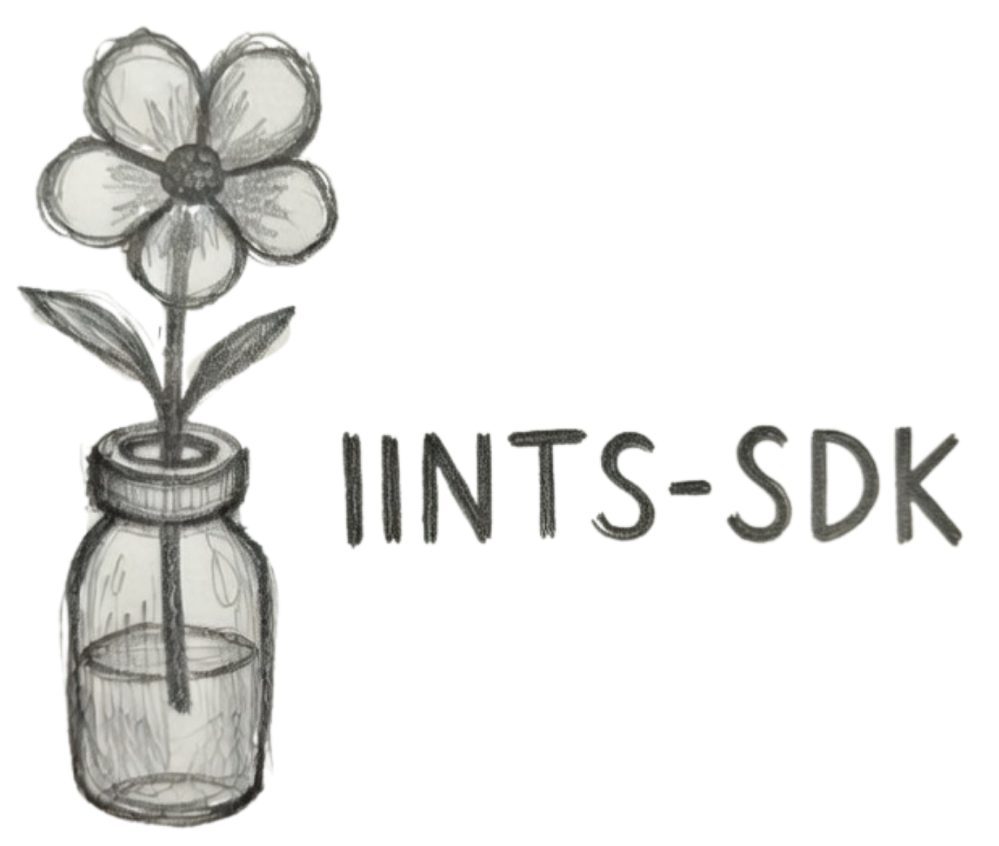

---
hide:
  - toc
---

  <section class="home-hero">
    

      
      IINTS-AF SDK
    

    

      

        <h1>IINTS-AF SDK Documentation</h1>
        

          Research tooling for virtual-patient insulin simulations, data quality
          certification, edge studies, and reproducible review bundles.
        

        

          <a class="home-button home-button-primary" href="./QUICKSTART/">Start with Quickstart</a>
          <a class="home-button" href="./USER_GUIDE_MAP/">Open Guide Map</a>
          <a class="home-button" href="./COMMAND_REFERENCE/">Browse CLI</a>
        

      

      

        

          
          

            Research workflow
            <strong>Simulation to report</strong>
          

        

        

          
          

            Data quality
            <strong>MDMP and realism checks</strong>
          

        

        

          
          

            Edge hardware
            <strong>Pi, UNO Q, Jetson</strong>
          

        

      

    

  </section>

  <section class="home-section">
    

      <h2>Getting Started</h2>
      
Choose the fastest entry point for what you need right now.

    

    

      <a class="home-card" href="./QUICKSTART/">
        
        5-Minute Quickstart
        Install the SDK, run a first demo, and confirm your environment is ready.
      </a>
      <a class="home-card" href="./USER_GUIDE_MAP/">
        
        User Guide Map
        A connected route through beginner, research, data, edge, and maintainer docs.
      </a>
      <a class="home-card" href="./TROUBLESHOOTING/">
        
        Troubleshooting
        Common failures, exact fixes, and recovery steps for local installs.
      </a>
      <a class="home-card" href="./COMMAND_REFERENCE/">
        
        Command Reference
        A compact map of the CLI surface when you already know what you want to run.
      </a>
    

  </section>

  <section class="home-section">
    

      <h2>Research Paths</h2>
      
Move from a first run to evidence you can inspect and share.

    

    

      <a class="home-path" href="./SCIENTIFIC_WORKFLOW/">
        01
        Scientific Workflow
        Study design, benchmark runs, comparisons, and reproducible outputs.
      </a>
      <a class="home-path" href="./MDMP_QUICKSTART/">
        02
        Data Quality
        Certification, trust grading, realism checks, and dataset review.
      </a>
      <a class="home-path" href="./EDGE_HARDWARE/">
        03
        Edge Deployment
        Raspberry Pi, Arduino UNO Q, Jetson endurance, and booth setup paths.
      </a>
    

  </section>

  <section class="home-section home-command-section">
    

      <h2>First Commands</h2>
      
The shortest useful sequence for a fresh environment.

    

    <pre class="home-command"><code>python3 -m venv .venv
source .venv/bin/activate
python -m pip install -U pip
python -m pip install -U "iints-sdk-python35[full,mdmp]"

iints doctor --suggest
iints start
iints demo</code></pre>
  </section>

  
<strong>Scope:</strong> research use only. IINTS-AF is not a medical device and does not provide clinical dosing advice.

