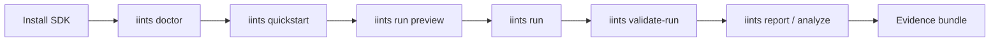

---
tags:
  - iints/user
  - iints/sdk
cssclasses:
  - iints-dashboard
status: active
updated: 2026-05-21
---
# SDK User Home

> [!tip] Start here as a user
> This page is not written like an internal repo map. It answers: **what can I do with the SDK, which command should I run, and where do I find proof?**

## Pick Your Role

| I am... | Start with | Goal |
| --- | --- | --- |
| new user | [[User Journey - First 30 Minutes]] | install, run demo, understand outputs |
| algorithm developer | [[User Journey - Algorithm Developer]] | create and test an insulin algorithm in simulation |
| data quality researcher | [[User Journey - Data Quality Researcher]] | import data, run MDMP/realism checks, cite sources |
| edge/hardware user | [[User Journey - Edge Hardware Demo]] | run Jetson/Raspberry Pi/UNO Q demos safely |
| jury/demo presenter | [[User Journey - EUCYS or Jury Demo]] | show the SDK clearly in a call or booth |
| local AI researcher | [[User Journey - Local AI Research]] | run local model-assisted research safely |

## The Canonical User Flow



## First Commands

```bash
iints doctor
iints demo
iints quickstart --output-dir iints_quickstart
cd iints_quickstart
iints run preview --algo algorithms/example_algorithm.py --patient-config-path patients/stable_patient.yaml --scenario-path scenarios/clinic_safe_baseline.json
```

## Where To Find Things

| User question | Open |
| --- | --- |
| What commands should I use? | [[Command Cookbook - User Edition]] |
| What is IINTS actually for? | [[What Can I Do With IINTS]] |
| Why do the numbers mean anything? | [[Physiology and Safety Sources]] |
| Which datasets does it know? | [[Dataset Source Library]] |
| How do I fix errors? | [[Troubleshooting From User Perspective]] |
| How do I explain it to people? | [[User Journey - EUCYS or Jury Demo]] |
| What sources support it? | [[Source Library Index]] |

> [!danger] Safety boundary
> IINTS is for simulation, validation, evidence bundles, and bench-only hardware demos. It is not for real insulin dosing.
