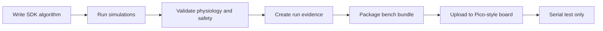

# Algorithm to Pump Pipeline

```mermaid
flowchart LR
  A[Write SDK algorithm] --> B[Run simulations]
  B --> C[Validate physiology and safety]
  C --> D[Create run evidence]
  D --> E[Package bench bundle]
  E --> F[Upload to Pico-style board]
  F --> G[Serial test only]
```

The hardware is not where the algorithm becomes safe; it is where an already-tested bundle is demonstrated.
